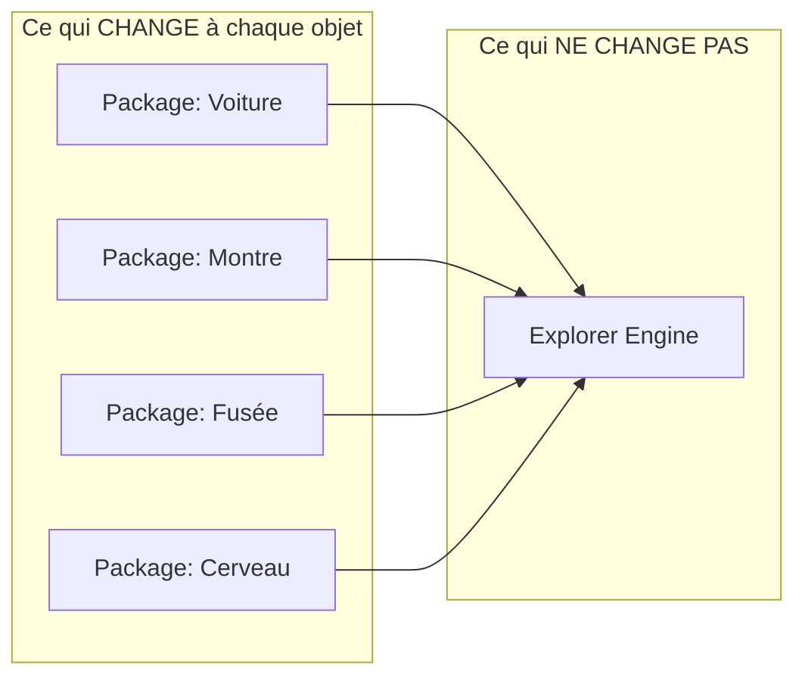

# Chapitre 01 — Vision du projet

> Ce chapitre définit *pourquoi* Explorer Engine existe, *pour qui*, et *selon quels principes*. Il constitue le cadre de référence auquel toutes les décisions ultérieures doivent se conformer.

---

## 1.1 Objectifs

### 1.1.1 Objectif principal

Fournir un **moteur générique et réutilisable** capable de transformer n'importe quel objet 3D en une **expérience d'exploration interactive**, riche et pédagogique, **sans écrire de code spécifique à l'objet**.

### 1.1.2 Objectifs stratégiques

| Objectif | Description | Mesure de succès |
|----------|-------------|------------------|
| **Généricité** | Le même moteur explore une montre ou une fusée. | Un nouvel objet est ajouté sans modifier le moteur (0 ligne de code moteur). |
| **Time-to-experience court** | Un créateur de contenu produit une expérience rapidement. | Une expérience de base fonctionnelle en < 1 journée à partir d'un GLB propre. |
| **Longévité** | Le moteur reste pertinent plusieurs années. | Compatibilité ascendante des packages ; API stable versionnée. |
| **Performance** | Fluidité sur matériel grand public. | 60 FPS sur desktop moyen de gamme, ≥ 30 FPS sur mobile récent. |
| **Extensibilité** | De nouvelles capacités sans casser l'existant. | Ajout de fonctionnalités via plugins sans toucher au noyau. |
| **Accessibilité** | Utilisable par tous, y compris technologies d'assistance. | Conformité WCAG 2.1 AA sur l'UI ; navigation clavier complète. |

### 1.1.3 Objectifs explicitement hors périmètre (v1)

Ces éléments ne sont **pas** des objectifs de la version 1, afin de préserver le focus (voir aussi §1.5 Limites et [chapitre 18](./18-evolutions-futures.md)) :

- Édition/authoring visuel intégré (→ *Explorer Studio*, futur).
- Multijoueur / collaboration temps réel.
- Réalité virtuelle / augmentée.
- Génération de contenu par IA.

---

## 1.2 Philosophie

### 1.2.1 « Le moteur est un lecteur, le package est le disque »

La métaphore directrice est celle d'un **lecteur multimédia**. Un lecteur de musique ne « connaît » aucune chanson : il lit un format. De la même manière, Explorer Engine ne connaît aucun objet : il lit des **Explorer Packages**. Cette séparation est le cœur de la philosophie du projet.

### 1.2.2 Déclaratif avant impératif

Le comportement d'une expérience se **décrit** (données), il ne se **programme** pas (code). Un hotspot, un état, une transition, une caméra sont des **entrées de configuration**. Le code impératif est réservé au moteur lui-même et, exceptionnellement, aux plugins pour des comportements non exprimables déclarativement.

**Conséquence de conception** : tout ce qu'un créateur de contenu doit pouvoir faire DOIT être exprimable dans le `config.json` ou par des ressources. Si une expérience courante nécessite du code, c'est un signal que le schéma de configuration doit être étendu.

### 1.2.3 Le noyau minimal, les capacités par plugins

Le noyau (kernel) fait le strict nécessaire : rendre une scène, charger un modèle, gérer la caméra, les états, les hotspots, l'orchestration. Tout le reste (mesures, annotations, visites guidées, audio spatial avancé, mini-cartes…) relève de **plugins**. Cela garde le noyau petit, testable, stable et durable.

### 1.2.4 Robustesse et dégradation gracieuse

Un package malformé, une texture manquante, un GPU faible ne doivent **jamais** provoquer un écran noir. Le moteur DOIT dégrader gracieusement : valeurs par défaut, placeholders, désactivation de fonctionnalités coûteuses, messages d'erreur explicites et exploitables.

### 1.2.5 Transparence et prévisibilité

Le comportement du moteur DOIT être prévisible et traçable. Les erreurs de configuration sont signalées clairement (validation de schéma, chemins de ressources vérifiés). Un mode diagnostic expose l'état interne (FPS, draw calls, mémoire, état courant, hotspots actifs).

---

## 1.3 Utilisateurs ciblés

Explorer Engine sert **trois publics distincts**, dont les besoins guident la conception.

### 1.3.1 L'utilisateur final (End User)

La personne qui **explore** l'objet dans son navigateur.

- **Attentes** : fluidité, clarté, intuitivité, plaisir, apprentissage.
- **Contexte** : desktop, tablette, mobile ; souris, tactile, clavier.
- **Ne connaît pas** : la 3D, la configuration, le code. L'expérience doit être auto-explicative.

### 1.3.2 Le créateur de contenu (Content Author / Package Author)

La personne qui **produit un Explorer Package** pour un objet donné.

- **Profil** : intégrateur 3D, designer technique, ingénieur produit, muséographe, formateur.
- **Outils** : logiciel 3D (Blender…), éditeur de texte pour le `config.json`, outils de conversion (Draco, KTX2).
- **Attentes** : documentation claire du format, validation des erreurs, itération rapide, pas besoin de recompiler le moteur.
- **Ne devrait pas avoir à** : écrire du TypeScript pour une expérience standard.

### 1.3.3 Le développeur d'extensions (Extension Developer)

La personne qui **étend le moteur** via des plugins ou l'intègre dans une application plus large.

- **Profil** : développeur front-end / 3D.
- **Attentes** : API publique stable et documentée, points d'extension clairs, système d'événements, cycle de vie maîtrisé.
- **Travaille avec** : l'API du moteur, le système de plugins ([chapitre 10](./10-plugins.md)).

### 1.3.4 Matrice publics × chapitres

| Public | Chapitres prioritaires |
|--------|------------------------|
| Utilisateur final | (impacté indirectement par tous — surtout 07, 08, 12, 13, 14) |
| Créateur de contenu | 04, 05, 06, 07, 09, 13 |
| Développeur d'extensions | 02, 10, 11, 15, 17 |

---

## 1.4 Cas d'utilisation

### 1.4.1 Familles de cas d'usage

| Domaine | Exemple d'objet | Valeur apportée |
|---------|-----------------|-----------------|
| **E-commerce / configurateur** | PC gaming, montre, voiture | Voir le produit sous tous les angles, comprendre ses composants, options. |
| **Éducation / formation** | Cerveau humain, moteur thermique, cellule | Apprendre en explorant, vues éclatées, annotations. |
| **Documentation technique / SAV** | Machine industrielle, appareil | Localiser un composant, comprendre l'assemblage, maintenance. |
| **Marketing / showroom** | Voiture, console, téléphone | Expérience immersive de présentation produit. |
| **Musée / patrimoine** | Artefact, sculpture, bâtiment | Exploration guidée d'objets rares ou inaccessibles. |
| **Aérospatial / ingénierie** | Fusée, satellite, turbine | Compréhension d'assemblages complexes multi-niveaux. |

### 1.4.2 Scénario type (parcours utilisateur)

1. L'utilisateur arrive sur l'expérience ; un **loader** charge le package (modèle + config).
2. L'objet apparaît dans son **état par défaut** (ex. `Closed`), avec un cadrage caméra soigné.
3. Des **hotspots** signalent les composants remarquables.
4. L'utilisateur **survole/clique** un hotspot → le **Focus System** met en avant le composant (zoom, isolation, panneau d'information).
5. L'utilisateur bascule vers un **état** `Exploded` → les composants s'écartent via l'**Animation Engine**.
6. Un **panneau UI** affiche les détails, un **breadcrumb** situe la navigation.
7. L'utilisateur revient à l'état initial via un bouton de **retour**.

Ce scénario est réalisé **entièrement par configuration**, sans code spécifique à l'objet.

### 1.4.3 Exemples concrets par objet

- **PC Gaming** : hotspots sur GPU/CPU/RAM/alim ; état `Open` (retrait du panneau latéral) ; focus sur le GPU avec fiche technique ; état `Exploded` montrant l'assemblage.
- **Montre** : état `Cutaway` révélant le mouvement ; hotspots sur couronne, aiguilles, mouvement ; animation du balancier.
- **Cerveau** : état `Transparent` ; hotspots sur les lobes ; focus avec description fonctionnelle ; audio explicatif.
- **Fusée** : états d'étagement (`Exploded` par étages) ; hotspots sur moteurs, réservoirs, coiffe ; visite guidée séquentielle (plugin).

---

## 1.5 Limites

Reconnaître les limites fait partie d'une conception mature. Les limites suivantes sont **assumées** pour la v1.

### 1.5.1 Limites fonctionnelles (v1)

- **Pas d'authoring intégré** : la création du `config.json` et la préparation du GLB se font hors moteur (voir *Explorer Studio* au chapitre 18).
- **Pas de simulation physique** : le moteur n'est pas un moteur physique (pas de collisions dynamiques, fluides, corps rigides). Les mouvements sont des animations scénarisées.
- **Pas de multijoueur ni de temps réel partagé.**
- **Pas de VR/AR native** (envisagé au chapitre 18).

### 1.5.2 Limites techniques

- **Dépendance au format GLB/glTF 2.0** comme format de modèle pivot.
- **Cible : navigateurs modernes** supportant WebGL 2 (et, à terme, WebGPU en option — voir chapitre 14/18). Les navigateurs sans WebGL 2 reçoivent un message de dégradation.
- **Poids des assets** : la fluidité dépend de la qualité de préparation du package (topologie, compression, résolution des textures). Le moteur optimise mais ne peut compenser un asset non optimisé à l'infini.

### 1.5.3 Limites de responsabilité

- Le moteur **ne garantit pas** l'exactitude des données de contenu (un hotspot mal placé relève du package, pas du moteur).
- Le moteur **ne fournit pas** les modèles 3D ; il les consomme.

---

## 1.6 Principes de conception

Ces principes sont **normatifs**. Ils sont référencés dans tout le reste de la documentation et servent de critère d'arbitrage en cas de doute.

### 1.6.1 Les 10 principes fondateurs

| # | Principe | Énoncé | Implication concrète |
|---|----------|--------|----------------------|
| P1 | **Engine ≠ Content** | Le moteur ne contient aucune connaissance d'un objet. | Nouvel objet ⇒ nouveau package, jamais de patch moteur. |
| P2 | **Data-driven** | Le comportement est piloté par des données déclaratives. | Le `config.json` est le point de contrôle principal. |
| P3 | **Single Responsibility** | Chaque module a une responsabilité unique. | Frontières nettes, faible couplage (voir chapitre 02). |
| P4 | **Composition over inheritance** | On compose des modules/plugins plutôt que d'hériter. | Architecture modulaire et extensible. |
| P5 | **Explicit contracts** | Les modules communiquent par interfaces et événements explicites. | Pas d'accès à l'état interne d'un autre module. |
| P6 | **Fail gracefully** | Toute erreur dégrade sans casser l'expérience. | Défauts, placeholders, messages exploitables. |
| P7 | **Performance by design** | La performance est une contrainte de conception. | Budgets de performance définis dès le départ (chapitre 14). |
| P8 | **Accessibility first** | L'accessibilité est intégrée, pas ajoutée après. | Clavier, ARIA, contrastes, respect des préférences système. |
| P9 | **Determinism & testability** | Le comportement est prévisible et testable. | Modules purs quand possible, effets isolés, état observable. |
| P10 | **Backward compatibility** | Les packages restent lisibles dans le temps. | Versionnage du schéma et migrations (chapitres 04/05). |

### 1.6.2 Règle d'arbitrage

En cas de conflit entre deux options de conception, l'ordre de priorité est :

1. **Sécurité & robustesse de l'utilisateur final** (P6, P8)
2. **Généricité & séparation moteur/contenu** (P1, P2)
3. **Simplicité & maintenabilité** (P3, P4, P5)
4. **Performance** (P7)
5. **Richesse fonctionnelle** (features)

> On préférera toujours un moteur plus simple et plus générique à un moteur plus riche mais couplé à des cas particuliers. La richesse passe par les plugins et la configuration, pas par la complexification du noyau.

### 1.6.3 Test décisif de généricité (« Generic Test »)

Avant d'ajouter toute fonctionnalité au noyau, poser la question :

> « Cette fonctionnalité a-t-elle du sens pour *n'importe quel* objet, ou seulement pour certains ? »

- Si elle vaut pour tous les objets → candidate pour le noyau (à confronter à P3).
- Si elle ne vaut que pour certains objets → elle DOIT être un plugin ou une option de configuration, **jamais** codée en dur dans le noyau.
