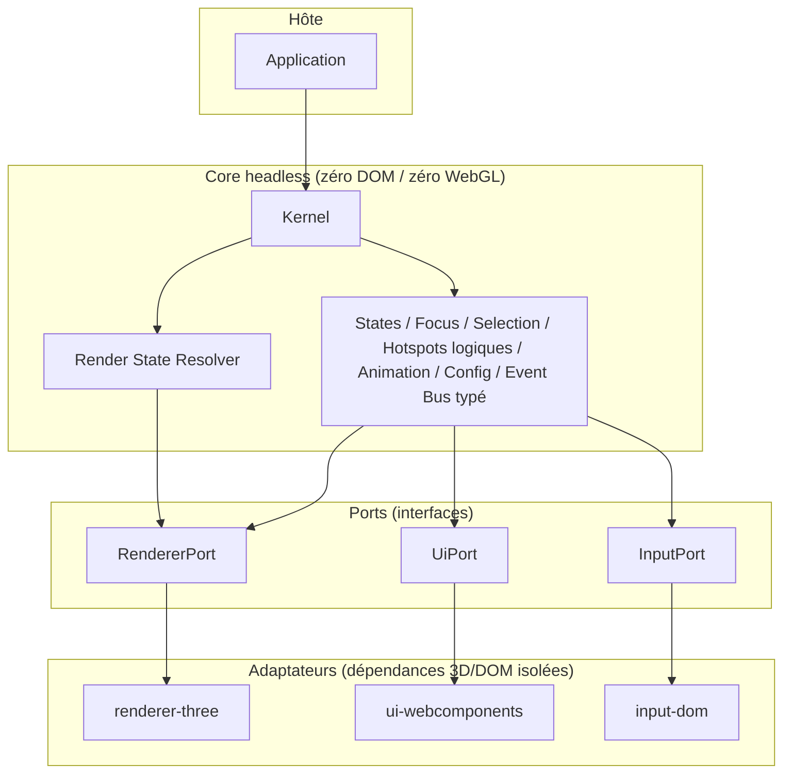
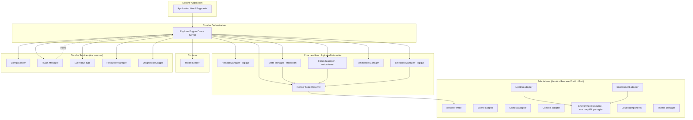
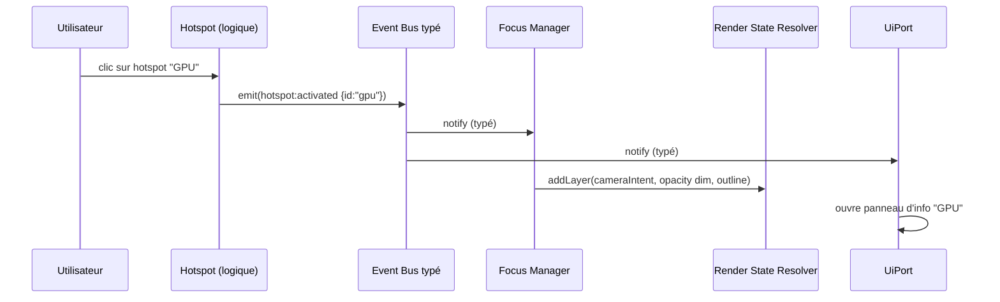
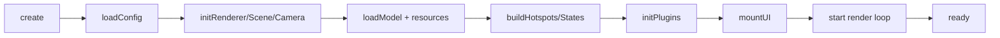

# Chapitre 02 — Architecture générale

> Ce chapitre décrit l'ensemble des modules du moteur : leur rôle, leurs responsabilités, leurs dépendances et leurs interactions. Il constitue la carte mentale de référence pour toute l'équipe.
>
> **Révisé en spec v2 (corrections C2, C6, C7, C9).** Introduit une **architecture hexagonale** (core headless + adaptateurs derrière des ports), le module **Render State Resolver** (chapitre 19), un **catalogue d'événements typé**, le contrat **`requestRender()`/frame ownership**, et corrige le **graphe de dépendances** (suppression de tout cycle).

---

## 2.0 Architecture hexagonale : core headless + adaptateurs (v2)

La v1 plaçait le rendu (WebGL/Three.js) et l'UI (DOM) au même niveau que la logique, dans un noyau monolithique. La v2 sépare **trois responsabilités** derrière des **ports** (interfaces) :

| Couche | Contenu | Dépendances externes |
|--------|---------|----------------------|
| **Core headless** (`@explorer-engine/core`) | Config, Render State Resolver, State Manager, Focus, Selection *logique*, Hotspot *logique*, Animation Engine, Event Bus (typé), sérialisation d'état. | **Aucune** (ni DOM, ni WebGL). |
| **Adaptateurs** | `renderer-three` (rendu 3D), `ui-webcomponents` (UI), `input-dom` (entrées). | Three.js, DOM, WebGL — **isolés ici**. |
| **Hôte** | L'application qui monte le moteur et branche les adaptateurs. | — |

Le core **ne connaît que des ports** : `RendererPort`, `UiPort`, `InputPort`. Il n'importe jamais Three.js ni le DOM.

**Bénéfices** : (1) la logique est **testable sans navigateur** (P9) ; (2) le moteur est **embarquable** avec une UI tierce ; (3) l'évolution **WebGPU/XR** (chapitre 18) devient un nouvel adaptateur `RendererPort`, sans toucher le core. La structure du dépôt reflète cette séparation ([chapitre 03](./03-structure-projet.md)).

> Dans la suite du chapitre, les « managers » de rendu (Renderer, Scene, Camera, Controls, Lighting, Environment) et d'UI sont, en v2, des **responsabilités portées par les adaptateurs** derrière `RendererPort`/`UiPort`. La logique d'interaction (States, Focus, Selection, Hotspots) et l'orchestration restent **dans le core headless**.

---

## 2.1 Vue d'ensemble

Explorer Engine est structuré en **couches** et en **modules**. Une règle absolue gouverne l'ensemble : **les dépendances vont de haut en bas et de la périphérie vers le noyau, jamais l'inverse**. Le noyau ne connaît ni les plugins, ni les objets, ni l'application hôte, ni le backend 3D/DOM (v2 : accès via ports uniquement).

### 2.1.1 Couches

> **Note v2** : les intentions caméra/éclairage passent par des **couches** du RSR (chapitre 19), pas par des appels directs `Focus → Camera`. La ressource **`EnvironmentResource`** (env map/IBL) est **partagée** par Lighting et Environment **sans qu'ils se référencent** — ce qui casse le cycle `Lighting ↔ Environment` de la v1 (correction C6).

### 2.1.2 Principe de communication : l'Event Bus **typé** (C9)

Les modules **ne s'appellent pas directement** entre eux pour les notifications. Ils émettent et écoutent des **événements** via un **Event Bus** central. Cela garantit un couplage faible (P3, P5).

**Catalogue d'événements typé (C9)** : les événements ne sont **pas** des chaînes libres. Le core et le SDK exposent un **catalogue typé** — une association `nom → forme du payload` vérifiée à la compilation. Un émetteur ou un écouteur portant un nom inconnu, ou un payload mal formé, est **une erreur de compilation**, pas un bug silencieux. Cela sécurise le refactoring et la maintenance sur 10 ans.

**Règle normative « pas de données par frame sur le bus »** : les données **chaudes** (positions projetées de hotspots, valeurs interpolées, deltas de frame) **ne transitent jamais** par l'Event Bus. Elles circulent par appels directs via les **ports** (`RendererPort`, etc.) et le Render State Resolver. Le bus est réservé aux **événements sémantiques** discrets (`hotspot:activated`, `state:changed`, `model:loaded`).

- Communication **directe** (appel de méthode / port) : le Core appelle les modules ; les modules publient des **couches** au RSR ; les ports exposent les primitives 3D/UI.
- Communication **indirecte** (événements typés) : notifications/réactions discrètes.

### 2.1.3 Catégories de modules (v2)

| Catégorie | Modules | Localisation |
|-----------|---------|--------------|
| **Rendu 3D (adaptateurs)** | renderer-three, Scene, Camera, Controls, Lighting, Environment (+ EnvironmentResource) | Derrière `RendererPort` |
| **Contenu** | Model Loader, Resource Manager | Core (headless) + décodeurs |
| **État visuel** | **Render State Resolver** (chapitre 19) | Core (headless) |
| **Interaction & narration** | Hotspot (logique), Selection (logique), Focus (mécanisme), State (statechart), Animation | Core (headless) |
| **Présentation (adaptateur)** | ui-webcomponents, Theme Manager | Derrière `UiPort` |
| **Système** | Config Loader, Plugin Manager, Event Bus typé, Resource Manager, Diagnostics, Navigation (opt-in) | Core (headless) |

---

## 2.2 Le noyau (Explorer Engine Core / Kernel)

### Rôle
Orchestrateur central. Point d'entrée unique du moteur. Il instancie, initialise, connecte et pilote tous les managers selon un cycle de vie déterministe.

### Responsabilités
- Exposer l'**API publique** du moteur (création d'une instance, chargement d'un package, contrôle du cycle de vie).
- **Brancher les adaptateurs** (`RendererPort`, `UiPort`, `InputPort`) fournis par l'hôte (v2, C2).
- Séquencer le **bootstrap** : charger la config → préparer le rendu → charger le modèle → construire hotspots/états → monter l'UI → démarrer la boucle.
- Détenir et fournir le **contexte partagé** (accès contrôlé aux modules du core, à l'Event Bus typé, à la config résolue).
- Gérer le **teardown** propre (dispose des ressources via les ports, désabonnement des événements, annulation des chargements en cours — C16).

### Contrat de boucle de rendu : `requestRender()` + frame ownership (v2, C7)

La v1 promettait un « rendu à la demande » mais n'arbitrait pas les animations continues (ventilateur en boucle, autoplay idle, audio spatial). La v2 définit un **contrat explicite d'ownership de frame** :

| Primitive | Sémantique |
|-----------|-----------|
| `requestRender()` | Demande **une** frame (rendu ponctuel). Appelé par le RSR quand une couche change, par l'InputPort sur interaction, par un resize. Idempotent au sein d'une frame. |
| `acquireFrameLoop(owner): FrameHandle` | Un producteur d'animation **acquiert un handle** : tant qu'au moins un handle est vivant, la boucle tourne en continu (60 FPS cible). |
| `handle.release()` | Libère le handle. Quand **tous** les handles sont libérés, la boucle **se met en veille** (plus aucun rendu jusqu'au prochain `requestRender()`). |

Détenteurs typiques de handle : un tween/timeline actif (Animation Engine), un clip GLB en boucle, un plugin qui anime en continu. Résultat : **zéro rendu sur scène stable**, **60 FPS garantis pendant les animations**, sans clip figé (correction du conflit v1 F11). Détail perf au [chapitre 14](./14-performances.md).

### Dépendances
- Tous les managers et services (il les possède).

### Interactions
- Reçoit les ordres de l'application hôte.
- Émet les événements de cycle de vie (`engine:ready`, `package:loaded`, `engine:disposed`).

### Cycle de vie (bootstrap)

---

## 2.3 Renderer

### Rôle
Encapsule le moteur de rendu WebGL (Three.js `WebGLRenderer`, avec ouverture possible à WebGPU au chapitre 14/18). Il transforme la scène 3D en pixels.

### Responsabilités
- Créer et configurer le contexte de rendu (canvas, résolution, `pixelRatio`, antialiasing, gestion du color space, tone mapping).
- Exécuter le **render pass** à chaque frame.
- Gérer le **redimensionnement** (resize) et l'adaptation à la densité de pixels.
- Héberger le **post-processing** (composer, passes : bloom, outline, SSAO…) de manière optionnelle et paramétrable.
- Exposer des **métriques** de rendu (draw calls, triangles, temps GPU approx.) au module Diagnostics.

### Dépendances
- Scene Manager (source de la scène), Camera Manager (source de la caméra).

### Interactions
- Piloté par le Core (render loop).
- Fournit le canvas au DOM ; coopère avec le UI Manager pour l'agencement (overlay UI au-dessus du canvas).
- Le Theme Manager peut influencer certains paramètres visuels (couleur de fond, exposition) via la config.

---

## 2.4 Scene Manager

### Rôle
Détient et organise le **graphe de scène** (scene graph) : la hiérarchie des objets 3D.

### Responsabilités
- Créer la scène racine.
- Ajouter/retirer des objets (modèle chargé, lumières, helpers, environnement).
- Maintenir un **index** des objets nommés/taggés (pour retrouver un composant par identifiant — essentiel pour hotspots, focus, états).
- Gérer les **groupes logiques** (ex. « composants internes », « carrosserie ») utilisés par les états.
- Fournir des utilitaires de requête sur le graphe (trouver par nom, par tag, calculer bounding boxes).

### Dépendances
- Model Loader (fournit le contenu), Lighting Manager, Environment Manager (ajoutent des objets). L'env map/IBL provient de `EnvironmentResource` (partagée, sans référence croisée Lighting↔Environment — C6).

### Interactions
- Interrogé par Hotspot Manager (positions d'ancrage), Focus Manager (bounding boxes), State Manager (groupes à animer), Selection Manager (raycasting).

---

## 2.5 Camera Manager

### Rôle
Gère la ou les caméras et leur comportement (cadrage, transitions, projections).

### Responsabilités
- Créer et configurer la caméra (perspective par défaut ; orthographique en option pour certains objets/plans).
- Gérer des **presets de vues** (positions/orientations nommées, définies dans la config : « vue de face », « trois-quarts »…).
- Exécuter des **transitions caméra** fluides (interpolation position + cible + FOV) — en coordination avec l'Animation Manager.
- Fournir les primitives au Focus Manager (cadrer un objet : calcul de la distance pour englober une bounding box).
- Gérer les **limites** (distances min/max, angles) en coordination avec le Controls Manager.

### Dépendances
- Scene Manager (cibles), Animation Manager (interpolations).

### Interactions
- Sollicité par Focus Manager et State Manager pour recadrer.
- Coopère avec Controls Manager (qui manipule la caméra en réponse à l'utilisateur).

---

## 2.6 Controls Manager

### Rôle
Traduit les entrées utilisateur (souris, tactile, clavier, gyroscope) en manipulation de la caméra/objet.

### Responsabilités
- Implémenter les schémas de contrôle : **orbit** (rotation autour de l'objet), pan, zoom/dolly ; option « turntable ».
- Appliquer l'**inertie/damping** pour un rendu fluide.
- Respecter les **contraintes** définies par la config (limites d'angle, de distance, verrouillage d'axes).
- Gérer les **modes** : contrôle libre vs. contrôle verrouillé (pendant une transition de focus ou un état animé, les contrôles peuvent être temporairement désactivés/restreints).
- Fournir un **contrôle clavier complet** (accessibilité).

### Dépendances
- Camera Manager (cible de la manipulation).

### Interactions
- Écoute les événements d'état (ex. `focus:started` → réduire/désactiver les contrôles ; `focus:ended` → réactiver).
- Émet des événements d'interaction (`controls:changed`) utiles pour la projection des hotspots.

---

## 2.7 Lighting Manager

### Rôle
Gère l'éclairage de la scène.

### Responsabilités
- Créer les lumières selon la config (directionnelle, ambiante, ponctuelle, spot, hémisphérique).
- Gérer l'**IBL** (Image-Based Lighting) via des environment maps (HDR/EXR → prefiltrées) pour un rendu PBR réaliste.
- Gérer les **ombres** (shadow maps) de façon paramétrable et budgétée (coût GPU).
- Fournir des **presets d'éclairage** (studio, extérieur, nuit…) sélectionnables par la config ou par les états.

### Dépendances
- Scene Manager (ajout des lumières), Environment Manager (env maps).

### Interactions
- Peut être modifié par les états (ex. état `Focus` assombrit l'ambiance et éclaire le composant ciblé) et par le Theme Manager.

---

## 2.8 Model Loader

### Rôle
Charge et prépare les modèles 3D (GLB/glTF) et leurs dérivés.

### Responsabilités
- Charger le **GLB** via le loader glTF, avec support des décodeurs **Draco** (géométrie) et **KTX2/Basis** (textures compressées), et **Meshopt**.
- Traverser le modèle pour **indexer** les meshes/nœuds nommés (mapping nom → objet), base du système de hotspots/focus/états.
- Préparer les **matériaux** (vérification PBR, assignation des env maps, réglages color space).
- Extraire les **animations** intégrées au GLB et les remettre à l'Animation Manager.
- Gérer les **LOD** (niveaux de détail) si fournis, et l'**instancing** pour les éléments répétés.
- Rapporter la progression du chargement (pour le loader UI) et gérer les erreurs (asset manquant, format invalide).

### Dépendances (v2)
- Resource Manager (chemins et cache), Scene adapter (insertion). **Ne dépend pas de l'Animation Manager** : le loader **produit un descripteur de clips** (données pures) que l'Animation Manager consomme (inversion de dépendance, correction C6/F25).

### Interactions
- Émet `model:loading` (progress), `model:loaded`, `model:error` (événements typés, C9).
- Fournit l'index des composants (clé **`explorerId`**, repli nom — C5) au Hotspot/Focus/State Managers via le core.

---

## 2.9 Environment Manager

### Rôle
Gère l'environnement visuel autour de l'objet : arrière-plan, sol, brouillard, environment map.

### Responsabilités
- Configurer l'**arrière-plan** (couleur unie, dégradé, skybox, image, transparent).
- Charger et appliquer l'**environment map** (réflexions/IBL) — coordonné avec le Lighting Manager.
- Gérer un **sol** optionnel (plan, ombre de contact, grille).
- Gérer le **brouillard**/atmosphère si pertinent.

### Dépendances
- **`EnvironmentResource`** (env map/IBL partagée), Scene adapter, Resource Manager. **Ne dépend pas du Lighting Manager** (v2, C6) : les deux consomment `EnvironmentResource` sans se référencer.

### Interactions
- Piloté par la config et par le Theme Manager (l'arrière-plan fait partie de l'identité visuelle).

---

## 2.10 Hotspot Manager

> Détaillé au [chapitre 07](./07-hotspots.md).

### Rôle
Gère les **points d'intérêt** ancrés sur le modèle 3D et projetés en 2D.

### Responsabilités
- Créer les hotspots à partir de la config (ancrage à un nœud/position, contenu, icône, comportement).
- **Projeter** les positions 3D → coordonnées écran à chaque frame.
- Gérer l'**occlusion** (masquer un hotspot caché derrière la géométrie).
- Gérer les **états visuels** (repos, survol, actif, désactivé) et leurs animations.
- Émettre les événements d'interaction (`hotspot:hover`, `hotspot:activated`).
- Gérer l'**accessibilité** (focusables clavier, ARIA).

### Dépendances
- Scene/Camera Manager (projection, occlusion), UI Manager (rendu des marqueurs 2D), Event Bus.

### Interactions
- Source principale d'interaction déclenchant le Focus Manager, l'UI, les états.

---

## 2.11 Focus Manager

> Détaillé au [chapitre 08](./08-focus-system.md).

### Rôle
Met en avant un composant sélectionné : cadrage caméra, isolation, mise en valeur, et retour.

### Responsabilités (v2 — mécanisme, pas état ; C4)
- Recevoir une demande de focus (depuis un hotspot, la sélection, l'UI, ou un plugin).
- **Publier des couches** au Render State Resolver : `cameraIntent` (cadrage), `opacity` (dim), `visibility` (isolate), `outline`, `lightingIntent` — au lieu de muter la scène.
- Gérer la **pile de focus** et le **retour** = **retrait de couches** (jamais de restauration).
- Coordonner l'UI d'information via `UiPort`.

### Dépendances (v2)
- **Render State Resolver** (cible des couches), Selection Manager, Animation Engine (interpolation), `UiPort`. **Ne dépend plus** directement de Camera/Lighting/Scene/UI Manager (couplage v1 supprimé — C6).

### Interactions
- Émet `focus:started`, `focus:ended`, `focus:changed` (événements typés).
- Superposé à l'état courant, **indépendant** du State Manager.

---

## 2.12 Selection Manager

### Rôle
Détermine quel objet 3D est visé/sélectionné par l'utilisateur (picking).

### Responsabilités
- Réaliser le **raycasting** depuis la position du pointeur vers la scène.
- Résoudre la sélection au bon **niveau logique** (un clic sur une vis peut sélectionner « le moteur » selon la granularité configurée).
- Gérer la **surbrillance de survol** (hover highlight) sur la géométrie.
- Fournir la cible aux consommateurs (Focus, UI, plugins).
- Gérer la **désélection** et la sélection multiple (option).

### Dépendances
- Scene Manager (géométrie), Camera Manager (rayon), Event Bus.

### Interactions
- Émet `selection:changed`, `selection:cleared`.
- Alimente le Focus Manager et l'UI.

---

## 2.13 State Manager

> Détaillé au [chapitre 09](./09-etats.md).

### Rôle
Gère les **états macroscopiques** de l'objet (Closed, Open, Exploded, Transparent, Cutaway, Focus…) et leurs transitions.

### Responsabilités
- Charger la **définition des états** depuis la config (quels groupes bougent/se transforment, quels réglages visuels).
- Exposer l'**état courant** et l'API de transition (`goToState`).
- Orchestrer les **transitions** via l'Animation Manager (déplacements, opacités, coupes).
- Garantir la **cohérence** (états mutuellement exclusifs vs. modificateurs combinables).
- Gérer une **machine à états** validée (transitions autorisées).

### Dépendances
- Animation Manager, Scene Manager, Camera Manager, Lighting Manager.

### Interactions
- Émet `state:changing`, `state:changed`.
- Écoute les demandes de l'UI, des hotspots, des plugins.

---

## 2.14 Animation Manager (Animation Engine)

> Détaillé au [chapitre 11](./11-animation-engine.md).

### Rôle
Moteur d'animation générique : interpole des valeurs dans le temps, orchestre timelines et séquences.

### Responsabilités
- Fournir un système de **tweening** (interpolation avec easing) pour toute propriété (position, rotation, échelle, opacité, couleur, FOV…).
- Gérer des **timelines** (séquences d'animations parallèles/séquentielles avec délais).
- Jouer les **clips d'animation** issus du GLB (via un mixer).
- Émettre des **événements** de timeline (start, update, complete, keyframe/marker).
- Assurer la **synchronisation** (avec l'audio, entre plusieurs animations, avec la caméra).
- S'intégrer à la **render loop** (update par frame, delta time).

### Dépendances
- Core (delta time), et fournit ses services à State/Focus/Camera Managers.

### Interactions
- Utilisé par presque tous les modules d'interaction. Émet des événements d'animation consommables par les plugins et l'UI.

---

## 2.15 UI Manager

> Détaillé au [chapitre 12](./12-interface-utilisateur.md).

### Rôle
Gère l'interface 2D superposée à la scène (overlay) : panneaux, boutons, breadcrumb, loaders, marqueurs de hotspots.

### Responsabilités
- Monter/démonter les **composants d'interface** selon la config et l'état.
- Afficher les **panneaux d'information** (contenu de hotspots/composants), la **toolbar**, la **navigation**, le **breadcrumb**, les **loaders**.
- Positionner les **marqueurs de hotspots** (recevant les coordonnées projetées du Hotspot Manager).
- Gérer le **responsive** (desktop/tablette/mobile) et l'**accessibilité** (ARIA, focus, clavier).
- Router les interactions UI vers le moteur (via événements/API).

### Dépendances
- Theme Manager (styles), Hotspot Manager (positions), Config Loader (contenu), Event Bus.

### Interactions
- Écoute la plupart des événements du moteur pour refléter l'état. Émet des commandes utilisateur (`ui:action`).

---

## 2.16 Theme Manager

> Détaillé au [chapitre 13](./13-systeme-themes.md).

### Rôle
Gère l'identité visuelle de l'interface (et certains aspects de la scène : fond, accent).

### Responsabilités
- Charger un **thème** (couleurs, typographies, rayons, ombres, espacements, icônes) depuis la config, sous forme de **design tokens**.
- Appliquer le thème à l'UI (via variables CSS / tokens) et exposer certains tokens à la scène (couleur de fond, couleur d'accent des hotspots).
- Supporter des **variantes** (clair/sombre, marque) et le respect des **préférences système** (`prefers-color-scheme`, `prefers-reduced-motion`).

### Dépendances
- Config Loader, UI Manager.

### Interactions
- Émet `theme:changed`. Consommé par UI Manager et, partiellement, Renderer/Environment.

---

## 2.17 Config Loader

> Détaillé aux [chapitres 04](./04-explorer-packages.md) et [05](./05-config-format.md).

### Rôle
Charge, valide et résout le `config.json` du package.

### Responsabilités
- Récupérer le `config.json` (fetch), le **parser**, le **valider** contre le schéma normatif.
- Appliquer les **valeurs par défaut** et **normaliser** (résolution des chemins relatifs vers les assets).
- Gérer le **versionnage** du schéma et les **migrations** éventuelles.
- Fournir une **config résolue** immuable au reste du moteur, avec des erreurs claires en cas d'invalidité.

### Dépendances
- Resource Manager (fetch), Diagnostics (rapport d'erreurs).

### Interactions
- Première étape du bootstrap ; alimente tous les modules.

---

## 2.18 Plugin Manager

> Détaillé au [chapitre 10](./10-plugins.md).

### Rôle
Découvre, charge, initialise et orchestre les plugins qui étendent le moteur.

### Responsabilités
- Lire la liste des plugins activés (config + enregistrement programmatique).
- Gérer le **cycle de vie** des plugins (register → init → start → stop → dispose).
- Fournir aux plugins un **contexte d'API contrôlé** (accès à l'Event Bus, à certains managers, à l'UI, à la config).
- Isoler les erreurs d'un plugin (un plugin défaillant ne casse pas le moteur).
- Gérer les **dépendances** et l'**ordre** d'initialisation entre plugins.

### Dépendances
- Core (contexte), Event Bus.

### Interactions
- Point d'extension central. Les plugins écoutent/émettent des événements et ajoutent des capacités (UI, comportements, sources de données).

---

## 2.19 Services transverses

### 2.19.1 Event Bus
Bus d'événements typé, pub/sub. Permet le découplage entre modules. Fournit `on/off/once/emit`, avec espaces de noms d'événements (`hotspot:*`, `state:*`, etc.). DOIT être performant (les événements par frame comme la projection ne passent pas forcément par le bus mais par la render loop).

### 2.19.2 Resource Manager
Chargement et cache des ressources (fetch, `ObjectURL`, `blob`, textures, audio). Gère la résolution des chemins relatifs au package, un cache mémoire, la déduplication des requêtes, et la libération (dispose) coordonnée avec le teardown. Centralise la politique réseau (retry, timeout).

### 2.19.3 Diagnostics / Logger
Journalisation structurée (niveaux : debug/info/warn/error), overlay de performance (FPS, draw calls, mémoire), et rapport d'erreurs exploitable. Activable via config/URL param. **Absolument silencieux** en production sauf erreurs.

---

## 2.20 Matrice de dépendances (synthèse)

Lecture : une ligne « dépend de » les colonnes cochées. Le Core, le RSR et les services transverses (Event Bus, Resource, Diagnostics) sont omis. **Matrice régénérée en v2 (C6) — vérifiée sans cycle.**

Légende : **RSR** = Render State Resolver · **EnvRes** = EnvironmentResource · **Anim** = Animation Engine · les colonnes Camera/Lighting/Scene/Env sont des **adaptateurs derrière `RendererPort`**.

| Module ↓ dépend de → | RSR | Anim | Camera | Scene | Lighting | EnvRes | RendererPort | UiPort | EventBus |
|----------------------|:---:|:----:|:------:|:-----:|:--------:|:------:|:------------:|:------:|:--------:|
| renderer-three (adapter) | | | ✔ | ✔ | ✔ | | — | | |
| Camera adapter | | ✔ | — | ✔ | | | | | |
| Controls adapter | | | ✔ | | | | | | |
| Lighting adapter | | | | ✔ | — | ✔ | | | |
| Environment adapter | | | | ✔ | | ✔ | | | |
| Model Loader | | | | ✔ | | | | | ✔ |
| **Render State Resolver** | — | ✔ | | | | | ✔ | | |
| Hotspot Manager (logique) | ✔ | ✔ | | | | | ✔ | ✔ | ✔ |
| Selection Manager (logique) | ✔ | | | | | | ✔ | | ✔ |
| Focus Manager (mécanisme) | ✔ | ✔ | | | | | | ✔ | ✔ |
| State Manager (statechart) | ✔ | ✔ | | | | | | | ✔ |
| ui-webcomponents (adapter) | | | | | | | | — | ✔ |

**Vérification d'acyclicité (v2)** :
- `Lighting → EnvRes ← Environment` : plus de référence croisée `Lighting ↔ Environment` → **cycle supprimé**.
- `Model Loader` ne dépend plus de `Anim` (il produit des données de clips) → **arête inversée**.
- `Focus / State / Selection → RSR → RendererPort` : dépendances **descendantes** uniquement ; plus de `Focus → Camera/Lighting/UI`.
- `RSR` dépend de `Anim` (interpolation) et `RendererPort` (application) ; `Anim` ne dépend d'aucun de ces modules → **pas de cycle**.

> **Règle** : aucune dépendance ne remonte vers le Core, le RSR-amont ou les plugins. Le graphe DOIT rester **acyclique (DAG)**, et cette propriété est **vérifiée automatiquement** (règle de lint anti-cycle + test de non-régression du graphe — [chapitre 15](./15-standards-code.md)). Toute interaction « remontante » passe par l'Event Bus **typé**.

---

## 2.21 Règles d'architecture (normatives)

1. **DAG obligatoire** : le graphe de dépendances est acyclique, **vérifié automatiquement** (lint + test). Un cycle est un bug d'architecture.
2. **Core headless** : le core n'importe ni Three.js ni le DOM ; il ne connaît que des **ports** (`RendererPort`, `UiPort`, `InputPort`) — v2, C2.
3. **Le noyau ne connaît pas les plugins** : l'extension va des plugins vers le moteur, jamais l'inverse.
4. **Aucun module ne connaît un objet spécifique** : pas de `if (objet === "voiture")` où que ce soit (P1).
5. **Aucune mutation directe de la scène** : l'état visuel passe **exclusivement** par des couches du **Render State Resolver** (chapitre 19, C1).
6. **Événements typés** : toute notification passe par le **catalogue d'événements typé** ; **aucune donnée par frame** sur le bus (C9).
7. **Rendu piloté** : le rendu se déclenche par `requestRender()` ou tant qu'un **frame handle** est vivant (C7) ; jamais de boucle 60 FPS inconditionnelle.
8. **État observable et sérialisable** : chaque changement significatif émet un événement ; l'état runtime est **sérialisable** (chapitre 20, C10).
9. **Dispose systématique** : tout module qui alloue des ressources (via ports/écouteurs) implémente un `dispose` ; les chargements en cours sont **annulables** (C16).
