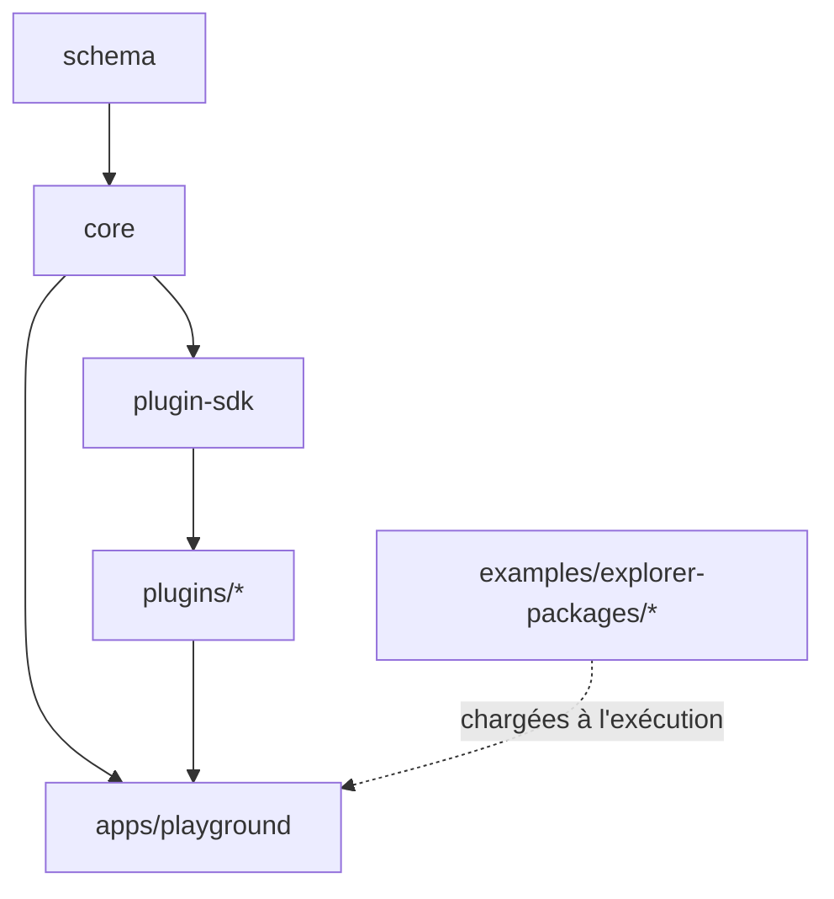

# Chapitre 03 — Structure du projet

> Ce chapitre décrit l'organisation cible du dépôt et **justifie** chaque choix. Il s'agit d'une structure de référence : aucun fichier n'est créé à ce stade, mais tout futur code DOIT s'y conformer.

---

## 3.1 Principes d'organisation

La structure suit quatre principes :

1. **Monorepo modulaire** — Le moteur, ses plugins officiels et les exemples de packages cohabitent dans un même dépôt, en *workspaces* séparés. Cela facilite le développement coordonné tout en gardant des frontières nettes.
2. **Séparation moteur / contenu / applications** — Le code du moteur (`packages/`) est strictement distinct des données d'exemples (`examples/explorer-packages/`) et des applications de démonstration (`apps/`).
3. **Une frontière = un dossier** — Chaque module du chapitre 02 correspond à un dossier dédié, avec une API publique explicite (un point d'entrée `index`), et pas d'import « en profondeur » depuis l'extérieur.
4. **Colocalisation** — Tests, types et documentation d'un module vivent à côté de ce module.

---

## 3.2 Arborescence de haut niveau

```
explorer-engine/
├── docs/                      # Cette documentation (source de vérité)
├── packages/                  # Code publiable (moteur + plugins officiels)
│   ├── core/                  #   @explorer-engine/core — le moteur
│   ├── plugin-sdk/            #   @explorer-engine/plugin-sdk — API pour écrire des plugins
│   ├── plugins/               #   Plugins officiels (un sous-dossier chacun)
│   │   ├── measure/
│   │   ├── annotations/
│   │   ├── guided-tour/
│   │   ├── minimap/
│   │   └── audio-spatial/
│   └── schema/                #   @explorer-engine/schema — schéma du config.json + validation
├── apps/                      # Applications (non publiées)
│   ├── playground/            #   Bac à sable de développement (charge un package local)
│   └── docs-site/             #   (optionnel) site de documentation
├── examples/
│   └── explorer-packages/     # Packages d'exemple (PC, montre, voiture…) — DATA, pas de code moteur
│       ├── gaming-pc/
│       ├── watch/
│       └── car/
├── tools/                     # Scripts internes (validation de package, conversion assets, CI helpers)
├── tests/                     # Tests transverses / e2e (les tests unitaires sont colocalisés)
├── .github/                   # CI, templates PR/issues
├── package.json               # Racine du workspace (scripts, config workspaces)
├── tsconfig.base.json         # Config TypeScript de base partagée
└── README.md
```

---

## 3.3 Structure interne du moteur (`packages/core`)

Chaque module du chapitre 02 est un dossier. La structure est **par domaine** (feature-based), pas par type technique.

```
packages/core/
├── src/
│   ├── engine/                # Kernel : orchestration, cycle de vie, contexte, API publique
│   ├── rendering/
│   │   ├── renderer/          # Renderer (WebGL, post-processing)
│   │   ├── scene/             # Scene Manager
│   │   ├── camera/            # Camera Manager
│   │   ├── controls/          # Controls Manager
│   │   ├── lighting/          # Lighting Manager
│   │   └── environment/       # Environment Manager
│   ├── content/
│   │   ├── model-loader/      # Model Loader (glTF/Draco/KTX2)
│   │   └── resources/         # Resource Manager (fetch, cache)
│   ├── interaction/
│   │   ├── hotspots/          # Hotspot Manager
│   │   ├── selection/         # Selection Manager
│   │   ├── focus/             # Focus Manager
│   │   └── states/            # State Manager
│   ├── animation/             # Animation Manager (tweens, timelines, mixer)
│   ├── ui/                    # UI Manager (overlay, panneaux, toolbar, loaders)
│   ├── theme/                 # Theme Manager (design tokens)
│   ├── config/               # Config Loader (chargement + normalisation ; le schéma vit dans packages/schema)
│   ├── plugins/               # Plugin Manager (cycle de vie, contexte d'API)
│   ├── events/                # Event Bus (pub/sub typé)
│   ├── diagnostics/           # Logger, overlay perf
│   ├── math/                  # Utilitaires géométriques partagés (si besoin)
│   ├── types/                 # Types publics transverses
│   └── index.ts               # API publique du moteur (barrel exports)
├── tests/                     # (ou colocalisé *.test.ts par module)
├── package.json
└── README.md
```

### 3.3.1 Convention interne d'un module

Chaque dossier de module DEVRAIT contenir :

| Fichier | Rôle |
|---------|------|
| `index` | Point d'entrée / API publique du module (le seul import autorisé depuis l'extérieur). |
| `*.contract` (ou `types`) | Interface(s) et types exposés du module. |
| implémentation | Le corps du module. |
| `*.test` | Tests unitaires colocalisés. |
| `README.md` (optionnel) | Notes internes renvoyant au chapitre de doc correspondant. |

> **Règle d'import** : l'extérieur d'un module importe **uniquement** son point d'entrée (`.../hotspots`), jamais un fichier interne (`.../hotspots/internal/projector`). Cette règle est vérifiée par le linter (chapitre 15).

---

## 3.4 Structure d'un plugin officiel (`packages/plugins/*`)

```
packages/plugins/measure/
├── src/
│   ├── index.ts               # Export du plugin (objet conforme au contrat de plugin)
│   ├── measure-plugin.*       # Implémentation
│   ├── ui/                    # Composants UI propres au plugin
│   └── measure.test.*
├── package.json               # dépend de @explorer-engine/plugin-sdk (pas de core en direct)
└── README.md
```

Les plugins dépendent du **`plugin-sdk`** (API stable et restreinte), **jamais** des internes du `core`. Voir [chapitre 10](./10-plugins.md).

---

## 3.5 Structure d'un package d'exemple (`examples/explorer-packages/*`)

> Ce sont des **données**, pas du code. Détaillé au [chapitre 04](./04-explorer-packages.md).

```
examples/explorer-packages/gaming-pc/
├── config.json
├── models/
│   └── gaming-pc.glb
├── assets/
│   ├── textures/
│   ├── audio/
│   └── env/
├── locales/                   # (optionnel) i18n du contenu
│   ├── fr.json
│   └── en.json
└── preview.jpg                # vignette
```

---

## 3.6 Justification des choix

| Choix | Alternative écartée | Justification |
|-------|---------------------|---------------|
| **Monorepo (workspaces)** | Multi-repos séparés | Développement coordonné moteur+plugins+exemples, versionnage cohérent, refactors transverses simples. Frontières préservées par des packages distincts. |
| **Feature-based** (par domaine) | Layer-based (`components/`, `services/`, `utils/`) | Aligne le code sur l'architecture du chapitre 02 : un module = un dossier. Facilite l'ownership et le raisonnement local. |
| **`plugin-sdk` séparé** | Plugins important `core` directement | Fige un contrat stable et minimal pour les plugins, protège les internes du moteur, permet de faire évoluer le core sans casser les plugins. |
| **`schema` en package dédié** | Schéma noyé dans `core` | Le schéma du `config.json` est réutilisable par des outils (validateur CLI, futur Explorer Studio) sans embarquer tout le moteur. |
| **`examples` = data pure** | Exemples mêlés au code | Prouve et impose la séparation moteur/contenu (P1). Un exemple ne contient jamais de code moteur. |
| **`apps/playground`** | Développer contre un exemple directement | Environnement de dev isolé pour itérer sur le moteur avec HMR, sans polluer les packages publiables. |
| **Tests colocalisés** | Dossier `tests/` monolithique | Proximité code/tests, meilleure maintenabilité ; `tests/` racine réservé à l'e2e/transverse. |
| **API publique par barrel (`index`)** | Imports profonds libres | Contrôle de la surface publique, refactors internes sûrs, application de la règle d'encapsulation. |

---

## 3.7 Frontières et règles de dépendances entre workspaces



Règles normatives :

1. `schema` ne dépend de rien d'interne (feuille de l'arbre).
2. `core` peut dépendre de `schema`. `core` **ne dépend pas** des plugins.
3. `plugin-sdk` expose une façade au-dessus du `core` ; les plugins dépendent **uniquement** du `plugin-sdk`.
4. `examples/*` ne contient **aucune** dépendance de code ; c'est de la donnée chargée à l'exécution.
5. `apps/*` peut tout consommer mais n'est **jamais** consommé par le reste.

---

## 3.8 Outils de dépôt (`tools/`)

Sans préjuger de l'implémentation (à venir), le dossier `tools/` hébergera des utilitaires **hors moteur** :

| Outil | Fonction |
|-------|----------|
| `validate-package` | Valide un Explorer Package (schéma du `config.json`, existence des assets, cohérence des références de nœuds). |
| `optimize-model` | Aide à la conversion/compression des GLB (Draco, KTX2, Meshopt) — wrapper autour d'outils standard. |
| `new-package` | Génère le squelette d'un Explorer Package. |
| `new-plugin` | Génère le squelette d'un plugin conforme au SDK. |

Ces outils préfigurent certaines briques d'*Explorer Studio* (chapitre 18) mais restent en ligne de commande pour la v1.

---

## 3.9 Ce que la structure garantit

- **P1 (Engine ≠ Content)** est matérialisé physiquement : `packages/` (moteur) vs `examples/` (contenu).
- **P3/P5 (modularité, contrats)** : un module = un dossier avec une API publique unique.
- **Extensibilité** : ajouter un plugin = ajouter un dossier dans `packages/plugins/`, sans toucher au core.
- **Longévité** : le versionnage indépendant du `schema` et du `plugin-sdk` protège la compatibilité ascendante des packages et des plugins.
