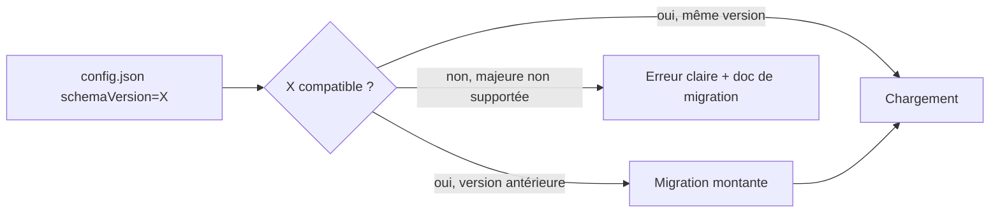
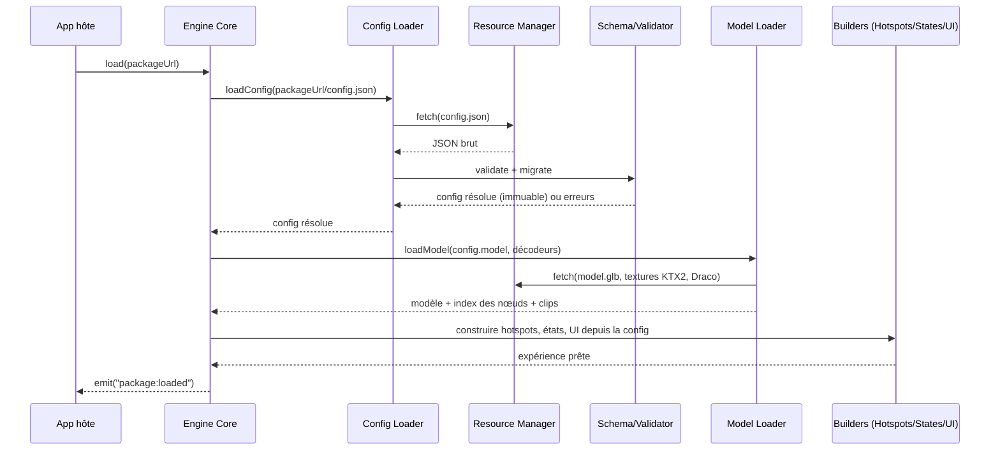
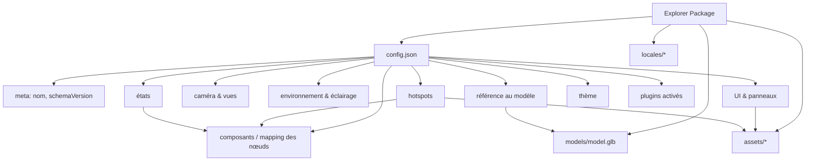

# Chapitre 04 — Explorer Packages

> L'Explorer Package est l'unité de contenu du moteur. Ce chapitre définit précisément ce qu'est un package, sa structure, ses règles, et la manière dont le moteur le charge. Le format du `config.json` lui-même est traité au [chapitre 05](./05-config-format.md).

---

## 4.1 Définition

Un **Explorer Package** est un ensemble **autonome et portable** de fichiers qui décrit **entièrement** une expérience d'exploration pour un objet 3D donné. Il ne contient **aucun code moteur**.

> **Principe fondateur (P1)** : le moteur est générique ; le package est spécifique. Charger un package différent = explorer un objet différent, sans modifier le moteur.

Un package répond à la question : *« Quel objet, avec quels composants, quels hotspots, quels états, quelle présentation ? »*. Le moteur répond à : *« Comment rendre, animer et faire interagir tout cela ? »*.

### 4.1.1 Ce qu'un package CONTIENT

- Un **modèle 3D** (GLB/glTF) — l'objet lui-même.
- Un **fichier de configuration** (`config.json`) — la description déclarative de l'expérience.
- Des **ressources** (assets) : textures additionnelles, environment maps, audio, images de panneaux, icônes de hotspots, éventuels clips d'animation externes.
- Optionnellement : des **traductions** (i18n), une **vignette** de prévisualisation, des **métadonnées**.

### 4.1.2 Ce qu'un package NE CONTIENT PAS

- Aucun code exécutable du moteur.
- Aucune logique impérative (sauf via un plugin, qui est du code **moteur**/extension, pas du contenu — voir chapitre 10).
- Aucune dépendance vers une version spécifique du moteur autre que la déclaration d'une **version de schéma**.

---

## 4.2 Structure d'un package

### 4.2.1 Arborescence normative

```
<package>/
├── config.json                # OBLIGATOIRE — description de l'expérience
├── models/
│   └── model.glb              # OBLIGATOIRE — modèle principal (nom libre, référencé dans config)
├── assets/                    # OPTIONNEL — ressources
│   ├── textures/             #   textures additionnelles
│   ├── env/                  #   environment maps (HDR/EXR ou KTX2 prefiltré)
│   ├── audio/                #   sons / narrations
│   ├── icons/                #   icônes de hotspots
│   └── images/               #   images des panneaux d'information
├── locales/                   # OPTIONNEL — internationalisation du contenu
│   ├── fr.json
│   └── en.json
├── preview.jpg                # OPTIONNEL — vignette de la galerie
└── package.meta.json          # OPTIONNEL — métadonnées (auteur, version, licence)
```

### 4.2.2 Règles structurelles (normatives)

1. `config.json` DOIT se trouver à la racine du package.
2. Tous les chemins d'assets référencés dans `config.json` sont **relatifs à la racine du package**. Aucun chemin absolu système ; les URL distantes sont autorisées seulement si explicitement permises par la politique de chargement (voir §4.4.4).
3. Le modèle principal DOIT être un **GLB** (glTF binaire) valide (glTF 2.0). Le format `.gltf` + fichiers séparés est **toléré** mais le GLB (auto-contenu) est **recommandé** pour la portabilité.
4. Un package DOIT être **auto-suffisant** : déplacé dans un autre hébergement, il fonctionne à l'identique (aucune dépendance implicite au chemin d'origine).
5. Les identifiants de composants référencés dans `config.json` DOIVENT correspondre à des **noms de nœuds réels** du GLB (le validateur vérifie cette cohérence — voir §4.6).

---

## 4.3 Cycle de vie et versionnage d'un package

### 4.3.1 Version de schéma

Chaque `config.json` déclare une propriété `schemaVersion` (voir chapitre 05). Le moteur :

- **Accepte** un package dont la `schemaVersion` est **compatible** avec la version de schéma qu'il supporte (compatibilité ascendante au sein d'une majeure).
- **Migre** si nécessaire via des migrations déclarées (le `Config Loader` applique des transformations montantes déterministes).
- **Refuse proprement** (message clair) un package d'une majeure non supportée, sans planter.



### 4.3.2 Métadonnées (`package.meta.json`)

Informations non fonctionnelles : `name`, `author`, `version` (du package, distincte du schéma), `license`, `description`, `createdAt`, `tags`. Utilisées par des galeries/outillages, ignorées par le rendu.

---

## 4.4 Comment le moteur charge un package

### 4.4.1 Vue d'ensemble du pipeline de chargement



### 4.4.2 Étapes détaillées

| Étape | Module | Description | Erreur possible → traitement |
|-------|--------|-------------|------------------------------|
| 1. Résolution de la racine | Core | Détermine l'URL de base du package. | URL invalide → erreur immédiate. |
| 2. Fetch config | Resource Manager | Récupère `config.json`. | 404/réseau → erreur claire + retry selon politique. |
| 3. Parse & valide | Config Loader + Schema | Parse JSON, valide contre le schéma, applique défauts, migre. | Invalide → liste d'erreurs pointant les propriétés fautives. |
| 4. Normalise chemins | Config Loader | Résout les chemins d'assets relatifs → URL absolues. | Chemin hors package → rejet (sécurité). |
| 5. Charge le modèle | Model Loader | GLB + décodeurs Draco/KTX2/Meshopt ; indexe les nœuds. | Nœud config absent du GLB → warning/erreur selon sévérité. |
| 6. Précharge assets critiques | Resource Manager | Env map, textures d'UI essentielles. | Manquant → placeholder + warning. |
| 7. Construit l'expérience | Builders | Instancie hotspots, états, UI, thème, plugins. | Référence invalide → dégradation ciblée. |
| 8. Prêt | Core | Émet `package:loaded`, retire le loader. | — |

### 4.4.3 Chargement progressif (lazy)

Le moteur DEVRAIT charger **d'abord le minimum vital** (config + modèle + env par défaut) pour afficher l'objet au plus vite, puis charger **paresseusement** :

- les images/audio des panneaux **au moment de leur ouverture** ;
- les LOD haute résolution **quand la caméra s'approche** ;
- les ressources d'un état **avant** la transition vers cet état (préchargement anticipé).

Voir la stratégie détaillée au [chapitre 14](./14-performances.md).

### 4.4.4 Politique de chargement et sécurité

- Par défaut, un package charge **uniquement** des ressources **relatives** à sa racine.
- Les **URL distantes** (CDN externe) sont autorisées seulement si l'application hôte les autorise explicitement (liste blanche de domaines). Ceci protège contre l'exfiltration et le contenu non maîtrisé.
- Le contenu textuel des panneaux (descriptions) est traité comme **donnée** : tout rendu HTML éventuel DOIT être **assaini** (sanitization) pour éviter l'injection (le contenu d'un package n'est pas nécessairement de confiance).

---

## 4.5 Sources et distribution d'un package

Un package peut être servi depuis :

| Source | Usage |
|--------|-------|
| Dossier statique / CDN | Cas nominal : hébergement web classique. |
| Archive (`.zip`) dézippée à l'exécution | Distribution en un seul fichier (option d'outillage). |
| Système de fichiers local (dev) | Développement via `apps/playground`. |
| API / génération dynamique | Un backend peut générer le `config.json` à la volée (le moteur ne voit qu'une URL). |

Le moteur ne connaît que des **URL** : la stratégie de distribution est transparente pour lui.

---

## 4.6 Validation d'un package

La validation est une exigence de robustesse (P6). Elle intervient à deux moments :

1. **Hors ligne (outil `validate-package`, chapitre 03/16)** — avant publication : schéma du `config.json`, présence des assets, correspondance des identifiants de nœuds avec le GLB, tailles/poids recommandés.
2. **À l'exécution (Config Loader)** — validation défensive : schéma, chemins, cohérence minimale ; en cas d'erreur, dégradation gracieuse et diagnostic.

### 4.6.1 Niveaux de sévérité

| Niveau | Exemple | Comportement moteur |
|--------|---------|---------------------|
| **Erreur bloquante** | `config.json` absent/invalide, GLB illisible | Arrêt du chargement, message clair, pas d'écran noir. |
| **Erreur ciblée** | Hotspot référence un nœud inexistant | Le hotspot fautif est ignoré ; le reste fonctionne ; warning. |
| **Avertissement** | Texture manquante, poids excessif | Placeholder + warning diagnostic ; expérience continue. |
| **Info** | Propriété dépréciée | Log info ; migration suggérée. |

---

## 4.7 Anatomie logique d'un package (récapitulatif)



Ce diagramme préfigure la structure du `config.json`, détaillée au chapitre suivant.

---

## 4.8 Portabilité et capacités (v2, C8)

La v1 disait un package « autonome et portable » tout en exigeant que ses plugins soient enregistrés côté hôte — contradiction. Reformulation v2 :

- Un package est **data-only et portable sur tout runtime conforme au profil de capacités qu'il déclare** (`requiredCapabilities`, chapitre 05).
- Le **runtime de référence** garantit un jeu de plugins/capacités standard (chapitre 10) ; un package n'utilisant que ces capacités est portable partout.
- Une capacité `required` absente → **dégradation gracieuse** (fonctionnalité désactivée + diagnostic), jamais d'échec global ; `optional` absente → ignorée.

## 4.9 Chargement : annulation et concurrence (v2, C16)

- Le pipeline de chargement (fetch → décodage WASM Draco/KTX2 → build) est **annulable de bout en bout** via un **jeton d'annulation** (`AbortSignal`).
- Politique : **un seul chargement actif à la fois** — un nouveau `load(url)` **annule proprement** le précédent (fetches avortés, décodeurs stoppés, ressources partielles libérées), sans race ni fuite.
- Le `dispose` du package sortant est coordonné avec l'annulation.

## 4.10 Règles d'or du package (synthèse normative — v2)

1. Un package est **data-only** et **portable sur tout runtime conforme au profil de capacités déclaré** (C8).
2. Tous les chemins sont **relatifs** à la racine du package ; les `$ref` aussi (C17).
3. Les composants référencent les nœuds par **`explorerId`** (repli nom + warning — C5).
4. Le package déclare une **`schemaVersion`** (+ `requiredCapabilities` si besoin).
5. Le moteur **valide**, **dégrade gracieusement** et **annule proprement** les chargements ; il ne plante jamais.
6. Aucun package ne requiert de **modification du moteur** pour fonctionner (P1).
