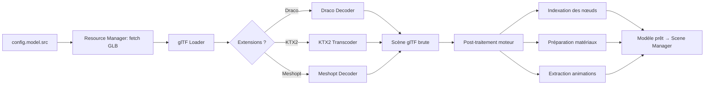

# Chapitre 06 — Gestion des modèles 3D

> Ce chapitre décrit tout le cycle de vie d'un modèle 3D dans le moteur : chargement, optimisation, matériaux, textures, animations, LOD, compression et performances. Il concerne principalement le **Model Loader**, le **Resource Manager**, le **Scene Manager** et le **Lighting Manager**.

---

## 6.1 Format pivot : glTF 2.0 / GLB

Le moteur adopte **glTF 2.0** (binaire **GLB** recommandé) comme format pivot unique.

**Pourquoi glTF/GLB :**

| Critère | Bénéfice |
|---------|----------|
| Standard ouvert (Khronos) | Pérennité, large support des outils (Blender, Substance, etc.). |
| PBR natif | Rendu physiquement réaliste cohérent entre outils. |
| Auto-contenu (GLB) | Un seul fichier : modèle + matériaux + textures + animations → package portable. |
| Extensions | Draco, KTX2, Meshopt, lumières, variants matériaux… |
| « JPEG de la 3D » | Optimisé pour la livraison web, pas pour l'édition. |

Le moteur **consomme** du glTF ; il ne convertit pas depuis les formats d'auteur (FBX, OBJ, STEP…). La conversion est une étape de préparation du package (outil `optimize-model`, hors moteur).

---

## 6.2 Chargement

### 6.2.1 Pipeline de chargement du modèle

### 6.2.2 Décodeurs

- **Draco** : décodeur de géométrie (WASM). Chargé **paresseusement** uniquement si le GLB utilise l'extension `KHR_draco_mesh_compression`.
- **KTX2/Basis** : transcodeur de textures GPU (WASM). Chargé si l'extension `KHR_texture_basisu` est présente. Nécessite la détection des capacités GPU (formats supportés : ASTC, ETC, BC/S3TC…).
- **Meshopt** : décodeur (WASM) pour `EXT_meshopt_compression`.

Les décodeurs sont des ressources **partagées** (singletons) gérées par le moteur, jamais rechargées par package.

### 6.2.3 Progression et erreurs

- Le loader rapporte une **progression** (octets chargés / total) → alimente le loader UI.
- Gestion d'erreurs : GLB illisible → erreur bloquante ; texture/décodeur manquant → dégradation (placeholder) ; timeout réseau → retry selon politique du Resource Manager.

### 6.2.4 Normalisation au chargement

Selon la config `model` (chapitre 05) :

- **Échelle** (`scale`), **axe up** (`up`), **recentrage** (`center`).
- Calcul de la **bounding box / sphere** globale (sert au cadrage caméra, aux plans near/far, au sol).
- Vérification/ajustement du **color space** des textures (couleurs en sRGB, données techniques — normal/roughness/metalness — en linéaire).

---

## 6.3 Indexation des nœuds

Étape critique pour la généricité : le moteur construit un **index** `nom de nœud → objet 3D`. Cet index est la **colonne vertébrale** des hotspots, du focus, de la sélection et des états — tous référencent des composants par le nom de leurs nœuds (chapitre 05, `components`).

- Les noms proviennent de la structure du GLB (définie par le créateur dans son outil 3D).
- Le moteur DEVRAIT tolérer les collisions de noms (plusieurs nœuds homonymes) en indexant en listes.
- Recommandation de package : **nommer proprement** les nœuds (convention documentée), car c'est le pont entre le modèle et la config.

---

## 6.4 Matériaux

### 6.4.1 Modèle PBR

Le moteur s'appuie sur le **PBR metallic-roughness** de glTF (couleur de base, métallicité, rugosité, normal map, occlusion, émissif). Support des extensions matériaux courantes selon disponibilité (clearcoat, transmission/verre, sheen…), activées à la demande pour maîtriser le coût.

### 6.4.2 Surcharges par la config

Les états et le focus peuvent **surcharger** temporairement des propriétés matérielles **sans altérer** le matériau d'origine :

| Surcharge | Usage |
|-----------|-------|
| `opacity` / `transparent` | États `Transparent`, `X-ray`, dimming du focus. |
| `wireframe` | Vue technique. |
| `color` / `emissive` | Surbrillance (hover, sélection). |
| `outline` | Contour de mise en valeur (post-processing, pas une prop matériau au sens strict). |

**Règle** : toute surcharge est **réversible**. Le moteur conserve l'état d'origine et le restaure (retour d'état/focus). Les surcharges DEVRAIENT réutiliser/cloner les matériaux avec parcimonie pour éviter l'explosion mémoire (voir 6.8).

### 6.4.3 Gestion de la transparence

La transparence est coûteuse et source d'artefacts (tri, depth). Le moteur :

- Active `transparent` **uniquement** quand nécessaire (états concernés).
- Gère l'ordre de rendu et le `depthWrite` pour limiter les artefacts.
- DEVRAIT préférer, quand c'est possible, des techniques stables (dithering/alpha-hash) pour les états semi-transparents étendus.

---

## 6.5 Textures

| Aspect | Règle |
|--------|-------|
| **Format livraison** | **KTX2/Basis** recommandé (compression GPU, mémoire réduite). Fallback PNG/JPEG toléré. |
| **Color space** | Base color/emissive en **sRGB** ; normal/roughness/metalness/AO en **linéaire**. Le loader corrige selon glTF. |
| **Mipmaps** | Générés/attendus pour la qualité en éloignement et la performance. |
| **Résolution** | Budgétée (chapitre 14) ; le package DEVRAIT fournir des tailles raisonnables (souvent ≤ 2K, 4K réservé aux gros plans). |
| **Anisotropie** | Réglable ; bornée selon capacités GPU. |
| **Atlas** | Le regroupement de textures réduit les draw calls (préparation package). |

---

## 6.6 Animations

Deux sources d'animation coexistent :

1. **Clips intégrés au GLB** (`KHR_animation`) : rig, mécanismes (aiguilles, ventilateurs, pistons…). Extraits par le Model Loader et confiés à l'**Animation Manager** (mixer).
2. **Animations générées par le moteur** : transitions d'états, focus, caméra, hotspots — produites par l'**Animation Engine** (tweens/timelines), voir [chapitre 11](./11-animation-engine.md).

| Aspect | Règle |
|--------|-------|
| Nommage des clips | Déclaré/normalisé via `animations.clips` (chapitre 05) pour les référencer par `id` stable. |
| Contrôle | Play/pause/seek/loop/vitesse via l'Animation Manager. |
| Combinaison | Un clip GLB peut coexister avec des tweens moteur (ex. ventilateur qui tourne pendant un focus). |
| Coût | Le skinning/morph target a un coût GPU/CPU ; budgété (chapitre 14). |

---

## 6.7 Niveaux de détail (LOD)

### 6.7.1 Principe

Afficher moins de détail quand l'objet/composant est loin ou petit à l'écran, pour économiser le GPU.

### 6.7.2 Stratégies supportées

| Stratégie | Description | Source |
|-----------|-------------|--------|
| **LOD discrets** | Plusieurs versions d'un mesh (`LOD0` haute, `LOD1` moyenne, `LOD2` basse), commutées selon la distance/taille écran. | Fournis dans le GLB (convention de nommage) ou via config `model.lod`. |
| **Décimation à la préparation** | Réduction de polygones hors ligne (outil `optimize-model`). | Préparation package. |
| **Culling** | Frustum culling (hors champ) natif ; occlusion culling optionnel. | Moteur. |
| **Lazy detail** | Charger le mesh/texture haute résolution **au rapprochement** (streaming). | Moteur + Resource Manager. |

### 6.7.3 Configuration

`model.lod` (chapitre 05) : `{ enabled, hysteresis, distances?: number[], strategy }`. Le moteur applique une **hystérésis** pour éviter le clignotement (flip-flop) aux frontières de LOD.

---

## 6.8 Optimisation et performances

> Objectifs chiffrés au [chapitre 14](./14-performances.md). Ici : les leviers spécifiques aux modèles.

### 6.8.1 Réduction des draw calls

| Levier | Effet |
|--------|-------|
| **Instancing** (`InstancedMesh`) | Un seul draw call pour N copies identiques (vis, LED, ailettes de radiateur…). Détecté via convention ou config. |
| **Merge de géométries statiques** | Fusionner les meshes immobiles partageant un matériau. |
| **Atlas de textures / partage de matériaux** | Moins de changements d'état GPU. |

### 6.8.2 Gestion mémoire

- **Dispose systématique** : géométries, matériaux, textures et cibles de rendu sont libérés (`dispose`) au teardown ou au changement de package. C'est une **exigence** (P6, chapitre 15).
- **Déduplication** : textures/matériaux identiques partagés via le cache du Resource Manager.
- **Clonage maîtrisé** : les surcharges de matériaux (états/focus) évitent de dupliquer inutilement ; utilisation de propriétés/overrides plutôt que de nouveaux matériaux quand possible.
- **Budget de textures** : suivi de la mémoire GPU des textures ; en cas de dépassement, dégradation (résolution réduite).

### 6.8.3 Compression (résumé)

| Cible | Technologie | Gain |
|-------|-------------|------|
| Géométrie | **Draco** / Meshopt | Réduit fortement la taille de téléchargement. |
| Textures | **KTX2/Basis** (ASTC/ETC/BC selon GPU) | Réduit le **poids ET la mémoire GPU** (contrairement à PNG/JPEG qui se décompressent en mémoire non compressée). |
| Ensemble | gzip/brotli au transport | Complète la compression des assets. |

> **Point clé** : KTX2 réduit la mémoire **GPU** (texture reste compressée sur le GPU), là où PNG/JPEG ne réduisent que le téléchargement. C'est un levier majeur pour le budget mémoire (chapitre 14).

---

## 6.9 Recommandations de préparation d'un package (côté créateur)

Ces recommandations conditionnent la performance ; elles seront reprises dans le guide auteur et l'outil de validation.

1. **Nommer proprement les nœuds** (ils sont le pont vers la config).
2. **Compresser** : Draco (géométrie) + KTX2 (textures) + Meshopt.
3. **Budget de polygones** raisonnable ; fournir des **LOD** pour les objets lourds.
4. **Textures** : résolution adaptée, atlas, mipmaps, color space correct.
5. **Instancier** les éléments répétés.
6. **Nettoyer** : supprimer les objets cachés inutiles, doublons, caméras/lumières d'auteur non désirées.
7. **Origines et pivots** cohérents (les transforms d'états s'appuient dessus).
8. **Valider** avec l'outil `validate-package` avant publication.

---

## 6.10 Responsabilités croisées (récapitulatif)

| Tâche | Module responsable |
|-------|--------------------|
| Fetch + cache des fichiers | Resource Manager |
| Décodage GLB/Draco/KTX2/Meshopt | Model Loader |
| Indexation des nœuds | Model Loader → Scene Manager |
| Insertion dans la scène | Scene Manager |
| Matériaux & env map | Model Loader + Lighting/Environment Manager |
| Clips d'animation | Model Loader → Animation Manager |
| LOD / instancing runtime | Model Loader + Renderer/Scene |
| Libération mémoire | Tous (via `dispose` orchestré par le Core) |
