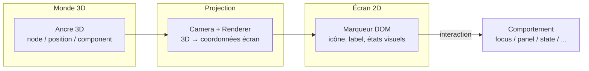
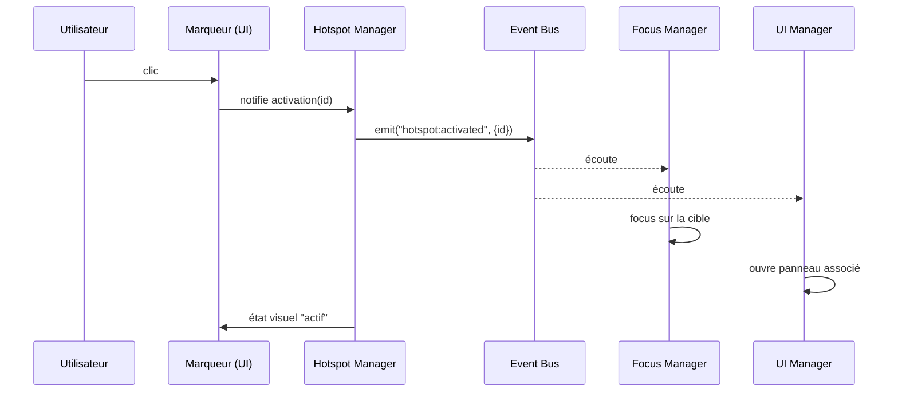
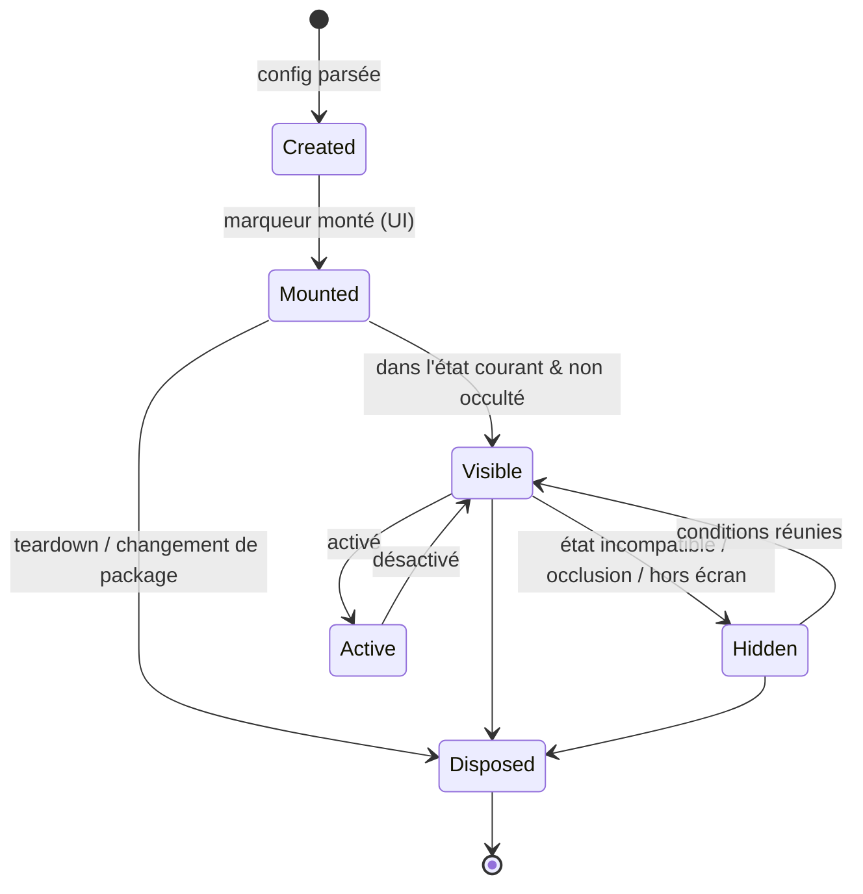

# Chapitre 07 — Hotspots

> Les hotspots sont les points d'intérêt ancrés sur le modèle 3D et projetés en 2D à l'écran. Ils sont la principale porte d'entrée de l'interaction. Ce chapitre décrit leur fonctionnement complet : création, projection, interaction, animations, cycle de vie, occlusion, comportement et accessibilité.

---

## 7.1 Définition et anatomie

Un **hotspot** est une entité hybride :

- une **ancre 3D** (un point dans l'espace du modèle) ;
- un **marqueur 2D** (élément DOM/overlay) affiché à la position projetée de l'ancre ;
- un **comportement** déclenché à l'interaction (focus, panneau, état, animation, événement).

> **Séparation des responsabilités** : la **logique** (ancrage, projection, occlusion, état) appartient au **Hotspot Manager** ; le **rendu visuel** du marqueur appartient à l'**UI Manager**, qui reçoit les positions calculées. Cela respecte la frontière rendu 3D / UI 2D (chapitre 02).

---

## 7.2 Création

### 7.2.1 Source déclarative

Les hotspots sont définis dans `config.hotspots` (chapitre 05). Aucun hotspot n'est codé en dur. Le **Hotspot Manager** les instancie au chargement du package.

### 7.2.2 Types d'ancrage

| Type d'ancre | Forme | Usage |
|--------------|-------|-------|
| **Par nœud** | `{ node: "GPU" }` | Suit un nœud nommé (bouge avec lui lors des états/animations). |
| **Par composant** | `{ component: "gpu" }` | Ancré au centre (bounding box) d'un composant logique. |
| **Par position fixe** | `{ position: [x,y,z] }` | Point libre dans l'espace du modèle. |
| **Avec offset** | `{ node, offset: [x,y,z] }` | Décalage par rapport à l'ancre (ex. au-dessus d'une pièce). |

> Une ancre par **nœud/composant** suit les transformations (états `Exploded`, animations), ce qui maintient le hotspot « collé » à son composant. Une ancre par **position** reste fixe dans l'espace du modèle.

### 7.2.3 Sources programmatiques

Un **plugin** (chapitre 10) PEUT créer des hotspots dynamiquement via l'API (ex. génération automatique, annotations utilisateur). Ces hotspots suivent le même cycle de vie que les hotspots déclaratifs.

---

## 7.3 Projection (3D → 2D)

### 7.3.1 Principe

À chaque frame (ou à chaque changement de caméra), le Hotspot Manager projette la position 3D de l'ancre vers des **coordonnées écran** (pixels) via la matrice caméra, puis transmet ces coordonnées à l'UI Manager qui positionne le marqueur.

### 7.3.2 Optimisation de la projection

La projection par frame de nombreux hotspots peut être coûteuse. Le moteur :

- Ne recalcule que si la **caméra ou l'objet a bougé** (dirty flag) — pas de recalcul inutile sur scène statique.
- Regroupe les mises à jour DOM (batch) pour éviter les reflows multiples.
- Utilise des transforms CSS (`translate3d`) plutôt que `top/left` pour rester sur le compositeur GPU.
- Applique un **culling** : les hotspots hors écran ou derrière la caméra ne sont pas rendus.

### 7.3.3 Profondeur et échelle

- Les hotspots PEUVENT varier de **taille/opacité** selon la distance à la caméra (les plus proches plus visibles), de façon paramétrable.
- Un **z-index** dérivé de la profondeur assure un empilement correct (le plus proche au-dessus).

---

## 7.4 Occlusion

Un hotspot dont l'ancre est **cachée derrière la géométrie** ne devrait pas s'afficher comme s'il était visible (sinon confusion : on « voit » un point situé de l'autre côté de l'objet).

### 7.4.1 Stratégies d'occlusion

| Stratégie | Principe | Coût | Précision |
|-----------|----------|------|-----------|
| **Raycast** | Rayon caméra → ancre ; si un mesh est touché avant l'ancre, elle est occultée. | Moyen | Bonne |
| **Depth buffer test** | Comparer la profondeur projetée de l'ancre au depth buffer. | Faible (GPU) | Bonne, nécessite lecture depth |
| **Aucune** | `occludable: false` (toujours visible). | Nul | — |

Le comportement par défaut est `occludable: true`. La stratégie concrète est un détail d'implémentation choisi pour respecter le budget de performance (raycast throttlé, ou depth test).

### 7.4.2 Comportement d'un hotspot occulté

Configurable : **masqué** (par défaut), ou **atténué** (semi-transparent, non cliquable), selon `hotspotStyle` du thème. L'occlusion NE DOIT PAS provoquer de clignotement (hystérésis / throttling).

---

## 7.5 Interaction

### 7.5.1 Événements d'entrée

| Interaction | Souris | Tactile | Clavier |
|-------------|--------|---------|---------|
| Survol | `hover` | (n/a) | `focus` |
| Activation | `click` | `tap` | `Enter`/`Espace` |
| Info rapide | `tooltip` au survol | appui long (option) | tooltip au focus |

### 7.5.2 Comportements (actions)

À l'activation, le hotspot déclenche son `action` (chapitre 05, §5.3.8) :

| Action | Effet | Module invoqué |
|--------|-------|----------------|
| `focus` | Met en avant la cible (zoom, isolation). | Focus Manager |
| `openPanel` | Ouvre un panneau d'information. | UI Manager |
| `goToState` | Change l'état de l'objet. | State Manager |
| `playAnimation` | Joue un clip/timeline. | Animation Manager |
| `emit` | Émet un événement personnalisé (consommé par un plugin). | Event Bus |

Une action PEUT être **composite** (séquence) via une timeline (chapitre 11) : ex. « aller à l'état exploded PUIS focus sur le GPU PUIS ouvrir le panneau ».

### 7.5.3 Flux d'interaction type

---

## 7.6 États visuels et animations

### 7.6.1 États d'un marqueur

| État | Déclencheur | Rendu (par défaut) |
|------|-------------|--------------------|
| **Repos** (idle) | défaut | Icône discrète, éventuelle pulsation légère. |
| **Survol** (hover) | pointeur/focus | Agrandissement, label visible, halo. |
| **Actif** (active) | hotspot sélectionné | Mise en évidence marquée, lié au composant en focus. |
| **Occulté** (occluded) | derrière géométrie | Masqué ou atténué (7.4.2). |
| **Désactivé** (disabled) | non pertinent dans l'état courant | Grisé ou masqué. |

### 7.6.2 Animations

- **Apparition/disparition** : fondu + échelle lors du changement d'état ou de visibilité (respecte `prefers-reduced-motion`).
- **Pulsation** d'attention (idle) : subtile, désactivable.
- **Clustering** : quand plusieurs hotspots se chevauchent à l'écran, ils PEUVENT se regrouper en un marqueur « +N » qui se déploie au survol/clic (résolution par `priority`).

Toutes les animations de marqueurs passent par des transitions CSS/UI (pas l'Animation Engine 3D), mais restent cohérentes avec les easings/durées du thème.

---

## 7.7 Visibilité conditionnelle par état

Un hotspot peut n'être pertinent que dans certains états (`visibleInStates`, chapitre 05). Exemples :

- Un hotspot « GPU » n'a de sens qu'en état `open`/`exploded` (invisible quand le boîtier est `closed`).
- Un hotspot « couronne » de montre reste visible dans tous les états.

Le Hotspot Manager écoute `state:changed` et met à jour la visibilité en conséquence (avec animation d'apparition/disparition).

---

## 7.8 Cycle de vie

| Phase | Description | Ressources |
|-------|-------------|-----------|
| **Created** | Instancié depuis la config ; ancre résolue (nœud/composant/position). | — |
| **Mounted** | Marqueur DOM créé, écouteurs attachés, ARIA posé. | DOM + listeners |
| **Visible/Hidden** | Piloté par état courant, occlusion, culling. | — |
| **Active** | En interaction (focus/panneau ouvert). | — |
| **Disposed** | Marqueur retiré, écouteurs détachés, références libérées. | Libère DOM + listeners |

> **Exigence (P6)** : chaque hotspot implémente `dispose` (retrait DOM + désabonnement). Aucun listener orphelin après teardown.

---

## 7.9 Accessibilité

L'accessibilité des hotspots est **obligatoire** (P8). Un hotspot n'est pas qu'un point 3D : c'est un **contrôle interactif**.

| Exigence | Détail |
|----------|--------|
| **Focusable clavier** | Chaque marqueur est atteignable via `Tab` (ordre logique, éventuellement configurable). |
| **Activation clavier** | `Enter`/`Espace` déclenchent l'action. |
| **Rôle & label ARIA** | `role="button"` (ou approprié), `aria-label` = libellé du hotspot. |
| **État annoncé** | `aria-pressed`/`aria-expanded` selon l'état actif/déployé. |
| **Focus visible** | Indicateur de focus net (respect du thème, contraste suffisant). |
| **Navigation alternative** | Une **liste** navigable de tous les hotspots (dans l'UI) permet d'accéder aux points sans manipuler la 3D — essentiel pour les technologies d'assistance. |
| **Reduced motion** | Les pulsations/animations respectent `prefers-reduced-motion`. |
| **Cible tactile** | Taille de cible ≥ recommandations (≈ 44×44 px). |

> La **liste alternative de hotspots** est une exigence forte : la 3D projetée n'est pas nativement accessible ; fournir un équivalent textuel/navigable garantit l'inclusion.

---

## 7.10 Performance des hotspots

| Levier | Règle |
|--------|-------|
| Projection conditionnelle | Recalcul uniquement si caméra/objet a bougé (dirty flag). |
| Batch DOM | Mises à jour de position groupées ; `transform` GPU. |
| Occlusion throttlée | Raycast/depth test à fréquence réduite (ex. quelques Hz), pas chaque frame. |
| Culling | Hotspots hors champ/derrière caméra non rendus. |
| Clustering | Limiter le nombre de marqueurs visibles simultanément. |
| Pool DOM | Réutilisation des éléments DOM plutôt que création/destruction répétée. |

Budget indicatif : la gestion des hotspots ne DOIT PAS faire chuter le frame budget (chapitre 14). Au-delà d'un seuil de hotspots visibles, le clustering s'active.

---

## 7.11 Règles normatives (synthèse)

1. Un hotspot est **déclaré**, jamais codé en dur (P2).
2. La **logique** est au Hotspot Manager ; le **rendu** à l'UI Manager.
3. La projection est **optimisée** (dirty flags, batch, culling).
4. L'occlusion est **par défaut activée** et **throttlée**.
5. Chaque hotspot est **accessible** (clavier, ARIA) et dispose d'un **équivalent liste**.
6. Chaque hotspot **se dispose** proprement (aucun listener orphelin).
