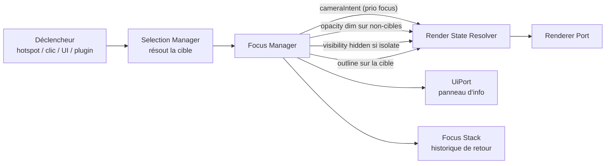
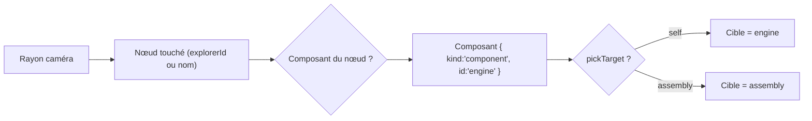
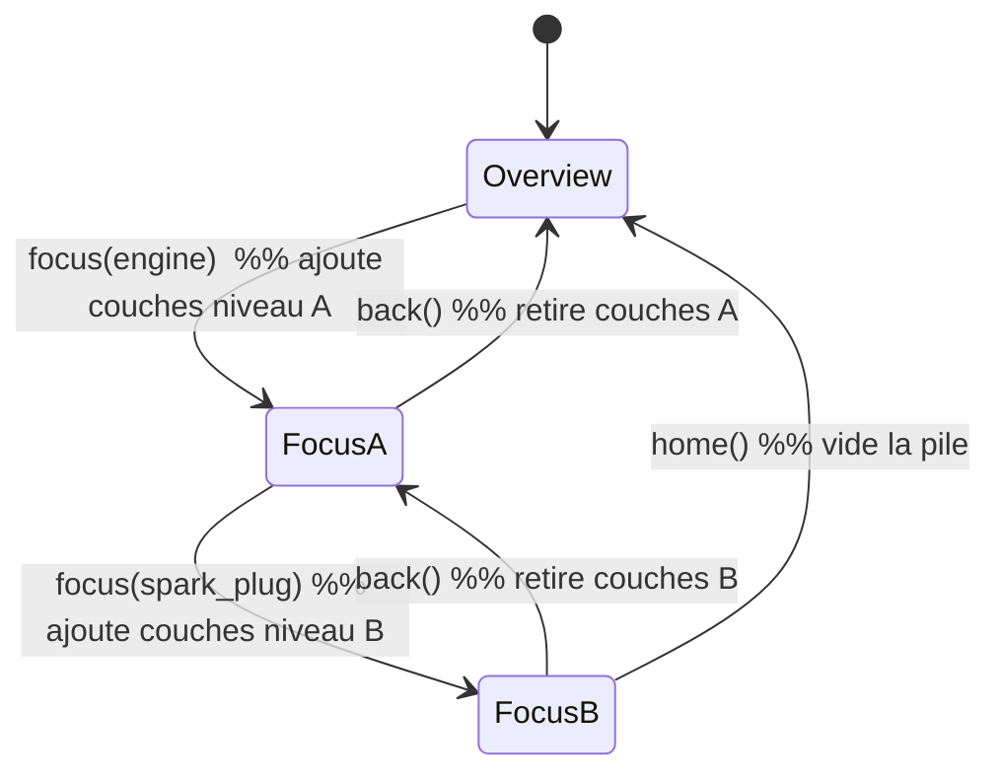

# Chapitre 08 — Focus System (mécanisme)

> **Révisé en spec v2 (corrections C1, C4).** Le Focus est désormais un **mécanisme** transverse et **non un état**. Il ne mute plus la scène : il **publie des couches** au [Render State Resolver](./19-render-state-resolver.md). L'ancien « état `Focus` » est **supprimé** (voir [chapitre 09](./09-etats.md)).

---

## 8.1 Rôle et positionnement (v2)

Le **Focus Manager** transforme une intention (« mettre ce composant en avant ») en un ensemble de **contributions déclaratives** (couches) : une intention de caméra, une atténuation des autres composants, un éventuel contour, une isolation. Il ne « sauvegarde/restaure » rien : entrer en focus = **ajouter des couches** ; sortir = **retirer ces couches**. La réversibilité est garantie par le resolver (C1).

> **Distinction clé (C4)** : le Focus n'est **pas** une valeur de la machine à états. C'est un mécanisme qui coexiste avec l'état courant en y superposant des couches de priorité supérieure.

---

## 8.2 Sélection (inchangé sur le principe)

La sélection détermine la cible du focus.

| Source | Mécanisme |
|--------|-----------|
| **Hotspot** | Action `focus` (chapitre 07). |
| **Clic direct sur la 3D** | Raycasting via le **Selection Manager**. |
| **UI** | Clic dans une liste de composants / breadcrumb / recherche. |
| **Plugin** | Appel programmatique (ex. visite guidée). |

### 8.2.1 Résolution de la granularité (picking)

Le Selection Manager applique la granularité définie par `components[].pickTarget` (chapitre 05), en **adressage typé** (C5) : la cible est un `{ kind: "component" | "group", id }`, jamais un nom de nœud brut.

- **Hover** : le Selection Manager publie une couche `outline`/`colorOverride` de priorité `selection:hover` (70) — plus de mutation directe (C1).
- **Événements** : `selection:changed`, `selection:cleared` (catalogue typé, C9).

---

## 8.3 Cadrage caméra via couche `cameraIntent`

Pour focaliser une cible, le Focus Manager **publie une couche `cameraIntent`** (priorité `focus`, 100) décrivant la pose caméra souhaitée :

1. Bounding sphere de la cible (via Scene *logique* — le core reste headless, cf. C2 ; l'adaptateur fournit les bornes géométriques).
2. Distance pour englober la sphère selon le FOV + marge (`focus.padding`).
3. Direction d'approche : vue préférée du composant, sinon direction courante, sinon direction évitant les occultants.
4. Pose caméra cible (position + lookAt + FOV).

Le RSR, canal `cameraIntent` étant **exclusif par priorité**, retient l'intention du focus tant que la couche existe. Le `RendererPort`/Camera adapter exécute la **transition** (Animation Engine). Pendant la transition, les contrôles sont suspendus ; en focus, ils peuvent être réactivés en mode restreint.

> **Le « retour » n'est plus du code de restauration** : retirer la couche `cameraIntent` du focus fait automatiquement reprendre l'intention suivante (état courant, ou vue par défaut) via recomposition (chapitre 19 §19.5).

---

## 8.4 Mise en avant : couches visuelles

La mise en valeur = **couches** publiées par le Focus Manager (toutes réversibles par retrait) :

| Technique | Couche publiée | Composition |
|-----------|----------------|-------------|
| **Dimming** | `opacity` (basse) sur les non-cibles | `min` (chapitre 19) |
| **Isolation** | `visibility: hidden` sur les non-cibles | `hidden` gagne |
| **Outline** | `outline` sur la cible | priorité |
| **Transparence des occultants** | `opacity` ciblée sur les occultants détectés | `min` |
| **Éclairage dédié** | `lightingIntent` (priorité focus) | exclusif |

Réglages via `config.focus` (chapitre 05). Aucune de ces techniques ne modifie le matériau d'origine : la rest pose reste intacte (chapitre 19 §19.3.3).

---

## 8.5 Information contextuelle

En parallèle, le focus **ouvre l'information** via le `UiPort` (contrat d'UI agnostique, C3/chapitre 12) : panneau associé, mise à jour du breadcrumb, audio éventuel. Coordination par événements typés (`focus:started` → l'adaptateur UI ouvre le panneau). Le core reste découplé de l'implémentation UI.

---

## 8.6 Pile de focus et navigation imbriquée

Le Focus Manager gère une **pile (stack)** de niveaux de focus. Chaque niveau = un ensemble de couches. Empiler un focus ajoute des couches de priorité focus ; dépiler retire les couches du niveau courant (recomposition → le niveau parent reprend).

La pile de focus fait partie de l'**état runtime sérialisable** (chapitre 20) : un focus imbriqué est partageable par URL.

---

## 8.7 Retour (exit)

Le retour est un **retrait de couches**, pas une restauration :

1. Retirer les couches du niveau courant (caméra, opacity, visibility, outline, lighting).
2. Le RSR recompose → l'état effectif redevient celui du niveau parent (ou de l'état courant), **animé** via l'interpolation des couches.
3. Fermeture/mise à jour de l'UI (`focus:ended`).

Déclencheurs : bouton « retour », clic hors cible (option), `Échap`, breadcrumb, ou `back()` programmatique.

---

## 8.8 Interactions avec les autres modules (v2)

| Module | Interaction |
|--------|-------------|
| **Render State Resolver** | Cible principale : le Focus **publie des couches** (caméra, opacity, visibility, outline, lighting). |
| **Selection Manager** | Fournit la cible résolue (adressage typé). |
| **Scene (logique)** | Bounding boxes via le `RendererPort` (core headless). |
| **Animation Engine** | Interpolation des couches (transitions). |
| **UiPort** | Panneau d'info, breadcrumb, bouton retour. |
| **Controls (via adapter)** | Suspension/restriction/restauration des contrôles pendant/après transition. |
| **State Manager** | **Indépendant** : le focus se superpose à l'état courant (priorité supérieure) ; il ne déclenche pas de changement d'état. |

> **Suppression de la double responsabilité** : en v1, Focus et l'état `Focus` mutaient tous deux caméra/matériaux. En v2, il n'existe qu'**un** mécanisme (ce chapitre) produisant des couches ; l'état `Focus` n'existe plus.

---

## 8.9 Paramétrage (config)

Réglages globaux `focus` (chapitre 05) : `padding`, `dimOthers`, `dimOpacity`, `outline`, `isolate`, `transition`. Surcharges par composant (vue préférée) et par hotspot (action `focus`). Le champ `restoreOnExit` de v1 est **supprimé** : le retour est intrinsèque au retrait de couches (plus rien à « restaurer »).

---

## 8.10 Accessibilité et robustesse

| Exigence | Détail |
|----------|--------|
| **Clavier** | Focus déclenchable et sortie (`Échap`) au clavier ; breadcrumb navigable. |
| **Annonce** | Via le **service A11y central** (C17) : « Focus sur GPU » (live region unique). |
| **Reduced motion** | Transitions de couches raccourcies/instantanées si demandé. |
| **Robustesse** | Cible invalide → aucune couche publiée, message doux, aucun plantage. |
| **Interruption** | Un nouveau focus remplace les couches du niveau courant ; l'interpolation repart de la valeur courante (chapitre 19). |

---

## 8.11 Règles normatives (synthèse v2)

1. Le Focus est un **mécanisme**, **jamais un état** (C4).
2. Le Focus **publie des couches** au resolver ; il ne mute pas la scène et ne « restaure » rien (C1).
3. Le cadrage se fait par couche **`cameraIntent`** exclusive par priorité ; le retour = retrait de couche.
4. Le Focus gère une **pile** reflétée par le breadcrumb et **incluse dans l'état sérialisable** (chapitre 20).
5. Le Focus est **indépendant** de la machine à états (superposition, pas transition).
6. Accessibilité et robustesse via le **service A11y central** et le RSR.
