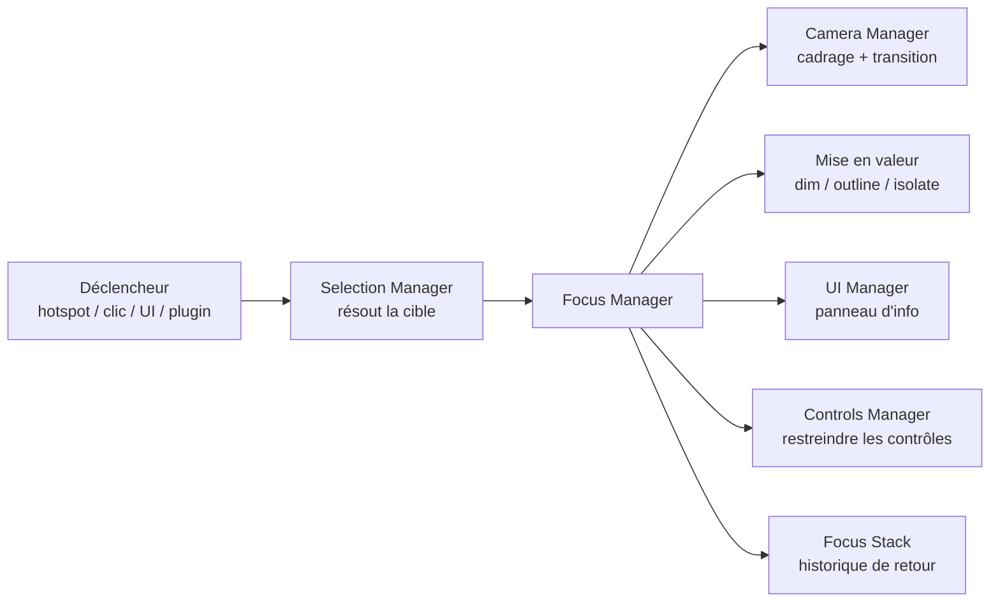
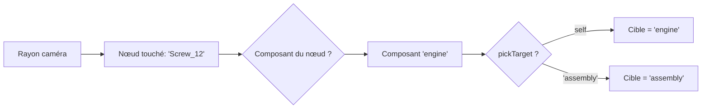
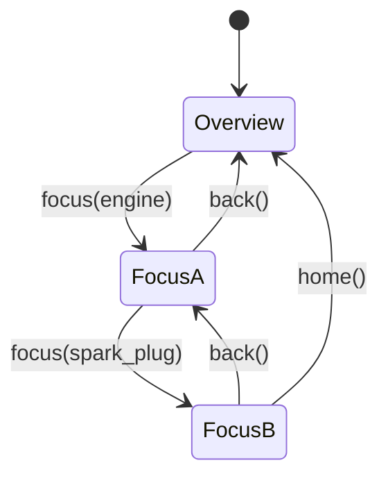

# Chapitre 08 — Focus System

> Le Focus System met en avant un composant sélectionné : il rapproche la caméra, isole visuellement la cible, affiche l'information associée, puis permet de revenir. Ce chapitre décrit précisément la sélection, le zoom, le déplacement caméra, la mise en avant du composant et le retour.

---

## 8.1 Rôle et vue d'ensemble

Le **Focus Manager** transforme une intention (« je veux comprendre ce composant ») en une expérience visuelle claire : la cible devient le centre de l'attention, le reste s'efface, l'information apparaît.

---

## 8.2 Sélection

La sélection est l'étape amont : **quelle** est la cible du focus.

### 8.2.1 Sources de sélection

| Source | Mécanisme |
|--------|-----------|
| **Hotspot** | Action `focus` (chapitre 07). |
| **Clic direct sur la 3D** | Raycasting via le **Selection Manager**. |
| **UI** | Clic dans une liste de composants / breadcrumb / recherche. |
| **Plugin** | Appel programmatique (ex. visite guidée). |

### 8.2.2 Résolution de la granularité (picking)

Un clic sur la géométrie touche un **nœud**, mais l'utilisateur veut souvent sélectionner un **composant logique** (cliquer sur une vis → sélectionner « le moteur »). Le Selection Manager applique la granularité définie par `components.pickTarget` (chapitre 05) :

- **Hover highlight** : au survol, le composant résolu est légèrement mis en évidence (feedback avant clic).
- **Sélection non sélectionnable** : un composant `selectable:false` renvoie au parent ou est ignoré.

### 8.2.3 Événements

`selection:changed { target }`, `selection:cleared`. Consommés par Focus Manager, UI, plugins.

---

## 8.3 Cadrage et déplacement caméra (zoom)

### 8.3.1 Calcul du cadrage

Pour focaliser une cible, le Focus Manager demande au **Camera Manager** de cadrer la **bounding box/sphere** de la cible :

1. Calcul de la bounding sphere de la cible (via Scene Manager).
2. Calcul de la **distance caméra** pour englober la sphère selon le FOV, avec une marge (`focus.padding`, chapitre 05).
3. Détermination d'une **direction d'approche** :
   - une **vue préférée** définie sur le composant/hotspot (si fournie), ou
   - la **direction courante** de la caméra (approche « naturelle » sans désorienter), ou
   - une direction calculée pour éviter les occultants.
4. Calcul de la **cible caméra** (centre de la bounding sphere).

### 8.3.2 Transition

Le déplacement est **animé** (jamais un saut brutal), via l'Animation Manager :

- Interpolation simultanée de **position**, **cible (lookAt)** et éventuellement **FOV**.
- Easing `focus.transition` (défaut `easeInOut`, ~600 ms).
- Respect de `prefers-reduced-motion` : transition raccourcie/instantanée si demandé.
- Trajectoire soignée (éviter de traverser la géométrie ; option d'arc).

### 8.3.3 Contrôles pendant le focus

Pendant la transition, les **contrôles utilisateur sont suspendus** (évite les conflits). Une fois en focus :

- Les contrôles PEUVENT être **réactivés en mode restreint** (orbite autour de la cible, distances bornées autour du composant).
- Le recentrage garde la cible au centre.

---

## 8.4 Mise en avant du composant

Le zoom seul ne suffit pas : il faut **isoler visuellement** la cible. Plusieurs techniques combinables (config `focus`, chapitre 05) :

| Technique | Effet | Réglage |
|-----------|-------|---------|
| **Dimming** | Assombrir/atténuer le reste de la scène. | `dimOthers`, `dimOpacity` |
| **Outline** | Contour lumineux autour de la cible (post-processing). | `outline` |
| **Isolation** | Masquer complètement le reste. | `isolate` |
| **Transparence des occultants** | Rendre semi-transparent ce qui masque la cible. | auto/option |
| **Éclairage dédié** | Lumière d'accent sur la cible ; ambiance abaissée. | via état/lighting |
| **Depth of field** (option) | Flou de profondeur pour détacher la cible. | post-processing, coût GPU |

**Règle de réversibilité** : toutes ces modifications (matériaux, opacités, lumières) sont **temporaires** et **restaurées** à la sortie du focus. Le Focus Manager mémorise l'état d'origine.

---

## 8.5 Information contextuelle

En parallèle de la mise en valeur 3D, le focus **ouvre l'information** :

- Le **panneau** associé au composant/hotspot (contenu défini dans `ui.panels`, chapitre 12) s'ouvre.
- Le **breadcrumb** se met à jour (ex. `Objet ▸ Internes ▸ GPU`).
- Un éventuel **audio** de narration se déclenche (si configuré / plugin).

La coordination se fait par événements (`focus:started` → UI ouvre le panneau). L'UI et la 3D restent découplées.

---

## 8.6 Pile de focus et navigation imbriquée

Le focus peut être **imbriqué** : focus sur « moteur », puis focus sur « bougie » à l'intérieur. Le Focus Manager gère une **pile (stack)** :

| Opération | Effet |
|-----------|-------|
| `focus(target)` | Empile un niveau ; cadre et met en valeur la nouvelle cible. |
| `back()` | Dépile ; revient au niveau précédent (caméra + mise en valeur restaurées). |
| `home()` / `exit()` | Vide la pile ; retour à la vue d'ensemble (`Overview`). |

Le **breadcrumb** reflète cette pile et permet de sauter directement à un niveau.

---

## 8.7 Retour (exit)

Le retour est aussi important que l'entrée. À la sortie d'un focus :

1. **Restauration visuelle** : matériaux, opacités, lumières, outline reviennent à l'état antérieur.
2. **Restauration caméra** : retour à la position/cible du niveau précédent (`restoreOnExit`), animé.
3. **Restauration des contrôles** : le mode libre (ou restreint du niveau parent) est rétabli.
4. **Fermeture UI** : le panneau se ferme (ou revient au panneau du niveau parent).
5. **Événement** : `focus:ended { target }`.

Déclencheurs de retour : bouton « retour » de la toolbar, clic hors cible (option), touche `Échap`, breadcrumb, ou `back()` programmatique.

---

## 8.8 Interactions avec les autres modules

| Module | Interaction |
|--------|-------------|
| **Selection Manager** | Fournit la cible résolue. |
| **Camera Manager** | Exécute cadrage et transitions. |
| **Scene Manager** | Bounding boxes, accès aux composants/groupes. |
| **Animation Manager** | Interpole caméra, opacités, lumières. |
| **Lighting Manager** | Éclairage d'accent / ambiance abaissée. |
| **UI Manager** | Panneau d'info, breadcrumb, bouton retour. |
| **Controls Manager** | Suspension/restriction/restauration des contrôles. |
| **State Manager** | Un focus PEUT s'accompagner d'un changement d'état (ex. `Focus` comme état), ou coexister avec l'état courant. |

### 8.8.1 Focus vs. État `Focus`

Deux notions à ne pas confondre :

- Le **Focus System** (ce chapitre) est un **mécanisme** transverse de mise en avant.
- L'état `Focus` (chapitre 09) est une **valeur d'état** possible de la machine à états, souvent implémentée *en utilisant* le Focus System.

Le Focus System peut être invoqué **sans** changer l'état global (focus « léger »), ou **piloter** une transition d'état (focus « fort »). Le comportement est configurable.

---

## 8.9 Paramétrage (récapitulatif config)

Réglages globaux dans `focus` (chapitre 05) : `padding`, `dimOthers`, `dimOpacity`, `outline`, `isolate`, `transition`, `restoreOnExit`. Surcharges possibles par **composant** (vue préférée, isolation spécifique) et par **hotspot** (action `focus` avec options).

---

## 8.10 Accessibilité et robustesse

| Exigence | Détail |
|----------|--------|
| **Clavier** | Focus déclenchable et sortie (`Échap`) au clavier ; breadcrumb navigable. |
| **Annonce** | Le changement de focus est annoncé (live region ARIA : « Focus sur GPU »). |
| **Reduced motion** | Transitions raccourcies/instantanées si demandé. |
| **Robustesse** | Cible invalide/vide → pas de focus, message doux, aucun plantage. |
| **Interruption** | Un nouveau focus pendant une transition **annule** proprement la précédente (pas d'empilement d'animations incohérent). |

---

## 8.11 Règles normatives (synthèse)

1. Le focus est **toujours animé** (jamais de saut), sauf `reduced-motion`.
2. Toute mise en valeur est **réversible** ; l'état d'origine est restauré au retour.
3. Le focus gère une **pile** (imbrication + retour) reflétée par le breadcrumb.
4. Les contrôles sont **suspendus** pendant les transitions, puis restaurés/restreints.
5. Le focus est **découplé** de l'UI et de l'état (communication par événements).
6. Le focus est **accessible** et **robuste** aux cibles invalides et aux interruptions.
