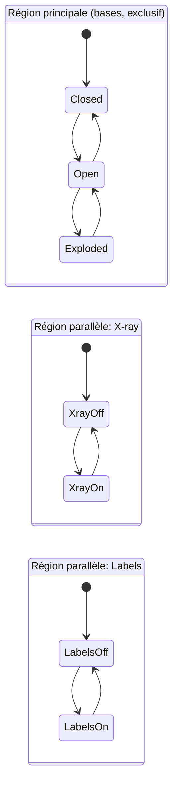
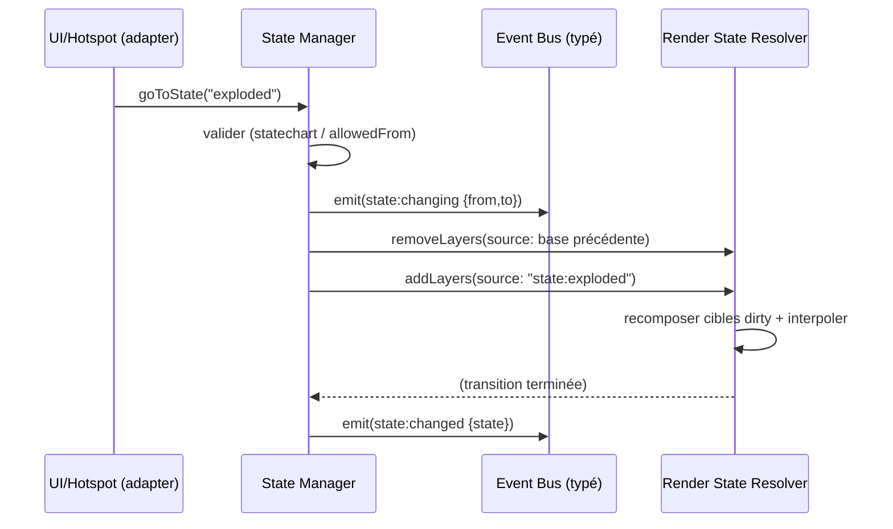

# Chapitre 09 — États (States)

> **Révisé en spec v2 (corrections C1, C4, C10, C11, transforms absolus).** Les états déclarent désormais des **couches** au [Render State Resolver](./19-render-state-resolver.md) ; les transforms sont **absolus** depuis la rest pose ; la structure est un **statechart** (régions parallèles) ; l'**état `Focus` est supprimé** ; l'état runtime est **sérialisable** (chapitre 20).

---

## 9.1 Concept (v2)

Un **état** est une **configuration nommée et déclarative** de l'objet, exprimée comme un **ensemble de couches** (contributions) publiées au resolver quand l'état est actif :

- des **couches `transform`** (offsets **absolus depuis la rest pose**) sur des composants/groupes ;
- des **couches `opacity` / `colorOverride` / `visibility`** ;
- une **couche `cameraIntent`** (priorité `state`) ;
- une **couche `lightingIntent`**.

Activer un état = publier ses couches ; le quitter = les retirer (recomposition). **Aucune mutation directe, aucune restauration** (chapitre 19). Les états restent **génériques** (P1/P2) : le moteur applique des couches déclarées, sans connaître l'objet.

---

## 9.2 États de référence

Exemples canoniques — **définis par chaque package**, jamais codés en dur.

| État | Sémantique | Réalisé par (couches) |
|------|-----------|-----------------------|
| **Closed** | Objet assemblé/fermé (référence). | Aucune couche (= rest pose). |
| **Open** | Une partie s'ouvre/se retire. | `transform` (offset absolu) sur un composant. |
| **Transparent** | Coques semi-transparentes. | `opacity` sur un groupe. |
| **Exploded** | Composants écartés. | `transform` sur plusieurs composants. |
| **Cutaway** | Vue en coupe. | `clipping` (voir 9.2.1) + `opacity`. |

> **`Focus` n'est plus un état (C4).** La mise en avant d'un composant est un **mécanisme** (chapitre 08) qui superpose ses propres couches à l'état courant, avec une priorité supérieure.

### 9.2.1 Cutaway

Le Cutaway repose sur des **clipping planes** déclaratifs (`{ normal, offset }`) appliqués à des composants/groupes (avec capping optionnel). En v2, le plan de coupe est exposé comme un canal/couche géré par l'adaptateur de rendu (le core reste headless, C2).

---

## 9.3 Statechart : bases + modifiers (C11)

La v1 opposait états `base` (exclusifs) et `modifier` (combinables). La v2 **formalise** cette structure en **statechart** :

- **Région principale** : les **bases**, mutuellement **exclusives** (une seule active). Transitions gouvernées par `allowedFrom`.
- **Régions parallèles** : les **modifiers**, chacun une région **indépendante** on/off (X-ray, Labels…), actives en parallèle de la base.
- **Règles d'exclusion** : des modifiers en conflit (ex. deux modifiers écrivant `opacity` sur la même cible) peuvent être déclarés **mutuellement exclusifs** (`excludes: [...]`).



L'**état macroscopique courant** = (base active) ⊗ (ensemble des modifiers actifs). La composition des couches associées est résolue par le RSR (règles par canal, chapitre 19), ce qui rend les combinaisons **prévisibles** (fin de l'espace combinatoire non validé, F8).

---

## 9.4 Modèle de données d'un état (v2)

```jsonc
{
  "id": "exploded",
  "label": "Vue éclatée",
  "region": "base",                 // "base" | modifier region id
  "allowedFrom": ["open"],          // (bases uniquement)
  "layers": [
    { "target": { "kind": "component", "id": "gpu" },
      "channel": "transform",
      "value": { "translate": [0, -0.25, 0.3] } },   // OFFSET ABSOLU depuis la rest pose
    { "target": { "kind": "group", "id": "shell" },
      "channel": "opacity", "value": 0.2 }
  ],
  "cameraIntent": "three-quarter",  // id de vue -> couche cameraIntent (prio state)
  "lightingIntent": "studio",
  "transition": { "duration": 900, "easing": "easeInOut" }
}
```

| Champ | Rôle (v2) |
|-------|-----------|
| `region` | `base` (exclusif) ou identifiant d'une région modifier (parallèle). |
| `allowedFrom` | Transitions autorisées (région principale). |
| `layers` | **Couches** publiées quand l'état est actif (adressage typé C5, transform **absolu**). |
| `cameraIntent` / `lightingIntent` | Couches d'intention (priorité `state`). |
| `excludes` | (modifiers) régions/modifiers mutuellement exclusifs. |
| `transition` | Interpolation des couches à l'activation. |

> **Suppressions v1 → v2** : le flag `transform.relative` est **retiré** (transforms **absolus** depuis la rest pose, chapitre 19 §19.3.3) ; les `material` overrides deviennent des couches `opacity`/`colorOverride` ; l'adressage `"group:internals"` par préfixe de chaîne est remplacé par `{ kind:"group", id:"internals" }` (C5).

---

## 9.5 Transitions

### 9.5.1 Déroulé (v2)



- La transition **interpole depuis les valeurs courantes** (le RSR gère les interruptions).
- Une transition non autorisée est refusée (avertissement) ou routée via un chemin intermédiaire si configuré.

### 9.5.2 Réversibilité et cohérence

Garanties **par construction** (chapitre 19) : quitter un état = retirer ses couches ⇒ retour exact à la rest pose + couches restantes. Plus de bookkeeping « original/restore ». Idempotence : re-demander l'état courant est un no-op.

---

## 9.6 État runtime sérialisable (C10)

L'état macroscopique fait partie de l'**état runtime sérialisable** (chapitre 20) : `{ base, modifiers[], focusStack[], view, selection }`. Il est **sérialisable/désérialisable** pour le deep-linking, l'historique navigateur et le partage d'URL. Le State Manager expose `serializeState()` / `applyState()` ; toute transition émet un événement permettant au module `Navigation` (opt-in) de mettre à jour l'URL.

---

## 9.7 Interactions avec les autres modules (v2)

| Module | Rôle |
|--------|------|
| **Render State Resolver** | Cible des couches d'état ; compose base + modifiers + focus. |
| **Animation Engine** | Interpole les couches (transitions). |
| **Camera / Lighting (via adapters)** | Exécutent les intentions résolues. |
| **Focus Manager** | **Indépendant** : superpose ses couches (priorité supérieure) sans changer l'état. |
| **UiPort** | Toolbar (bases = `radiogroup`, modifiers = `switch`), breadcrumb. |
| **Hotspot Manager** | `visibleInStates` filtre les hotspots. |
| **Navigation (opt-in)** | Sérialisation ↔ URL (chapitre 20). |

---

## 9.8 États et UI

- La **toolbar** (via `UiPort`, C3) : bases en **groupe exclusif** (`radiogroup`), modifiers en **interrupteurs** (`switch`).
- L'UI reflète l'état courant (bouton actif, breadcrumb) et les modifiers actifs.
- Feedback de transition assuré par l'interpolation des couches.

---

## 9.9 Accessibilité et robustesse

| Exigence | Détail |
|----------|--------|
| **Annonce** | Via le service A11y central (« Vue éclatée »). |
| **Clavier** | Bases = `radiogroup`, modifiers = `switch`/`checkbox`. |
| **Reduced motion** | Transitions de couches réduites/instantanées. |
| **Robustesse** | Couche/cible invalide → couche ignorée + warning, jamais de plantage. |
| **État initial** | Défini par la config (souvent `closed`), garanti cohérent au chargement (= rest pose + couches initiales). |

---

## 9.10 Règles normatives (synthèse v2)

1. Un état **publie des couches** au resolver ; il ne mute pas la scène et ne restaure rien (C1).
2. Les `transform` sont des **offsets absolus depuis la rest pose** ; `relative` est **supprimé**.
3. La structure est un **statechart** : bases exclusives (région principale) + modifiers parallèles + exclusions (C11).
4. **`Focus` n'est pas un état** (C4) ; c'est un mécanisme superposé (chapitre 08).
5. L'adressage des cibles est **typé** (`{ kind, id }`), sans préfixe de chaîne (C5).
6. L'état macroscopique est **sérialisable** (deep-linking, chapitre 20).
7. Les états communiquent par **événements typés** (C9).
