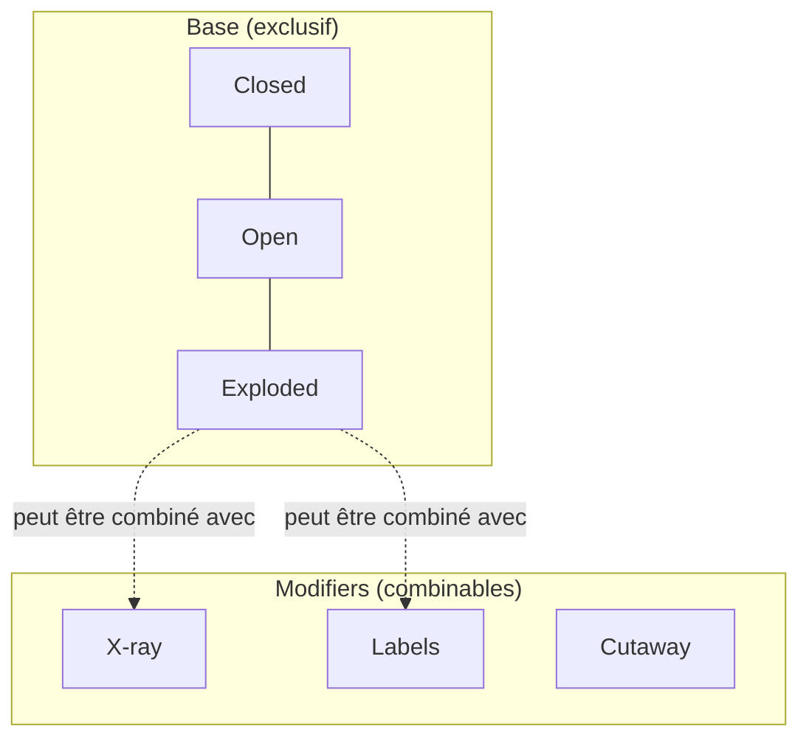
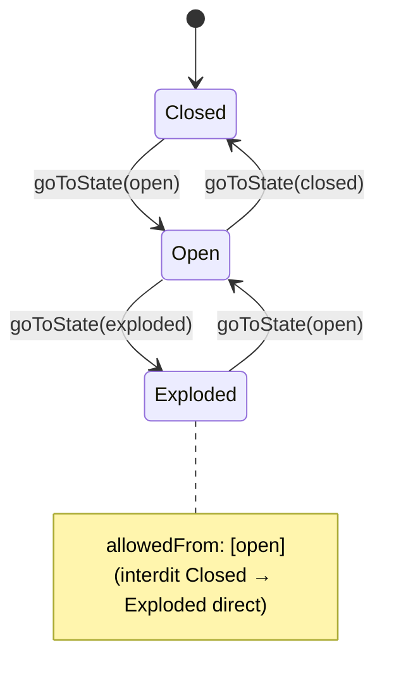
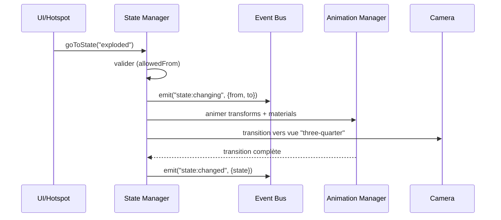

# Chapitre 09 — États (States)

> Les états décrivent les grandes configurations visuelles d'un objet : fermé, ouvert, transparent, éclaté, en coupe, en focus. Ce chapitre définit le système d'états, leurs types, et les transitions entre eux. Il concerne le **State Manager** ([chapitre 02](./02-architecture-generale.md)).

---

## 9.1 Concept

Un **état** (state) est une **configuration nommée et déclarative** de l'objet, combinant :

- des **transformations** de composants/groupes (translations, rotations, échelles) ;
- des **surcharges de matériaux** (opacité, wireframe, couleur) ;
- une **vue caméra** associée (optionnelle) ;
- un **éclairage** associé (optionnel) ;
- une **transition** entrante (durée, easing).

Les états sont **génériques** : le moteur ne connaît pas « voiture » ou « montre », il applique des transformations déclarées dans le `config.json` (P1, P2).

---

## 9.2 États de référence

Ces états sont des **exemples canoniques**. Ils ne sont pas codés en dur : chaque package définit les siens. Le moteur fournit la **mécanique** ; le package fournit la **définition**.

| État | Sémantique | Réalisé par |
|------|-----------|-------------|
| **Closed** | État nominal, objet assemblé/fermé. | État de base, souvent aucun transform (référence). |
| **Open** | Une partie s'ouvre/se retire (panneau, capot, couvercle). | Transform(s) de translation/rotation sur un composant. |
| **Transparent** | Coques externes semi-transparentes pour voir l'intérieur. | Surcharge d'opacité sur un groupe. |
| **Exploded** | Composants écartés pour montrer l'assemblage. | Transforms de translation sur plusieurs composants. |
| **Focus** | Un composant est isolé et mis en avant. | S'appuie sur le Focus System (chapitre 08). |
| **Cutaway** | Vue en coupe révélant l'intérieur. | Plan de coupe (clipping) + surcharges matériaux. |

### 9.2.1 Cutaway : note technique

Le **Cutaway** repose sur des **clipping planes** (plans de découpe GPU) et/ou une géométrie de coupe préparée. Le moteur DEVRAIT supporter des plans de coupe déclaratifs (`{ normal, offset }`) appliqués à des composants/groupes, avec un « capping » optionnel (bouchage de la coupe) selon les capacités.

---

## 9.3 Types d'états

Deux natures d'états, essentielles pour éviter les incohérences :

| Type | Comportement | Exemples | Combinaison |
|------|-------------|----------|-------------|
| **base** | **Exclusif** : un seul état de base actif à la fois. | Closed, Open, Exploded | Remplace le précédent. |
| **modifier** | **Combinable** : se superpose à l'état de base. | Transparent (X-ray), Cutaway, Labels visibles | S'ajoute/se retire indépendamment. |

Cette distinction permet, par exemple, d'être en état **base `exploded`** ET **modifier `xray`** simultanément.



---

## 9.4 Modèle de données d'un état

Rappel de la structure (chapitre 05, §5.3.9) :

```jsonc
{
  "id": "exploded",
  "label": "Vue éclatée",
  "type": "base",
  "transforms": [
    { "target": "gpu", "translate": [0, -0.25, 0.3], "relative": true },
    { "target": "group:internals", "scale": 1.0 }
  ],
  "material": [ { "target": "group:shell", "opacity": 0.2 } ],
  "camera": "three-quarter",
  "lighting": "studio",
  "transition": { "duration": 900, "easing": "easeInOut" },
  "allowedFrom": ["open"]
}
```

| Champ | Rôle |
|-------|------|
| `transforms` | Ce qui bouge (par composant ou groupe). |
| `material` | Surcharges visuelles réversibles. |
| `camera` | Vue à adopter (via Camera Manager). |
| `lighting` | Ambiance associée. |
| `transition` | Animation entrante. |
| `allowedFrom` | Contraintes de la machine à états. |

> Les cibles (`target`) référencent des **composants** (`gpu`) ou des **groupes** (`group:internals`) définis dans `components` (chapitre 05). Cela découple la définition des états de la structure fine du GLB.

---

## 9.5 Machine à états et transitions

### 9.5.1 Modèle

Le State Manager implémente une **machine à états** :

- L'ensemble des états de **base** forme un graphe de transitions autorisées (`allowedFrom`).
- Les **modifiers** sont des drapeaux (on/off) orthogonaux à l'état de base.
- L'**état courant** = (état de base) + (ensemble de modifiers actifs).



### 9.5.2 Validation des transitions

- Une transition vers un état de base **non autorisé** depuis l'état courant est **refusée** (avec avertissement diagnostic), ou **routée** via un chemin intermédiaire si configuré.
- Par défaut (sans `allowedFrom`), toutes les transitions sont permises.
- Le moteur PEUT calculer un **chemin** (ex. Closed → Open → Exploded) si la cible n'est atteignable qu'indirectement — comportement optionnel et configurable.

### 9.5.3 Déroulé d'une transition



Pendant la transition : les contrôles PEUVENT être restreints ; une nouvelle demande de transition **interrompt** proprement la précédente (interpolation depuis les valeurs courantes, pas de saut).

---

## 9.6 Transitions : réversibilité et cohérence

- **Réversibilité** : toute transformation/surcharge est calculée par rapport à un **état de référence** mémorisé. Revenir à `closed` restaure exactement les positions/matériaux d'origine.
- **Interpolation depuis l'état courant** : les transitions partent des valeurs **actuelles** (utile si on interrompt une animation en cours).
- **Composition** : activer/désactiver un modifier ne perturbe pas l'état de base (les surcharges sont additives et traçées séparément).
- **Idempotence** : demander l'état courant est un no-op (pas de re-animation).

---

## 9.7 Interactions avec les autres modules

| Module | Rôle dans les états |
|--------|---------------------|
| **Animation Manager** | Exécute les interpolations (transforms, opacités, lumières). |
| **Scene Manager** | Résout composants/groupes ; fournit les objets à transformer. |
| **Camera Manager** | Adopte la vue associée à l'état. |
| **Lighting Manager** | Applique l'ambiance associée. |
| **Focus Manager** | L'état `Focus` s'appuie sur lui ; un focus peut déclencher un état. |
| **UI Manager** | Toolbar (boutons d'état), breadcrumb, reflète l'état courant. |
| **Hotspot Manager** | `visibleInStates` filtre les hotspots selon l'état. |

---

## 9.8 États et UI

- La **toolbar** propose des contrôles d'état (`stateToggle`, groupes de boutons exclusifs pour les bases, interrupteurs pour les modifiers) — chapitre 12.
- L'UI reflète **toujours** l'état courant (bouton actif, breadcrumb).
- Les transitions d'état DEVRAIENT fournir un **feedback** (l'état cible s'illumine, transition visible).

---

## 9.9 Accessibilité et robustesse

| Exigence | Détail |
|----------|--------|
| **Annonce** | Changement d'état annoncé (live region : « Vue éclatée »). |
| **Clavier** | Les contrôles d'état sont activables au clavier ; groupes exclusifs = `radiogroup`, modifiers = `switch`/`checkbox`. |
| **Reduced motion** | Transitions raccourcies/instantanées si demandé. |
| **Robustesse** | Cible/transform invalide → transition partielle/ignorée + warning, jamais de plantage. |
| **État initial** | Défini par la config (souvent `closed`) ; garanti cohérent au chargement. |

---

## 9.10 Règles normatives (synthèse)

1. Les états sont **déclaratifs et génériques** ; aucune connaissance d'objet spécifique (P1, P2).
2. **base = exclusif**, **modifier = combinable** ; l'état courant est (base + modifiers).
3. Les transitions sont **validées** (machine à états) et **animées** depuis l'état courant.
4. Toute transformation/surcharge est **réversible** par rapport à l'état de référence.
5. Les états communiquent par **événements** (`state:changing`, `state:changed`).
6. Les états sont **accessibles** (annonces, clavier) et **robustes** (dégradation ciblée).
