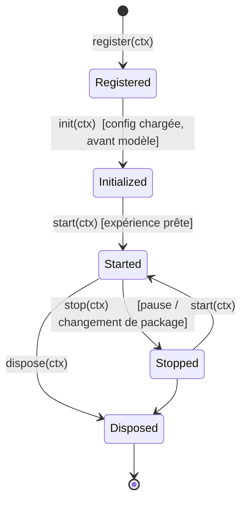
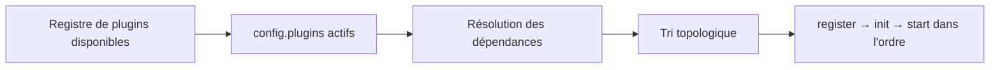

# Chapitre 10 — Plugins

> Le système de plugins est le mécanisme d'extension du moteur. Il permet d'ajouter des capacités **sans modifier le noyau** (P4, P1). Ce chapitre décrit le système, la création d'un plugin, son chargement, sa communication avec le moteur, et fournit plusieurs exemples.

---

## 10.1 Philosophie

Le noyau d'Explorer Engine reste **minimal et stable**. Toute fonctionnalité non universelle est un **plugin**. Cela découle directement du *Generic Test* (chapitre 01) : si une fonctionnalité ne vaut pas pour *tous* les objets, elle DOIT être un plugin.

**Bénéfices :**

- Noyau petit, testable, durable.
- Capacités ajoutées/retirées à la carte, par package (`config.plugins`).
- Écosystème extensible (plugins officiels + tiers) sans fork du moteur.
- Isolation des risques : un plugin défaillant ne casse pas l'expérience.

---

## 10.2 Contrat d'un plugin

Un plugin est un **objet conforme à un contrat** (interface) défini par le **`plugin-sdk`** (chapitre 03). Conceptuellement, il expose :

| Élément | Rôle |
|---------|------|
| `id` | Identifiant unique (référencé dans `config.plugins`). |
| `name`, `version` | Métadonnées. |
| `dependencies?` | Autres plugins requis (ordre d'init). |
| `capabilities?` | Ce que le plugin fournit/consomme (déclaratif). |
| **Hooks de cycle de vie** | `register`, `init`, `start`, `stop`, `dispose`. |

> Le plugin ne manipule **jamais** les internes du moteur directement. Il reçoit un **contexte d'API** (Plugin Context) restreint et stable, fourni par le Plugin Manager.

---

## 10.3 Le Plugin Context (API offerte aux plugins)

Le **Plugin Context** est la **façade** que le moteur expose aux plugins. Il est **stable** et **versionné** (compatibilité ascendante). Il donne accès de façon contrôlée à :

| Domaine | Capacités offertes (exemples) — v2 |
|---------|-------------------------------------|
| **Événements** | `on/off/once/emit` sur l'**Event Bus typé** (catalogue nom→payload, C9) ; un plugin déclare ses propres événements typés dans un espace de nom. |
| **Scène (lecture)** | Requêter des composants, bounding boxes, l'index (clé **`explorerId`**, C5) — lecture seule. |
| **État visuel** | **`addLayer` / removeLayer / updateLayer`** au Render State Resolver (chapitre 19), dans une **plage de priorité réservée aux plugins** (≥ 200). Un plugin **ne mute jamais** la scène directement (C1). |
| **Focus / États** | Demander un focus (mécanisme), lire l'état courant, demander une transition (statechart). |
| **Hotspots** | Créer/supprimer des hotspots dynamiques (logique). |
| **Animation** | Créer des tweens ; acquérir un **frame handle** (`acquireFrameLoop`) s'il anime en continu (C7). |
| **UI** | Fournir des **descripteurs d'UI** (bouton toolbar, panneau, overlay) via des **slots** du `UiPort` (C3) — **pas de JSX, pas de framework**. |
| **Rendu** | Accès **indirect** via `RendererPort` (le core est headless) ; pas d'accès Three.js brut par défaut. |
| **Config** | Lire ses `options` (`config.plugins[].options`) et la config globale (lecture). |
| **Ressources** | Charger des assets via le Resource Manager (politique de chargement + **annulation** C16). |
| **Diagnostics** | Logger dans l'espace de nom du plugin. |

> Le contexte **n'expose pas** les objets internes bruts (Three.js, DOM). Un accès bas niveau via `RendererPort` PEUT être fourni sous **capacité explicitement déclarée**, à utiliser avec précaution.

---

## 10.4 Cycle de vie d'un plugin

| Hook | Moment | Usage typique |
|------|--------|---------------|
| `register` | Découverte du plugin. | Déclarer capacités/dépendances, réserver un espace de nom. |
| `init` | Après config chargée, avant/pendant construction de la scène. | Lire les options, s'abonner aux événements, préparer l'état interne. |
| `start` | Expérience prête (`package:loaded`). | Créer hotspots/UI, démarrer les comportements. |
| `stop` | Pause / avant changement de package. | Suspendre les comportements, détacher l'UI temporaire. |
| `dispose` | Teardown. | Libérer **toutes** les ressources, désabonner tous les événements. |

> **Exigence (P6)** : `dispose` DOIT tout nettoyer (aucun listener/DOM/ressource orphelin). Un plugin est responsable de sa propre libération.

---

## 10.5 Chargement et enregistrement

### 10.5.1 Deux voies d'enregistrement

| Voie | Description | Qui décide |
|------|-------------|-----------|
| **Programmatique** | L'application hôte enregistre des plugins connus au démarrage du moteur (registre de plugins disponibles). | Développeur intégrateur |
| **Déclarative** | Le package **active et configure** des plugins par `config.plugins` (`{ id, enabled, options }`). | Créateur de contenu |

**Règle de sécurité (P1 + sécurité)** : un package **ne fournit pas** le code d'un plugin ; il ne peut activer que des plugins **déjà enregistrés** dans le runtime hôte. Cela évite l'exécution de code arbitraire venu d'un package. (Un futur mode « plugins sandboxés » pourra assouplir cela — chapitre 18.)

### 10.5.1bis Portabilité et `requiredCapabilities` (v2, C8)

La v1 était contradictoire : un package était dit « autonome et portable » (chapitre 04), mais ses plugins devaient être enregistrés par l'hôte (donc un package utilisant un plugin **ne fonctionnait pas** sur un hôte qui ne l'avait pas enregistré). La v2 réconcilie :

1. **Runtime de référence** : un profil officiel embarque un **jeu de plugins standard garanti** (au minimum : `guided-tour`, `measure`, `annotations`). Un package qui n'utilise que ces plugins est **portable sur tout runtime de référence**.
2. **`requiredCapabilities`** : un package déclare les **capacités** dont il a besoin (ex. `["scenario", "measure"]`), pas des ids de plugins concrets. Le runtime associe capacités → plugins disponibles.
3. **Dégradation gracieuse** : si une capacité requise est absente, le moteur **charge l'objet sans la fonctionnalité** concernée + diagnostic clair (jamais d'écran noir). Une capacité `optional` manquante est ignorée silencieusement.

> Reformulation normative : un package est **« portable sur tout runtime conforme au profil de capacités qu'il déclare »**. Le mot « autonome » (chapitre 04) est reprécisé en ce sens (correction C8).

### 10.5.2 Résolution et ordre

- Le Plugin Manager résout les **dépendances** et applique un **tri topologique** pour l'ordre d'init.
- Une dépendance manquante → le plugin est désactivé avec un avertissement clair (pas de plantage).

### 10.5.3 Isolation des erreurs

Chaque hook de plugin est exécuté de façon **isolée** (try/catch). Une erreur dans un plugin :

- est **journalisée** avec son espace de nom ;
- **désactive** le plugin fautif proprement ;
- **ne casse pas** le moteur ni les autres plugins.

---

## 10.6 Communication avec le moteur

Le mode de communication **privilégié** est l'**Event Bus** (découplage). Deux directions :

| Direction | Mécanisme | Exemple |
|-----------|-----------|---------|
| **Moteur → plugin** | Le plugin **écoute** des événements. | Sur `hotspot:activated`, un plugin d'analytics enregistre l'action. |
| **Plugin → moteur** | Le plugin **émet** des événements ou appelle l'API du contexte. | Un plugin de visite guidée appelle `focus`/`goToState`. |
| **Plugin → plugin** | Via l'Event Bus (espaces de noms) ou dépendances déclarées. | Un plugin d'annotations émet `annotation:created`. |

**Points d'extension UI** : le contexte offre des « slots » où un plugin peut injecter des éléments (bouton de toolbar, entrée de menu, panneau) sans connaître l'implémentation de l'UI Manager.

---

## 10.7 Exemples de plugins

### 10.7.1 Guided Tour (visite guidée)

> **Propriétaire de la scénarisation (v2, C12)** : toute séquence riche (visite, présentation branchée, narration synchronisée) vit **ici**, dans ce plugin, au-dessus de l'Animation Engine. Le **noyau d'animation ne contient plus de DSL de scénario** ; il n'expose que des transitions atomiques et de l'interpolation.

- **But** : enchaîner automatiquement une séquence de points d'intérêt avec narration.
- **Options** : `{ steps: [hotspotId|componentId], autoStart, narration?, loop? }`.
- **Fonctionnement** : au `start`, ajoute un bouton toolbar « Visite ». Sur activation, itère les étapes : pour chaque étape, demande un `focus`, ouvre le panneau, joue l'audio, attend, puis passe à la suivante. Émet `tour:step`, `tour:completed`.
- **Communication** : consomme `focus`, `goToState`, l'audio ; émet ses propres événements.

### 10.7.2 Measure (mesure de distances)

- **But** : mesurer des distances entre points de la surface 3D.
- **Fonctionnement** : mode « mesure » activé via toolbar ; l'utilisateur clique deux points (picking via Selection), le plugin dessine une ligne + label de distance (overlay UI + éventuellement objet 3D). Respecte l'échelle réelle (`model.scale`).
- **Communication** : utilise le raycasting exposé, crée des overlays UI, lit l'échelle.

### 10.7.3 Annotations

- **But** : ajouter des notes/étiquettes utilisateur ancrées sur le modèle.
- **Fonctionnement** : crée des **hotspots dynamiques** à la volée ; persiste les annotations (localStorage / backend via l'hôte). Émet `annotation:created/updated/deleted`.
- **Communication** : API de création de hotspots, ressources/persistance.

### 10.7.4 Minimap / Orientation

- **But** : afficher une mini-vue (boussole/axes ou vue miniature) pour situer la caméra.
- **Fonctionnement** : overlay UI mis à jour depuis les événements caméra (`controls:changed`).

### 10.7.5 Spatial Audio

- **But** : sons positionnés dans l'espace 3D (ronronnement d'un moteur, bips…).
- **Fonctionnement** : place des sources audio spatialisées ancrées à des composants ; volume/pan selon la position caméra. Se synchronise avec les états (ex. son au démarrage d'une animation).

### 10.7.6 Analytics

- **But** : mesurer l'usage (hotspots consultés, temps par composant).
- **Fonctionnement** : écoute passivement les événements (`hotspot:activated`, `state:changed`, `focus:*`) et les transmet à l'hôte. **Ne modifie rien** (plugin purement observateur).

### 10.7.7 Tableau récapitulatif

| Plugin | Consomme (écoute/API) | Produit (émet/UI) | Catégorie |
|--------|-----------------------|-------------------|-----------|
| Guided Tour | focus, state, audio | tour:*, bouton toolbar | Narration |
| Measure | picking, échelle | overlays, ligne 3D | Outil |
| Annotations | hotspots API, persistance | annotation:*, hotspots | Contenu utilisateur |
| Minimap | controls:changed | overlay | Orientation |
| Spatial Audio | états, positions | sources audio 3D | Ambiance |
| Analytics | tous événements | (externe) | Observation |

---

## 10.8 Bonnes pratiques de développement de plugins

1. **Dépendre uniquement du `plugin-sdk`**, jamais des internes du core.
2. **Nettoyer dans `dispose`** : chaque abonnement/élément DOM/ressource créé doit être libéré.
3. **Espace de nom** : préfixer ses événements (`measure:*`) pour éviter les collisions.
4. **Fail soft** : un plugin ne doit jamais faire planter l'expérience ; capter ses propres erreurs.
5. **Configurable** : exposer un maximum via `options` (data-driven, cohérent avec P2).
6. **Respecter le budget de performance** (chapitre 14) : pas de travail lourd par frame sans nécessité.
7. **Accessibilité** : tout UI ajouté par un plugin respecte les mêmes exigences (P8).
8. **Idempotence** du cycle de vie : `start`/`stop` doivent pouvoir s'enchaîner sans fuite.

---

## 10.9 Règles normatives (synthèse)

1. Toute capacité non universelle est un **plugin**, pas du code noyau (P4).
2. Un plugin communique via le **Plugin Context** (façade stable), jamais avec les internes bruts par défaut.
3. Un package **active/configure** des plugins **enregistrés** ; il n'apporte pas leur code (sécurité).
4. Les erreurs de plugins sont **isolées** ; un plugin défaillant est désactivé proprement.
5. Le cycle de vie (`register→init→start→stop→dispose`) est respecté ; `dispose` **libère tout**.
6. La communication privilégiée est l'**Event Bus** avec espaces de noms.
