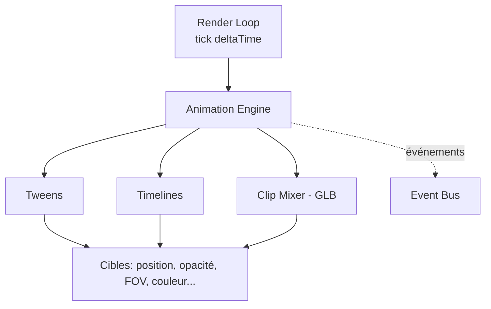
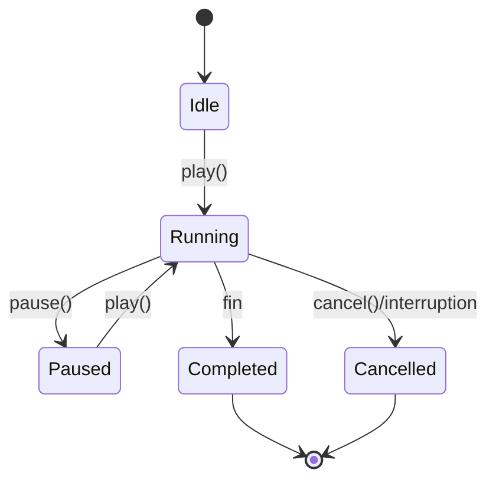
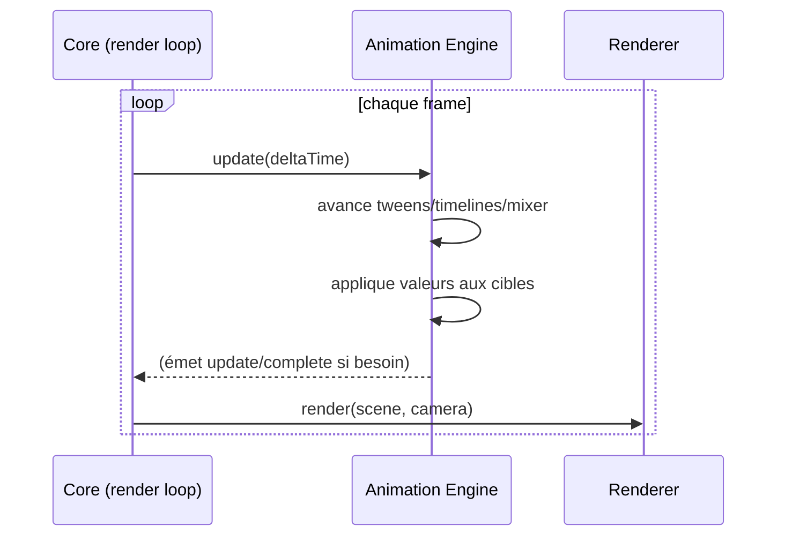

# Chapitre 11 — Animation Engine

> **Révisé en spec v2 (corrections C12, C7).** Le moteur d'animation se limite à l'**interpolation** et à l'enchaînement d'**animations atomiques** ; la **scénarisation** (DSL de séquence) est retirée du noyau et confiée au plugin `guided-tour`. Il implémente le **frame ownership** (`acquireFrameLoop`/release) du contrat `requestRender()`.

> L'Animation Engine (Animation Manager) est le moteur temporel : il interpole des valeurs dans le temps et orchestre des séquences. Ce chapitre décrit les timelines, transitions, événements, la synchronisation et les séquences. Presque tous les modules d'interaction s'appuient sur lui.

---

## 11.1 Rôle et positionnement

L'Animation Engine est un **service transverse** fournissant une base d'animation **générique et réutilisable** :

- Il ne connaît ni les états, ni les hotspots, ni la caméra en particulier : il interpole des **valeurs** et notifie.
- Il est **piloté** par la render loop (mise à jour par frame avec `deltaTime`).
- Il est **consommé** par State Manager, Focus Manager, Camera Manager, Hotspot Manager, plugins.

---

## 11.2 Concepts de base

### 11.2.1 Tween (interpolation)

Un **tween** interpole une ou plusieurs propriétés d'une valeur de départ vers une valeur d'arrivée, sur une durée, avec une fonction d'**easing**.

| Attribut | Description |
|----------|-------------|
| `target` | Ce qui est animé (un accès à une propriété : position, opacité, FOV…). |
| `from` / `to` | Valeurs de départ/arrivée (le `from` par défaut = valeur courante). |
| `duration` | Durée en ms. |
| `easing` | Fonction d'accélération (voir 11.4). |
| `delay` | Délai avant démarrage. |
| `onUpdate/onComplete` | Rappels/événements. |

Le tween est **agnostique du type** : il sait interpoler des nombres, vecteurs, quaternions (rotation, via slerp), couleurs.

### 11.2.2 Clip (animation GLB)

Un **clip** est une animation embarquée dans le GLB (chapitre 06), jouée via un **mixer**. L'Animation Engine expose play/pause/seek/loop/vitesse et le fondu entre clips (crossfade).

### 11.2.3 Timeline (séquence)

Une **timeline** orchestre plusieurs animations dans le temps : en **parallèle**, en **séquence**, avec **décalages** (offsets), **labels** et **markers**.

---

## 11.3 Timelines

### 11.3.1 Modèle

Une timeline est une **composition** d'étapes positionnées sur un axe temporel :

```mermaid
gantt
    title "Présentation" — orchestrée par le plugin guided-tour (C12), au-dessus des transitions atomiques du core
    dateFormat  X
    axisFormat %s
    section Caméra
    Travelling avant      :0, 2
    section Objet
    Transition Exploded   :1, 3
    section UI
    Ouvrir panneau        :3, 1
    section Audio
    Narration             :1, 4
```

> **Note v2** : ce scénario (qui enchaîne caméra + état + UI + audio) est **assemblé par le plugin `guided-tour`**, pas par un DSL du noyau. Le noyau fournit les briques atomiques (transition de couche, tween, clip) ; le plugin les **séquence**.

- Les étapes peuvent se **chevaucher** (parallélisme) ou s'**enchaîner**.
- Une timeline expose : `play`, `pause`, `seek(t)`, `reverse`, `timeScale`, `progress`.
- Les timelines peuvent être **imbriquées** (une timeline dans une timeline).

### 11.3.2 Périmètre v2 : interpolation, PAS scénarisation (C12)

**Décision v2** : le noyau d'animation ne contient **aucun DSL de scénario**. Le champ `config.animations.timelines` (avec des `action` : état/focus/panneau…) de la v1 est **supprimé du schéma** ([chapitre 05](./05-config-format.md)).

Raison : un DSL de scénario en JSON dérive inévitablement vers un langage (conditions, boucles, variables), impossible à valider et à maintenir, et **doublait** le plugin Guided Tour. La v2 sépare nettement :

| Responsabilité | Où |
|----------------|-----|
| **Interpoler** une valeur, **enchaîner/paralléliser** des animations **atomiques** (tween, clip, transition de couche) | **Noyau** Animation Engine (ce chapitre) |
| **Scénariser** (visite, présentation, narration branchée : « fais A puis focus B puis ouvre le panneau C ») | **Plugin `guided-tour`** (capacité `"scenario"`, [chapitre 10](./10-plugins.md)) |

Ainsi, une timeline du noyau **compose des animations** (positions, opacités, caméra) mais ne « pilote » pas des états/UI par un langage déclaratif. Le plugin de scénario, lui, orchestre les transitions atomiques exposées par le core et **s'appuie** sur cet Animation Engine.

> `config.animations` se limite désormais à **nommer des clips** et régler l'**`autoplay`** d'un **clip simple** (ex. ventilateur en boucle).

---

## 11.4 Fonctions d'easing

Un ensemble **borné et validé** de fonctions (référencées par nom dans la config) :

| Catégorie | Exemples |
|-----------|----------|
| Linéaire | `linear` |
| Quadratique/cubique | `easeIn`, `easeOut`, `easeInOut` (et variantes quad/cubic/quart) |
| Expressives | `easeInBack`, `easeOutBack`, `easeOutElastic`, `easeOutBounce` |
| Personnalisée | Courbe de Bézier cubique paramétrable `cubic-bezier(x1,y1,x2,y2)` |

> Le nom d'easing dans le `config.json` DOIT appartenir à cet ensemble (validation). Les easings « expressifs » sont à utiliser avec parcimonie (sobriété visuelle).

---

## 11.5 Événements et cycle de vie d'une animation

Chaque animation/timeline émet des événements consommables :

| Événement | Moment |
|-----------|--------|
| `start` | Démarrage. |
| `update` | Chaque frame (avec `progress` ∈ [0,1]). |
| `complete` | Fin. |
| `marker`/`label` | Passage à un point nommé de la timeline. |
| `cancel` | Interruption/annulation. |

Ces événements permettent la **synchronisation** (déclencher X quand une animation atteint un marker) et l'**observabilité** (un plugin/UI réagit à la progression).

---

## 11.6 Synchronisation

### 11.6.1 Types de synchronisation

| Type | Description | Exemple |
|------|-------------|---------|
| **Inter-animations** | Enchaîner/paralléliser via timeline. | Caméra + explosion simultanées. |
| **Animation ↔ audio** | Aligner une narration sur des markers. | Le panneau s'ouvre au mot-clé de la narration. |
| **Animation ↔ caméra** | La caméra suit une trajectoire pendant qu'un état se joue. | Travelling pendant l'explosion. |
| **Animation ↔ état** | Une transition d'état est une animation orchestrée. | Chapitre 09. |

### 11.6.2 Horloge et déterminisme

- Une **horloge centrale** (dérivée de la render loop) fournit un `deltaTime` cohérent à toutes les animations.
- Les animations sont **basées sur le temps** (time-based), pas sur le nombre de frames : le comportement est **identique quel que soit le FPS** (déterminisme, P9).
- En cas de **frame drop** (delta anormalement grand après un onglet en arrière-plan), le moteur **clampe** le delta pour éviter les sauts d'animation.

---

## 11.7 Séquences et scénarisation

Les **séquences** (timelines nommées) permettent de scénariser des expériences riches :

- **Intro/onboarding** : présentation automatique au chargement.
- **Visite guidée** : enchaînement de focus/panneaux (souvent via le plugin Guided Tour, qui s'appuie sur l'Animation Engine).
- **Démo d'inactivité** (idle) : rotation lente / mini-présentation quand l'utilisateur est inactif (`autoplay`).
- **Micro-interactions** : petites animations de feedback (hover, activation).

Les séquences sont **interruptibles** : toute interaction utilisateur peut les annuler proprement (`cancel`), sans laisser l'objet dans un état incohérent (retour à un état stable connu).

---

## 11.8 Intégration à la render loop

- L'Animation Engine est mis à jour **avant** le rendu, pour que la frame reflète les valeurs à jour.
- Il maintient une **liste active** d'animations ; les terminées sont retirées (et **disposées**).
- **Performance** : pas d'allocation par frame (réutilisation d'objets temporaires), boucle serrée.

### 11.8.1 Frame ownership (v2, C7)

L'Animation Engine est un **détenteur de frame handle**. Quand une animation démarre, il appelle `acquireFrameLoop()` (chapitre 02) : la boucle tourne en continu tant qu'au moins une animation est active. Quand la dernière animation se termine, il **libère** le handle → la boucle **se met en veille** (plus de rendu jusqu'au prochain `requestRender()`).

- Un **clip GLB en boucle** (ventilateur) détient un handle **persistant** → la scène n'est jamais « statique » tant qu'il tourne, et le rendu continue légitimement à 60 FPS.
- Une **transition** ponctuelle acquiert puis libère un handle.
- Un changement de couche **hors animation** (application instantanée) déclenche un simple `requestRender()`.

Ce contrat résout le conflit v1 (rendu à la demande vs animations continues, F11) : **jamais de clip figé**, **jamais de boucle 60 FPS inutile**.

---

## 11.9 Accessibilité : `prefers-reduced-motion`

Exigence transverse (P8) : quand l'utilisateur a activé « réduire les animations » :

- Les transitions sont **raccourcies** ou rendues **instantanées** (saut à l'état final).
- Les animations décoratives/en boucle (pulsations, idle) sont **désactivées**.
- Les changements d'état/focus restent **fonctionnels** (juste sans mouvement superflu).

L'Animation Engine expose un **mode réduit** global respectant cette préférence, applicable par défaut.

---

## 11.10 Règles normatives (synthèse)

1. L'Animation Engine est **générique** : il interpole des valeurs, il ne connaît pas les objets métier.
2. Les animations sont **time-based** et **déterministes** (indépendantes du FPS), avec delta clampé.
3. Timelines et tweens émettent des **événements** (`start/update/complete/marker/cancel`) pour la synchronisation.
4. Toute animation est **interruptible** et laisse un état **stable**.
5. Aucune **allocation par frame** ; les animations terminées sont **disposées**.
6. Le **mode réduit** (`prefers-reduced-motion`) est respecté.
