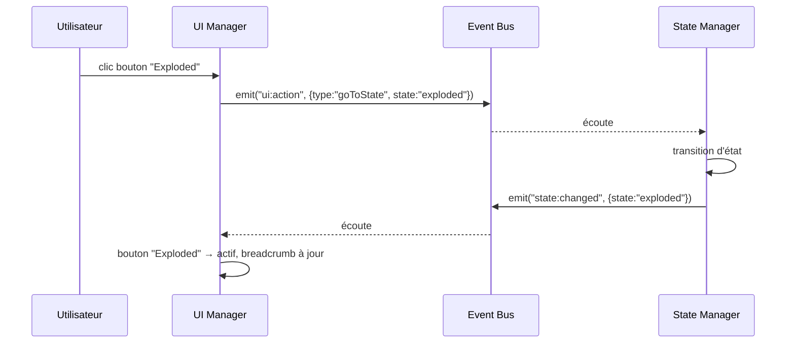

# Chapitre 12 — Interface utilisateur

> L'UI est la couche 2D superposée à la scène 3D. Ce chapitre décrit les panneaux, la navigation, le breadcrumb, la toolbar, les boutons, les loaders, les transitions, le responsive et l'accessibilité. Il concerne l'**UI Manager** et s'appuie sur le **Theme Manager** (chapitre 13).

---

## 12.1 Principes de l'UI

1. **Overlay non intrusif** : l'UI se superpose au canvas 3D ; elle guide sans masquer l'objet, qui reste la vedette.
2. **Data-driven** : les panneaux, boutons, contenus sont **déclarés** dans `config.ui` (P2). L'UI se construit à partir de la config.
3. **Découplée de la 3D** : l'UI communique avec le moteur par **événements/API** (chapitre 02), jamais en manipulant la scène directement.
4. **Thématisable** : tout le style passe par des **design tokens** (chapitre 13). Aucune couleur/typo en dur.
5. **Accessible par conception** (P8) : clavier, ARIA, contrastes, focus visibles.
6. **Responsive** : une seule expérience, adaptée desktop/tablette/mobile.

### 12.1.1 Choix technologique (principe, non-implémentation)

L'UI est une couche **DOM/HTML** superposée (overlay) plutôt que rendue dans le canvas WebGL. Justification : accessibilité native (ARIA, focus, lecteurs d'écran), sélection de texte, responsive CSS, internationalisation, coût moindre. Le canvas 3D reste dédié à la 3D ; l'UI reste dédiée à l'interface. La technologie concrète (framework ou vanilla) est un choix d'implémentation à trancher au chapitre 15/roadmap, contraint par : légèreté, absence de dépendance lourde imposée aux intégrateurs, et respect des tokens.

---

## 12.2 Anatomie de l'interface

```
┌───────────────────────────────────────────────────────────┐
│  [Logo]        Breadcrumb: Objet ▸ Internes ▸ GPU     [⚙]  │  ← barre haute
│                                                             │
│                                                             │
│                    (CANVAS 3D + hotspots)                   │
│                                                             │
│                                             ┌─────────────┐ │
│                                             │  Panneau    │ │  ← panneau d'info
│                                             │  d'info GPU │ │
│                                             │  specs...   │ │
│                                             └─────────────┘ │
│  ┌─────────────────────────────────────────┐               │
│  │ Toolbar: [Closed][Open][Exploded] [X-ray]│  [↺ Reset]    │  ← barre d'outils
│  └─────────────────────────────────────────┘               │
└───────────────────────────────────────────────────────────┘
```

### 12.2.1 Zones d'UI

| Zone | Contenu | Configurable |
|------|---------|--------------|
| **Barre haute** | Logo/titre, breadcrumb, réglages, langue. | `ui.layout`, `meta` |
| **Toolbar** | Contrôles d'état, focus/reset, outils (plugins). | `ui.toolbar` |
| **Panneau(x) d'info** | Contenu du composant/hotspot en focus. | `ui.panels` |
| **Marqueurs de hotspots** | Positionnés par le Hotspot Manager. | `hotspots`, `theme` |
| **Loader** | Écran/overlay de chargement. | `ui.loader` |
| **Hints / onboarding** | Aides contextuelles. | `ui.hints` |
| **Overlays de plugins** | Minimap, mesures… | via plugins |

---

## 12.3 Panneaux (Panels)

### 12.3.1 Rôle

Un **panneau** affiche l'information d'un composant/hotspot : description, spécifications, images, vidéos, audio, actions.

### 12.3.2 Composition par blocs

Un panneau est une **liste de blocs** typés (chapitre 05, §5.3.11), assemblés déclarativement :

| Bloc | Contenu |
|------|---------|
| `text` | Paragraphe (i18n, markdown restreint et **assaini**). |
| `image` | Image (lazy-load). |
| `video` | Vidéo (lazy-load, contrôles). |
| `audio` | Piste audio / narration. |
| `list` | Liste à puces. |
| `specs` | Table clé/valeur (fiche technique). |
| `divider` | Séparateur. |
| `action` | Bouton déclenchant une action (focus, état, événement). |

> Le contenu textuel provenant d'un package est **potentiellement non fiable** : tout rendu riche DOIT être **assaini** (pas d'injection HTML/script) — voir chapitre 04 §4.4.4.

### 12.3.3 Comportement

- Ouverture/fermeture **animées** (respect reduced-motion).
- Position **responsive** (latéral sur desktop, plein écran/bottom-sheet sur mobile).
- Un seul panneau principal à la fois (par défaut) ; la navigation entre composants met à jour le contenu.
- Piloté par événements (`focus:started` → ouvrir ; `focus:ended` → fermer).

---

## 12.4 Navigation et Breadcrumb

### 12.4.1 Breadcrumb (fil d'Ariane)

Le breadcrumb reflète la **pile de focus** (chapitre 08) et/ou la hiérarchie de composants :

```
Objet ▸ Internes ▸ Carte graphique ▸ Ventilateur
```

- Chaque segment est **cliquable** (saut direct à ce niveau = `back` jusqu'à ce niveau).
- Se met à jour sur `focus:changed` / `state:changed`.
- Sur mobile, il se condense (ex. « … ▸ Ventilateur » avec expansion).

### 12.4.2 Autres aides à la navigation

| Aide | Rôle |
|------|------|
| **Liste de composants** | Panneau/menu listant tous les composants (navigation alternative — clé pour l'accessibilité, chapitre 07). |
| **Recherche** | Filtrer/atteindre un composant par nom (option). |
| **Reset / Home** | Revenir à la vue d'ensemble et à l'état initial. |
| **Boutons précédent/suivant** | Parcourir séquentiellement les hotspots. |

---

## 12.5 Toolbar et boutons

### 12.5.1 Éléments de toolbar (déclaratifs)

| Item | Rôle |
|------|------|
| `stateToggle` | Groupe de boutons d'états (bases = exclusifs ; modifiers = interrupteurs). |
| `resetView` | Réinitialiser caméra/état. |
| `fullscreen` | Plein écran. |
| `themeToggle` | Basculer clair/sombre. |
| `languageSelect` | Changer de langue (i18n). |
| `custom` (plugin) | Bouton fourni par un plugin (visite, mesure…). |

### 12.5.2 États et feedback des boutons

Chaque bouton possède les états **repos / survol / actif / focus / désactivé**, stylés via tokens. Le bouton reflète l'état réel du moteur (ex. le bouton « Exploded » est actif quand l'état courant l'est). Feedback immédiat au clic (micro-animation, respect reduced-motion).

---

## 12.6 Loaders et transitions

### 12.6.1 Écran de chargement

- Affiché pendant le chargement du package (config + modèle + assets critiques).
- **Progression réelle** (octets/étapes) plutôt qu'un spinner indéterminé quand c'est possible.
- Personnalisable (`ui.loader` : logo, style, astuces/tips).
- **Transition de sortie** douce vers la scène (fondu) une fois `package:loaded`.

### 12.6.2 Transitions d'interface

- Ouverture/fermeture de panneaux, apparition de hotspots, changements de vue : **animées** et **cohérentes** (mêmes durées/easings issus du thème).
- Squelettes/placeholders pendant le lazy-load des contenus lourds (images/vidéos).
- Toutes les transitions respectent **`prefers-reduced-motion`**.

---

## 12.7 Responsive

### 12.7.1 Cibles

| Profil | Caractéristiques | Adaptations UI |
|--------|------------------|----------------|
| **Desktop** | Grand écran, souris, clavier. | Panneau latéral, toolbar complète, hotspots précis. |
| **Tablette** | Écran moyen, tactile. | Panneau latéral ou modal, cibles agrandies. |
| **Mobile** | Petit écran, tactile, ressources limitées. | Panneau en **bottom-sheet**/plein écran, toolbar condensée, breadcrumb replié, hotspots simplifiés/cluster. |

### 12.7.2 Principes

- **Mobile-first** dans la conception des composants.
- Zones tactiles ≥ ~44×44 px.
- Réagencement (pas seulement redimensionnement) selon la largeur/orientation.
- Prise en compte des **safe areas** (encoches), de l'orientation, et des perfs réduites (chapitre 14 : qualité adaptative sur mobile).

---

## 12.8 Accessibilité (obligatoire — P8)

| Domaine | Exigence |
|---------|----------|
| **Clavier** | Toute action réalisable au clavier ; ordre de tabulation logique ; `Échap` ferme/retourne. |
| **Focus visible** | Indicateur de focus net et contrasté partout. |
| **ARIA** | Rôles/labels/états corrects (boutons, groupes, panneaux, live regions). |
| **Annonces** | Changements d'état/focus/chargement annoncés (live regions polies). |
| **Contraste** | Conformité **WCAG 2.1 AA** (texte et éléments essentiels). |
| **Texte** | Redimensionnable ; pas d'information portée uniquement par la couleur. |
| **Navigation alternative** | Liste de composants/hotspots navigable (équivalent non-3D). |
| **Préférences système** | `prefers-color-scheme`, `prefers-reduced-motion`, `prefers-contrast` respectés. |
| **i18n & RTL** | Support multilingue et direction droite-à-gauche. |
| **Cible tactile** | Tailles suffisantes. |

> Objectif de conformité : **WCAG 2.1 niveau AA** pour l'ensemble de l'UI overlay. La 3D elle-même n'est pas « accessible » nativement ; l'équivalent textuel/navigable comble ce manque.

---

## 12.9 Internationalisation (i18n)

- Toute chaîne affichable peut être une **clé i18n** (chapitre 05, `i18n`).
- Le contenu du package (labels, panneaux) est traduisible via `locales/*.json`.
- L'UI du moteur (boutons génériques, messages) possède ses propres traductions intégrées.
- Support **RTL** (mise en miroir de la mise en page).
- Formatage local (nombres, unités) respecté.

---

## 12.10 Interaction UI ↔ moteur



L'UI **émet des intentions** et **reflète l'état** ; elle ne pilote jamais la scène directement. Cette boucle unidirectionnelle (action → événement → réaction → reflet) garantit la cohérence.

---

## 12.11 Règles normatives (synthèse)

1. L'UI est un **overlay DOM** déclaratif, découplé de la 3D (communication par événements).
2. Aucun style en dur : tout passe par les **design tokens** (chapitre 13).
3. Le contenu de package est **assaini** avant rendu.
4. L'UI est **responsive** (mobile-first) et **accessible** (WCAG 2.1 AA, clavier, ARIA, préférences système).
5. Toute chaîne est **internationalisable** ; RTL supporté.
6. L'UI **reflète** l'état du moteur ; elle n'en est jamais la source de vérité.
