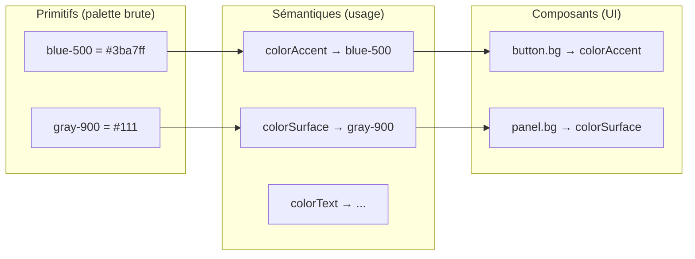
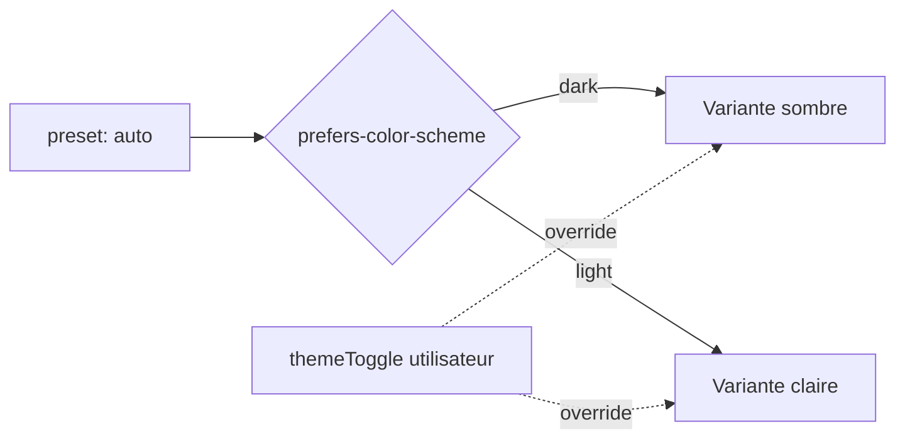

# Chapitre 13 — Système de thèmes

> Le système de thèmes gouverne l'identité visuelle de l'interface (et certains aspects de la scène). Il permet de **personnaliser entièrement l'UI** sans toucher au code. Il concerne le **Theme Manager** (chapitre 02) et alimente l'**UI Manager** (chapitre 12).

---

## 13.1 Objectifs

1. **Personnalisation totale** de l'apparence via **données** (P2), sans modifier le moteur.
2. **Cohérence** : un seul système de tokens gouverne toute l'UI.
3. **Marque** : adapter l'expérience à une identité (couleurs, typo, logo, formes).
4. **Adaptativité** : clair/sombre, préférences système, contraste.
5. **Extensibilité** : les plugins consomment les mêmes tokens (UI homogène).

---

## 13.2 Design Tokens

Le thème repose sur des **design tokens** : des variables sémantiques nommées, indépendantes de leur valeur concrète. C'est la pierre angulaire.

### 13.2.1 Deux niveaux de tokens



| Niveau | Rôle | Exemple |
|--------|------|---------|
| **Primitifs** | Palette/échelle brute. | `blue-500`, `space-4`, `radius-md` |
| **Sémantiques** | Intention d'usage (référencent des primitifs). | `colorAccent`, `colorSurface`, `colorText`, `colorDanger` |
| **Composants** | Application par composant (référencent des sémantiques). | `button.bg`, `panel.radius`, `hotspot.color` |

> Un package personnalise surtout les **tokens sémantiques** (et éventuellement composants), pas les primitifs — cela garde la cohérence tout en permettant l'adaptation à une marque.

### 13.2.2 Catégories de tokens

| Catégorie | Tokens (exemples) |
|-----------|-------------------|
| **Couleurs** | `colorAccent`, `colorBackground`, `colorSurface`, `colorText`, `colorTextMuted`, `colorBorder`, `colorSuccess/Warning/Danger` |
| **Typographie** | `fontFamily`, `fontSize*`, `fontWeight*`, `lineHeight*` |
| **Espacements** | échelle `space-1..N` |
| **Rayons** | `radiusSm/Md/Lg/Full` |
| **Ombres/élévations** | `shadowSm/Md/Lg` |
| **Bordures** | `borderWidth`, `borderColor` |
| **Transitions** | `durationFast/Base/Slow`, `easingDefault` (cohérence avec chapitre 11) |
| **Z-index** | échelle d'empilement (panneaux, hotspots, modaux) |
| **Iconographie** | jeu d'icônes, taille par défaut |
| **Scène** | `sceneBackground`, `hotspotColor`, `outlineColor` (tokens partagés avec la 3D) |

---

## 13.3 Application des tokens

### 13.3.1 Mécanisme (principe)

Les tokens sont exposés à l'UI sous forme de **variables CSS** (custom properties) sur la racine de l'overlay. Le style des composants **référence** ces variables. Changer un token → toute l'UI se met à jour, sans reconstruire.

- **Zéro valeur en dur** dans les composants : chaque propriété visuelle pointe vers un token (règle vérifiée en revue/lint).
- Certains tokens (fond de scène, couleur des hotspots/outline) sont aussi lus par le **Renderer/Environment/Focus** pour une cohérence 2D↔3D.

### 13.3.2 Source des tokens

1. **Thème par défaut du moteur** (base saine, accessible).
2. **Preset** choisi par le package (`theme.preset`: `light`/`dark`/`auto`).
3. **Surcharges** du package (`theme.tokens`) — fusionnées par-dessus.
4. **Préférences système** (voir 13.5).

La résolution est une **cascade** : défaut → preset → surcharges package → préférences/runtime.

---

## 13.4 Variantes de thème (clair/sombre/marque)

- Le moteur fournit au minimum une variante **claire** et une **sombre**, toutes deux accessibles.
- `theme.preset: "auto"` suit `prefers-color-scheme`.
- Un package PEUT définir une **variante de marque** (surcharges de tokens sémantiques).
- Le basculement de variante est **runtime** (bouton `themeToggle`), sans rechargement, avec transition douce.



---

## 13.5 Respect des préférences système (accessibilité)

Le Theme Manager respecte **par défaut** :

| Préférence | Effet |
|------------|-------|
| `prefers-color-scheme` | Choix clair/sombre en mode `auto`. |
| `prefers-reduced-motion` | Transitions réduites/désactivées (coordonné avec l'Animation Engine, chapitre 11). |
| `prefers-contrast` | Variante à contraste renforcé (tokens ajustés). |
| `forced-colors` (mode contrasté OS) | Respect des couleurs système imposées. |

**Contrainte de conception (P8)** : toute variante de thème DOIT respecter les ratios de contraste **WCAG 2.1 AA**. Un thème fourni par un package qui violerait les contrastes DEVRAIT déclencher un avertissement (outil de validation) — l'accessibilité prime sur l'esthétique.

---

## 13.6 Thème et hotspots / scène

Certains éléments 3D/hybrides sont thématisés via des tokens partagés :

| Élément | Token(s) |
|---------|----------|
| Marqueurs de hotspots (repos/hover/actif) | `hotspot.color`, `hotspot.colorActive`, `hotspot.size` |
| Contour de focus (outline) | `outlineColor`, `outlineThickness` |
| Fond de scène | `sceneBackground` (si `environment.background` = token) |
| Couleur d'accent (surbrillance sélection) | `colorAccent` |

Cela garantit que la 3D et l'UI partagent la **même identité** (l'accent de la marque colore aussi les hotspots et l'outline).

> **Conversion de color space (v2, C17)** : les tokens de couleur sont exprimés en **sRGB** (chaînes CSS, pour l'UI). Lorsqu'un token alimente la **scène 3D** (fond, couleur de hotspot, outline), l'adaptateur de rendu applique une conversion **sRGB → linéaire** avant usage dans le pipeline PBR. Cette conversion est la **responsabilité du `RendererPort`** (le core reste agnostique du rendu). Sans elle, les couleurs de marque apparaîtraient délavées/incohérentes entre UI et 3D.

---

## 13.7 Personnalisation par un package (exemple)

```jsonc
{
  "theme": {
    "preset": "dark",
    "tokens": {
      "colorAccent": "#c9a227",          // or/doré pour une montre de luxe
      "colorSurface": "#141416",
      "colorText": "#f5f5f0",
      "fontFamily": "'Georgia', serif",
      "radiusMd": "2px",                  // formes anguleuses = premium
      "hotspot.color": "#c9a227"
    }
  }
}
```

> Ce seul bloc redéfinit l'identité de l'expérience — sans toucher au moteur (P1/P2).

---

## 13.8 Extensibilité et longévité

- **Plugins** : consomment les tokens (même palette) → UI homogène ; ils NE définissent PAS leurs propres couleurs en dur.
- **Nouveaux tokens** : ajoutés de façon rétrocompatible (défauts fournis) ; un ancien package reste valide (P10).
- **Thèmes réutilisables** : un preset de thème PEUT être partagé entre packages (bibliothèque de thèmes).
- **Futur (Explorer Studio, chapitre 18)** : édition visuelle des tokens avec prévisualisation temps réel et vérification de contraste.

---

## 13.9 Règles normatives (synthèse)

1. Toute l'apparence dérive de **design tokens** ; **aucune** valeur visuelle en dur (UI comme plugins).
2. La résolution est une **cascade** (défaut → preset → surcharges → préférences).
3. Le moteur fournit des variantes **claire et sombre accessibles** ; `auto` suit le système.
4. Les préférences système (`color-scheme`, `reduced-motion`, `contrast`, `forced-colors`) sont **respectées**.
5. Les thèmes DOIVENT respecter le **contraste WCAG 2.1 AA**.
6. 3D et UI partagent des **tokens communs** pour une identité cohérente.
