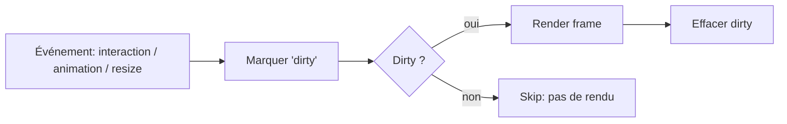
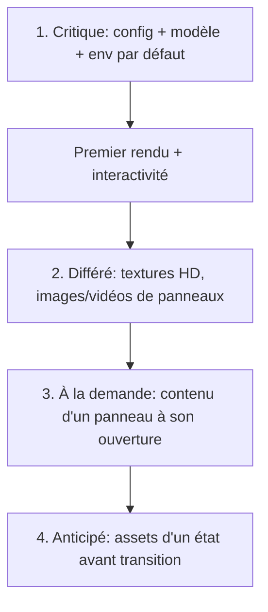

# Chapitre 14 — Performances

> La performance est une **contrainte de conception** (P7), pas une optimisation tardive. Ce chapitre définit les objectifs chiffrés et les leviers : 60 FPS, optimisation GPU, mémoire, lazy loading, Draco, KTX2, instancing.

---

## 14.1 Objectifs (budgets de performance)

Ces objectifs sont des **cibles de conception**. Tout écart significatif est un défaut à traiter.

### 14.1.1 Fluidité

| Cible | Desktop (moyen de gamme) | Mobile (récent) |
|-------|--------------------------|-----------------|
| **FPS visé** | **60 FPS** | **≥ 30 FPS** (viser 60) |
| **Budget par frame** | ~16,6 ms | ~33 ms (ou 16,6 si 60) |
| **Temps de scripting/frame** | < ~8 ms | < ~12 ms |
| Interruptions (jank) | Rares, < 50 ms | Rares |

### 14.1.2 Chargement

| Métrique | Cible |
|----------|-------|
| **Time to First Render** (objet visible) | Aussi court que possible (quelques secondes sur connexion correcte). |
| **Interactivité** | L'utilisateur peut orbiter dès l'affichage de l'objet (pas d'attente de tous les assets). |
| **Poids initial** | Minimisé via compression + lazy loading (chargement différé du non-critique). |

### 14.1.3 Mémoire

| Ressource | Règle |
|-----------|-------|
| **Mémoire GPU (textures)** | Budgétée ; KTX2 pour réduire ; dégradation si dépassement. |
| **Fuites** | **Zéro** fuite : `dispose` systématique (géométries, matériaux, textures, DOM, listeners). |
| **Stabilité** | Mémoire stable dans le temps (pas de croissance monotone en usage prolongé). |

---

## 14.2 Boucle de rendu et rendu à la demande

### 14.2.1 Rendu à la demande (on-demand rendering)

Une expérience d'exploration est **souvent statique** (l'utilisateur observe sans bouger). Rendre 60 fois/seconde une scène immobile gaspille GPU/batterie.

**Principe** : le moteur ne rend une frame **que si quelque chose a changé** (caméra bougée, animation active, hotspot à reprojeter, état en transition). Une **file de « dirty »** déclenche le rendu ; sinon, la boucle est en veille.

> Bénéfice majeur : consommation quasi nulle sur scène statique, tout en gardant 60 FPS pendant les interactions/animations.

### 14.2.2 Adaptation dynamique de la qualité

Si le frame budget est dépassé, le moteur **dégrade automatiquement** (adaptive quality) : réduction du `pixelRatio`, désactivation temporaire de passes coûteuses (SSAO, ombres, DOF), baisse de LOD. À l'inverse, il remonte la qualité quand le budget le permet. Le mobile démarre avec des réglages plus prudents.

---

## 14.3 Optimisation GPU

| Levier | Description | Où |
|--------|-------------|-----|
| **Réduction des draw calls** | Instancing, merge de géométries statiques, atlas/partage de matériaux. | Model Loader, préparation package (ch. 06) |
| **Frustum culling** | Ne pas rendre hors champ. | Renderer/Scene (natif) |
| **Occlusion culling** (option) | Ne pas rendre ce qui est masqué. | Renderer (avancé) |
| **Ombres budgétées** | Shadow maps de résolution maîtrisée, désactivables. | Lighting Manager |
| **Post-processing sélectif** | Bloom/outline/SSAO uniquement si utile et si budget. | Renderer |
| **Résolution adaptative** | `pixelRatio` plafonné (souvent ≤ 2), réduit sous charge. | Renderer |
| **Matériaux maîtrisés** | Éviter transparence/extensions coûteuses inutiles. | Model Loader (ch. 06) |
| **Transparence contrôlée** | Activée seulement quand nécessaire (états). | State Manager (ch. 09) |

### 14.3.1 Instancing

Pour les éléments **répétés identiques** (vis, LED, ailettes de radiateur, rangées de sièges…) : un seul `InstancedMesh` → **un draw call** pour N instances. Détection par convention de nommage du GLB ou déclaration en config. Gain majeur sur des objets à répétitions (ex. serveur, moteur).

---

## 14.4 Optimisation mémoire

| Levier | Description |
|--------|-------------|
| **KTX2/Basis** | Textures compressées **restant compressées en mémoire GPU** (contrairement à PNG/JPEG). Levier n°1 de la mémoire GPU. |
| **Dispose orchestré** | Le Core déclenche la libération de toutes les ressources au teardown/changement de package (exigence P6). |
| **Cache & déduplication** | Le Resource Manager mutualise les assets identiques ; déduplique les requêtes. |
| **Pools** | Réutilisation d'objets (marqueurs DOM de hotspots, objets temporaires d'animation) pour éviter le GC. |
| **Zéro allocation par frame** | Les boucles chaudes (render, animation, projection) n'allouent pas. |
| **Textures budgétées** | Suivi de la mémoire texture ; dégradation de résolution si dépassement. |

---

## 14.5 Chargement (loading) et lazy loading

### 14.5.1 Stratégie en cascade

| Priorité | Contenu | Moment |
|----------|---------|--------|
| **Critique** | config, GLB, env map de base | Immédiat (bloque le premier rendu). |
| **Important** | textures HD, LOD proches | Juste après l'affichage. |
| **À la demande** | images/vidéos/audio de panneaux | À l'ouverture du panneau. |
| **Anticipé** | ressources d'un état/étape | Préchargées juste avant la transition. |

### 14.5.2 Techniques

- **Compression transport** : Draco (géométrie), Meshopt, gzip/brotli.
- **Textures progressives** / mipmaps.
- **Streaming de LOD** : charger le détail au rapprochement.
- **Préchargement anticipé** : deviner la prochaine interaction (état/hotspot probable) et précharger.
- **Décodeurs paresseux** : Draco/KTX2 chargés seulement si le GLB les utilise.
- **Progression réelle** exposée au loader UI (chapitre 12).

---

## 14.6 Compression (récapitulatif)

| Cible | Techno | Réduit le téléchargement | Réduit la mémoire GPU |
|-------|--------|:------------------------:|:---------------------:|
| Géométrie | **Draco** | ✔ | — (décompressé en VRAM) |
| Géométrie | **Meshopt** | ✔ | partiel |
| Textures | **KTX2/Basis** | ✔ | ✔ (**reste compressé en VRAM**) |
| Textures | PNG/JPEG | ✔ | ✘ (décompressé en VRAM) |
| Transport | gzip/brotli | ✔ | — |

> **Recommandation forte** : Draco + KTX2 + Meshopt par défaut pour tout package de production. C'est le triptyque qui rend possible l'objectif de fluidité **et** de mémoire.

---

## 14.7 WebGL vs WebGPU (ouverture)

- **Cible v1 : WebGL 2** (support large, maturité).
- **WebGPU** : envisagé en **option/évolution** (chapitre 18) pour de meilleures performances et le compute. L'architecture du Renderer (chapitre 02) **isole** le backend graphique pour permettre cette évolution sans réécrire le moteur.

---

## 14.8 Mesure et instrumentation

On n'optimise que ce que l'on mesure. Le module **Diagnostics** (chapitre 02) fournit :

| Métrique | Usage |
|----------|-------|
| FPS / frame time | Détecter le jank. |
| Draw calls / triangles | Suivre la charge GPU. |
| Mémoire (géométries, textures, programmes) | Détecter fuites/dépassements. |
| Temps de chargement par phase | Optimiser le TTFR. |
| Compteurs d'animations actives | Vérifier le rendu à la demande. |

- Un **overlay de perf** activable (URL param/config) en développement.
- Des **budgets** peuvent être définis et un avertissement émis en cas de dépassement (dev).
- **Tests de performance** (non-régression) dans la CI sur des packages de référence (chapitre 16/17).

---

## 14.9 Différences mobile

| Aspect | Adaptation mobile |
|--------|-------------------|
| `pixelRatio` | Plafonné plus bas. |
| Ombres / post-processing | Réduits/désactivés par défaut. |
| LOD | Plus agressif. |
| Textures | Résolution moindre (variantes) si disponibles. |
| Cible FPS | 30–60 selon appareil, qualité adaptative. |
| Batterie/thermique | Rendu à la demande crucial. |

---

## 14.10 Règles normatives (synthèse)

1. **60 FPS** sur desktop moyen, **≥ 30 FPS** sur mobile récent, comme contrainte de conception.
2. **Rendu à la demande** : pas de rendu sur scène statique.
3. **Qualité adaptative** : dégradation/upgrade automatique selon le budget.
4. **Draco + KTX2 + Meshopt** par défaut ; **KTX2** pour la mémoire GPU.
5. **Lazy loading en cascade** : critique d'abord, reste différé/à la demande/anticipé.
6. **Zéro fuite mémoire** : `dispose` systématique ; zéro allocation par frame en boucle chaude.
7. **Instancing** pour tout élément répété.
8. **Mesurer** en continu (Diagnostics + budgets + tests de perf CI).
