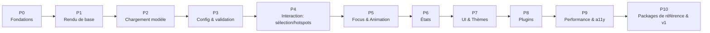

# Chapitre 16 — Roadmap

> Ce chapitre découpe le développement d'Explorer Engine en **tâches petites, indépendantes, testables et validables**. Chaque tâche a un **objectif**, des **prérequis**, un **livrable** et des **critères de validation**. On ne passe à la tâche suivante qu'après validation de la précédente.

> Principe directeur : **construire de façon incrémentale et toujours démontrable**. À la fin de chaque phase, on doit pouvoir *voir* quelque chose fonctionner. Le développement suit strictement cette spécification.

---

## 16.0 Prérequis d'architecture v2 (à intégrer aux phases)

La spec v2 introduit des fondations qui **précèdent** ou **modifient** certaines tâches. Elles sont à insérer aux phases indiquées **avant** de coder le reste de la phase :

| Prérequis v2 | Corr. | S'insère en | Impact sur les tâches existantes |
|--------------|-------|-------------|----------------------------------|
| **Ports & core headless** (`RendererPort`/`UiPort`/`InputPort`) | C2/C3 | **P0** (avant P1) | Le Renderer/UI deviennent des **adaptateurs** ; P1/P7 ciblent des adaptateurs. Test CI « pas de `three`/DOM dans core ». |
| **Render State Resolver** (chapitre 19) | C1 | **P4 (avant Focus/États)** | Nouveau module noyau. Focus (P5) et États (P6) le **consomment** (produisent des couches). |
| **Event Bus typé** + anti-cycle exécutable | C9/C6 | **P0** | Catalogue typé dès le bus (P0-T4) ; lint anti-cycle en CI (P0-T2). |
| **Identité `explorerId`** + adressage typé | C5 | **P2 (indexation)** | P2-T4 indexe par `explorerId` ; `optimize-model` (P3-T4/outillage) génère/préserve les ids. |
| **`requestRender()` + frame ownership** | C7 | **P1-T5** | Remplace la formulation « rendu à la demande » par le contrat frame handles. |
| **État runtime sérialisable** (chapitre 20) | C10 | **P3/P6** (exigence) ; module `Navigation` en **P7** | `serialize/apply` dès la machine à états ; URL binding en P7. |
| **Occlusion BVH sans readback** | C13 | **P4-T3** | La stratégie d'occlusion est fixée (BVH/async), pas « depth test » naïf. |
| **Statecharts** (régions parallèles) | C11 | **P6-T1** | La machine à états est un statechart dès le départ. |
| **Scénarios en plugin** (pas de DSL core) | C12 | **P8-T2** | Aucune tâche de « timeline DSL » ; le Tour porte la scénarisation. |
| **Compat schéma / annulation chargement / depth** | C14/C16/C15 | **P3 / P2** | Politique de compat au schéma (P3-T1) ; annulation au Resource Manager (P2-T1) ; normalisation au Model Loader (P2-T2). |

> **Règle** : ces prérequis ne créent pas une phase séparée ; ils **s'intègrent** aux phases existantes en tête de celles-ci. Le principe « une tâche validée à la fois » reste inchangé.

---

## 16.1 Vue d'ensemble des phases

| Phase | Thème | Résultat démontrable |
|-------|-------|----------------------|
| P0 | Fondations du dépôt | Monorepo, CI, playground vides mais fonctionnels. |
| P1 | Rendu de base | Un cube s'affiche, orbit control. |
| P2 | Chargement de modèle | Un GLB compressé s'affiche, cadré. |
| P3 | Config & validation | Une expérience pilotée par `config.json`. |
| P4 | Interaction | Sélection + hotspots cliquables. |
| P5 | Focus & Animation | Zoom animé sur un composant + retour. |
| P6 | États | Basculer Closed/Open/Exploded/X-ray. |
| P7 | UI & Thèmes | Panneaux, toolbar, breadcrumb, thème. |
| P8 | Plugins | Guided Tour + Measure fonctionnels. |
| P9 | Perf & a11y | 60 FPS, WCAG AA, budgets tenus. |
| P10 | Packages & v1 | 2–3 objets réels ; **Design Freeze v1.0**. |

---

## 16.2 Format d'une tâche

Chaque tâche suit ce gabarit :

- **ID** — identifiant (`P{phase}-T{n}`).
- **Objectif** — ce que la tâche apporte.
- **Prérequis** — tâches/éléments nécessaires avant de commencer.
- **Livrable** — l'artefact concret produit.
- **Critères de validation** — conditions **vérifiables** de « terminé ».

> Une tâche est « **Done** » uniquement si **tous** ses critères de validation sont remplis, tests et CI verts (chapitre 15).

---

## 16.3 Phase P0 — Fondations du dépôt

### P0-T1 — Initialisation du monorepo
- **Objectif** : structure de dépôt conforme au chapitre 03.
- **Prérequis** : cette documentation.
- **Livrable** : workspaces `packages/`, `apps/`, `examples/`, `tools/` ; configs TS de base ; conventions.
- **Validation** : `install` + `build` à vide réussissent ; arborescence conforme au chapitre 03.

### P0-T2 — Outillage qualité et CI
- **Objectif** : garde-fous automatiques (chapitre 15).
- **Prérequis** : P0-T1.
- **Livrable** : linter + formateur + type-check + runner de tests + pipeline CI.
- **Validation** : CI passe (type-check, lint, format, test à vide) ; un import profond ou un cycle est **refusé** par le lint.

### P0-T3 — Playground
- **Objectif** : environnement de dev pour itérer avec HMR.
- **Prérequis** : P0-T1.
- **Livrable** : `apps/playground` qui monte une page vide capable d'accueillir le moteur.
- **Validation** : la page se lance en dev avec rechargement à chaud.

### P0-T4 — Squelette du Core, Event Bus, Diagnostics
- **Objectif** : noyau minimal (cycle de vie vide) + services transverses.
- **Prérequis** : P0-T1..T3.
- **Livrable** : Core (create/dispose no-op), Event Bus (pub/sub typé), Logger.
- **Validation** : tests unitaires du bus (on/off/once/emit) verts ; création/dispose sans fuite.

---

## 16.4 Phase P1 — Rendu de base

### P1-T1 — Renderer
- **Objectif** : afficher un canvas WebGL.
- **Prérequis** : P0.
- **Livrable** : Renderer (canvas, color space, tone mapping, resize, pixelRatio).
- **Validation** : canvas visible, se redimensionne correctement ; dispose propre.

### P1-T2 — Scene + Camera + une géométrie
- **Objectif** : rendre un objet simple.
- **Prérequis** : P1-T1.
- **Livrable** : Scene Manager, Camera Manager, un mesh de test.
- **Validation** : un cube/sphère s'affiche, éclairé ; boundingbox calculée.

### P1-T3 — Controls (orbit)
- **Objectif** : manipuler la caméra.
- **Prérequis** : P1-T2.
- **Livrable** : Controls Manager (orbit, damping, limites) + contrôle clavier.
- **Validation** : rotation/zoom/pan fluides souris + tactile + clavier ; limites respectées.

### P1-T4 — Lighting + Environment de base
- **Objectif** : éclairage/arrière-plan corrects.
- **Prérequis** : P1-T2.
- **Livrable** : Lighting Manager (presets), Environment Manager (fond, env map).
- **Validation** : preset `studio` rend un PBR crédible ; fond configurable.

### P1-T5 — Render loop à la demande
- **Objectif** : ne rendre que si « dirty » (chapitre 14).
- **Prérequis** : P1-T1..T4.
- **Livrable** : boucle on-demand.
- **Validation** : sur scène immobile, aucun rendu superflu ; interactions/anim déclenchent le rendu.

---

## 16.5 Phase P2 — Chargement de modèle

### P2-T1 — Resource Manager
- **Objectif** : fetch + cache + résolution de chemins.
- **Livrable** : Resource Manager (retry/timeout, dédup, dispose).
- **Validation** : chargement d'un asset, cache/dédup vérifiés par tests ; libération correcte.

### P2-T2 — Model Loader (glTF)
- **Objectif** : charger un GLB simple.
- **Prérequis** : P2-T1, P1.
- **Livrable** : chargement glTF, insertion en scène, cadrage auto, progression.
- **Validation** : un GLB s'affiche cadré ; progression rapportée ; erreurs gérées.

### P2-T3 — Décodeurs Draco / KTX2 / Meshopt
- **Objectif** : supporter les modèles compressés.
- **Prérequis** : P2-T2.
- **Livrable** : décodeurs paresseux branchés.
- **Validation** : un GLB Draco+KTX2 s'affiche ; décodeurs chargés uniquement si nécessaires.

### P2-T4 — Indexation des nœuds
- **Objectif** : mapping nom → objet (base des hotspots/états).
- **Prérequis** : P2-T2.
- **Livrable** : index des nœuds/composants exposé au Scene Manager.
- **Validation** : récupération d'un objet par nom ; gestion des homonymes.

---

## 16.6 Phase P3 — Config & validation

### P3-T1 — Schéma du config (`packages/schema`)
- **Objectif** : schéma normatif + validateur (chapitre 05).
- **Livrable** : schéma versionné, validation, valeurs par défaut.
- **Validation** : configs valides acceptées, invalides rejetées avec erreurs claires ; défauts appliqués.

### P3-T2 — Config Loader
- **Objectif** : charger/valider/normaliser/migrer la config.
- **Prérequis** : P3-T1, P2-T1.
- **Livrable** : Config Loader → config résolue immuable.
- **Validation** : chemins résolus ; migration d'une version antérieure ; erreurs exploitables.

### P3-T3 — Bootstrap piloté par config
- **Objectif** : le Core construit la scène **depuis** la config.
- **Prérequis** : P3-T2, P1, P2.
- **Livrable** : pipeline de chargement complet (chapitre 04 §4.4).
- **Validation** : un `config.json` minimal (chapitre 05 §5.5.1) produit une expérience visuelle correcte, **sans code spécifique**.

### P3-T4 — Outil `validate-package`
- **Objectif** : validation hors ligne d'un package.
- **Prérequis** : P3-T1, P2-T4.
- **Livrable** : CLI de validation (schéma + assets + correspondance des nœuds).
- **Validation** : détecte config invalide, asset manquant, nœud inexistant.

---

## 16.7 Phase P4 — Interaction (sélection & hotspots)

### P4-T1 — Selection Manager (raycasting + granularité)
- **Objectif** : picking au bon niveau logique.
- **Prérequis** : P2-T4, P3-T3.
- **Livrable** : sélection + hover highlight + résolution `pickTarget`.
- **Validation** : clic sur géométrie → composant attendu ; hover met en évidence ; désélection.

### P4-T2 — Hotspot Manager (projection)
- **Objectif** : ancrer + projeter des hotspots.
- **Prérequis** : P4-T1, P1-T5.
- **Livrable** : hotspots depuis la config, projection 3D→2D optimisée (dirty/batch/culling).
- **Validation** : marqueurs positionnés correctement, suivent la caméra, pas de recalcul inutile.

### P4-T3 — Occlusion
- **Objectif** : masquer les hotspots occultés.
- **Prérequis** : P4-T2.
- **Livrable** : test d'occlusion throttlé.
- **Validation** : un hotspot derrière la géométrie est masqué/atténué, sans clignotement.

### P4-T4 — Interaction & accessibilité hotspots
- **Objectif** : hotspots cliquables et accessibles (chapitre 07).
- **Prérequis** : P4-T2.
- **Livrable** : hover/active, actions (`emit`), clavier/ARIA, liste alternative.
- **Validation** : activation souris/tactile/clavier ; ARIA correct ; audit a11y OK ; dispose sans listener orphelin.

---

## 16.8 Phase P5 — Focus & Animation

### P5-T1 — Animation Engine (tweens)
- **Objectif** : interpolation générique time-based.
- **Prérequis** : P1-T5.
- **Livrable** : tweens (nombres/vecteurs/quaternions/couleurs), easings, événements ; intégration render loop.
- **Validation** : animation fluide, déterministe (indépendante du FPS), delta clampé, dispose des terminées ; zéro alloc/frame.

### P5-T2 — Timelines & séquences
- **Objectif** : composition temporelle.
- **Prérequis** : P5-T1.
- **Livrable** : timelines (parallèle/séquence/offsets/markers), timelines déclaratives.
- **Validation** : séquence config-driven jouée ; interruptible ; markers émis.

### P5-T3 — Camera transitions
- **Objectif** : déplacements caméra animés + presets de vues.
- **Prérequis** : P5-T1, P1-T3.
- **Livrable** : transitions position/cible/FOV ; vues nommées.
- **Validation** : passage animé entre deux vues ; contrôles suspendus pendant transition.

### P5-T4 — Focus Manager
- **Objectif** : mise en avant complète d'un composant + retour.
- **Prérequis** : P5-T3, P4-T1.
- **Livrable** : cadrage, dim/outline/isolate réversibles, pile de focus, retour, événements.
- **Validation** : focus animé sur un composant, info-cible, retour restaure exactement l'état ; imbrication + `back()` OK ; `reduced-motion` respecté.

---

## 16.9 Phase P6 — États

### P6-T1 — State Manager (machine à états)
- **Objectif** : états base/modifier + transitions validées.
- **Prérequis** : P5-T2, P2-T4.
- **Livrable** : chargement des états, `goToState`, `allowedFrom`, événements.
- **Validation** : transition refusée si non autorisée ; base exclusif, modifier combinable.

### P6-T2 — Transforms & surcharges matériaux réversibles
- **Objectif** : appliquer/annuler transforms et matériaux.
- **Prérequis** : P6-T1, P5-T1.
- **Livrable** : transforms animés (Exploded/Open), surcharges (Transparent/X-ray) réversibles.
- **Validation** : Closed↔Open↔Exploded animés ; X-ray combiné ; retour parfait à l'état de référence.

### P6-T3 — Cutaway (clipping)
- **Objectif** : vue en coupe.
- **Prérequis** : P6-T2.
- **Livrable** : plans de coupe déclaratifs (+ capping si possible).
- **Validation** : coupe révèle l'intérieur ; réversible ; pas d'artefact majeur.

---

## 16.10 Phase P7 — UI & Thèmes

### P7-T1 — Theme Manager (design tokens)
- **Objectif** : tokens + variantes + préférences système (chapitre 13).
- **Prérequis** : P3-T3.
- **Livrable** : cascade de tokens, clair/sombre/auto, `reduced-motion`/`contrast`.
- **Validation** : surcharge de tokens change l'UI ; `auto` suit le système ; contrastes AA.

### P7-T2 — UI Manager : shell (toolbar, breadcrumb, loader)
- **Objectif** : structure d'interface.
- **Prérequis** : P7-T1, P4-T2, P6-T1.
- **Livrable** : toolbar (états/reset), breadcrumb (pile de focus), loader avec progression.
- **Validation** : boutons reflètent l'état ; breadcrumb navigable ; loader → transition de sortie.

### P7-T3 — Panneaux (blocs) + responsive
- **Objectif** : afficher l'information.
- **Prérequis** : P7-T2, P5-T4.
- **Livrable** : panneaux par blocs (text/specs/image/…), lazy-load, responsive (bottom-sheet mobile), assainissement.
- **Validation** : panneau s'ouvre au focus ; responsive desktop/mobile ; contenu assaini ; a11y OK.

### P7-T4 — i18n
- **Objectif** : multilingue + RTL.
- **Prérequis** : P7-T3.
- **Livrable** : résolution des clés i18n, sélecteur de langue, RTL.
- **Validation** : bascule de langue ; RTL correct.

---

## 16.11 Phase P8 — Plugins

### P8-T1 — Plugin Manager + `plugin-sdk` + Plugin Context
- **Objectif** : système d'extension (chapitre 10).
- **Prérequis** : P4..P7.
- **Livrable** : cycle de vie, contexte d'API stable, isolation d'erreurs, résolution de dépendances.
- **Validation** : un plugin de test s'enregistre/init/start/stop/dispose ; erreur isolée sans casser le moteur.

### P8-T2 — Plugin Guided Tour
- **Objectif** : visite guidée (référence).
- **Prérequis** : P8-T1, P5-T4, P6.
- **Livrable** : enchaînement focus/panneaux/états scénarisé.
- **Validation** : visite complète, interruptible, événements émis.

### P8-T3 — Plugin Measure
- **Objectif** : outil de mesure (référence).
- **Prérequis** : P8-T1, P4-T1.
- **Livrable** : mesure de distance à l'échelle réelle.
- **Validation** : deux points → distance correcte ; overlay accessible ; dispose propre.

---

## 16.12 Phase P9 — Performance & accessibilité

### P9-T1 — Instancing & réduction draw calls
- **Objectif** : leviers GPU (chapitre 14).
- **Livrable** : instancing des répétitions, merge statique.
- **Validation** : baisse mesurée des draw calls sur un package de test.

### P9-T2 — Qualité adaptative & budgets mobiles
- **Objectif** : tenir le frame budget partout.
- **Livrable** : dégradation/upgrade dynamique, réglages mobiles.
- **Validation** : 60 FPS desktop, ≥30 FPS mobile sur packages de référence ; dégradation propre sous charge.

### P9-T3 — Lazy loading en cascade
- **Objectif** : chargement optimisé (chapitre 14).
- **Livrable** : critique→différé→à la demande→anticipé.
- **Validation** : objet interactif rapidement ; panneaux chargés à l'ouverture.

### P9-T4 — Audit mémoire (zéro fuite)
- **Objectif** : stabilité mémoire.
- **Livrable** : dispose orchestré vérifié, pools.
- **Validation** : charger/décharger 50× un package → mémoire stable (pas de croissance).

### P9-T5 — Audit accessibilité global
- **Objectif** : conformité WCAG 2.1 AA.
- **Livrable** : corrections issues d'audits (clavier, ARIA, contraste, annonces).
- **Validation** : parcours complet au clavier ; audit automatisé sans violation bloquante.

---

## 16.13 Phase P10 — Packages de référence & v1

### P10-T1 — Package de référence « simple »
- **Objectif** : valider le flux complet sur un objet réel simple (ex. montre).
- **Livrable** : package data-only (GLB + config + assets) dans `examples/`.
- **Validation** : expérience complète (hotspots, focus, un état, panneaux, thème) **sans code moteur**.

### P10-T2 — Package de référence « complexe »
- **Objectif** : valider la montée en charge (ex. PC gaming ou moteur).
- **Livrable** : package avec états multiples, exploded, plugins, i18n.
- **Validation** : perf tenue ; tous les systèmes exercés ; validé par `validate-package`.

### P10-T3 — Documentation d'usage & guide auteur
- **Objectif** : permettre à des tiers de créer des packages.
- **Livrable** : guide créateur (préparation GLB, config, thèmes), guide plugin.
- **Validation** : une personne externe produit un package en suivant le guide.

### P10-T4 — Design Freeze v1.0
- **Objectif** : figer l'API et le schéma.
- **Prérequis** : P0..P10 validés.
- **Livrable** : version 1.0 (moteur + schéma + SDK versionnés).
- **Validation** : API publique stable documentée ; compatibilité ascendante engagée (P10).

---

## 16.14 Règles de progression (normatives)

1. **Une tâche à la fois**, validée avant la suivante.
2. **Chaque phase se termine par une démonstration** visible.
3. **Tests + CI verts** sont une condition de « Done » (chapitre 15).
4. **Toute tâche respecte la spécification** ; tout écart est un amendement documenté du présent document.
5. **Les packages d'exemple restent data-only** (preuve continue de P1).
