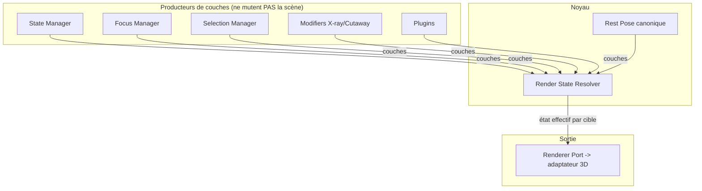
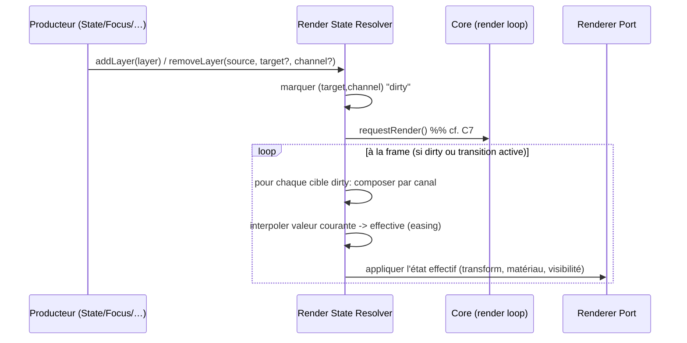

# Chapitre 19 — Render State Resolver (état de rendu déclaratif)

> **Chapitre noyau, introduit en spec v2 (correction C1).** À lire juste après le [chapitre 02](./02-architecture-generale.md) et avant les [États](./09-etats.md) et le [Focus](./08-focus-system.md), qu'il refonde. Il corrige le défaut structurel n°1 de la revue v1.

---

## 19.1 Problème corrigé

En v1, l'état visuel de la scène (transforms, opacités, couleurs, contours, visibilité, intention de caméra/éclairage) était **muté de façon impérative** par au moins six sources : State Manager, Focus Manager, Selection Manager, états `modifier` (X-ray), et plugins. Chaque source « mémorisait l'original puis le restaurait ». Ce modèle **ne compose pas** :

- **Conflit d'ordre** : X-ray met l'opacité d'une coque à 0.2 ; un focus par-dessus mémorise 0.2 comme « original », l'assombrit, puis le restaure à 0.2 ; désactiver X-ray restaure alors une valeur déjà écrasée → **résultat non déterministe selon l'ordre**.
- **Interruptions en cascade** : transition d'état interrompue par un focus, lui-même interrompu par un hover → trois « originaux » restaurés dans le désordre.
- **Réversibilité fragile** : la « pose de repos » n'est plus récupérable de façon fiable (aggravé par les transforms `relative`).

> C'est le classique **last-writer-wins sur un état mutable partagé**, sans autorité de réconciliation.

---

## 19.2 Décision : un résolveur déclaratif à couches

Aucun sous-système ne mute directement la scène. Chaque sous-système **publie des contributions déclaratives** (des *couches*) décrivant *ce qu'il veut* pour certaines cibles. Un module noyau unique, le **Render State Resolver (RSR)**, **compose** toutes les couches et calcule l'**état effectif** par cible, puis l'applique (ou l'interpole) via l'adaptateur de rendu.

**Principe fondateur** : on ne « restaure » jamais. Entrer dans un focus = **ajouter** une couche ; en sortir = **retirer** cette couche et **recomposer**. La réversibilité et la composition sont garanties *par construction*.

---

## 19.3 Modèle de données

### 19.3.1 La couche (Layer / Contribution)

Une **couche** est une contribution déclarative, typée et immuable :

| Champ | Type | Rôle |
|-------|------|------|
| `source` | `LayerSource` | Qui contribue (`state`, `focus`, `selection`, `modifier:xray`, `plugin:<id>`…). Sert au retrait et au débogage. |
| `target` | `Address` (typée, cf. C5) | La cible : `{ kind: "component" \| "group" \| "node", id }`. |
| `channel` | `Channel` | Le canal visuel affecté (liste fermée, cf. 19.3.2). |
| `value` | dépend du canal | La valeur souhaitée (offset de transform, opacité, couleur, booléen de visibilité, intention caméra…). |
| `priority` | `number` | Départage les couches concurrentes sur `(target, channel)`. |
| `transition` | `TransitionSpec?` | Comment atteindre cette valeur (durée/easing) à l'ajout/retrait. |

### 19.3.2 Canaux (Channels) — liste **fermée** en v1

Un canal est une dimension visuelle indépendante et composable. La liste est **fermée** en v1 (extensible en v2, arbitrage O4 du change-log) :

| Canal | Type de valeur | Composition |
|-------|----------------|-------------|
| `transform` | offset (translate/rotate/scale) **depuis la rest pose** | **additif** (somme des offsets) |
| `opacity` | `[0,1]` | **min** (le plus transparent gagne) |
| `colorOverride` | couleur + intensité | priorité (last-by-priority) |
| `outline` | booléen + style | priorité |
| `visibility` | `visible \| hidden` | **hidden gagne** (isolation) |
| `cameraIntent` | pose caméra cible | **exclusif**, résolu par priorité (cf. 19.5) |
| `lightingIntent` | preset/ambiance | exclusif par priorité |

> La **règle de composition dépend du canal** (additive pour `transform`, `min` pour `opacity`, priorité pour les autres). C'est ce qui rend X-ray + focus + hover **prévisibles**.

### 19.3.3 Rest Pose canonique (corrige F3 / point 8)

Le RSR détient une **pose de repos canonique unique** : l'état du modèle **au chargement** (transforms d'origine, matériaux d'origine), établie **une seule fois**. **Toutes** les contributions `transform` sont des **offsets absolus depuis cette rest pose**, jamais relatifs à l'état courant.

- **Suppression des transforms `relative`** : le schéma v1 exposait `relative: true` (chapitre 05). Il est **retiré**. Un état déclare un offset **absolu** depuis la rest pose.
- L'effectif d'une cible = `restPose(target) ⊕ Σ transformLayers(target)`.
- Conséquence : déterminisme total, réversibilité exacte (retirer les couches ⇒ retour bit-à-bit à la rest pose).

---

## 19.4 Algorithme de résolution

Étapes :

1. **Publication** : un producteur appelle `addLayer` / `removeLayer` / `updateLayer`. Aucune mutation directe de la scène.
2. **Invalidation** : le RSR marque les couples `(target, channel)` affectés comme *dirty* et déclenche `requestRender()` (chapitre C7 / 02).
3. **Composition** : pour chaque cible *dirty*, le RSR agrège les couches par canal selon la règle du canal (additif / min / priorité / exclusif).
4. **Interpolation** : la transition entre valeur courante et effective est confiée à l'Animation Engine (tween interne), depuis la **valeur courante** (gère les interruptions proprement).
5. **Application** : le RSR pousse l'état effectif via le `RendererPort` (le core reste headless — chapitre C2).

> **Zéro allocation par frame** : les couches sont indexées par cible ; seules les cibles *dirty* sont recomposées. Sur scène stable, aucun travail.

---

## 19.5 Canaux d'intention (caméra, éclairage)

`cameraIntent` et `lightingIntent` sont **exclusifs** : plusieurs sous-systèmes peuvent souhaiter une caméra (état + focus), mais une seule s'applique. Le RSR résout par **priorité** :

- Priorités par défaut : `focus (100) > state (50) > default (0)`.
- Le producteur gagnant fournit l'intention ; le Camera/Lighting adapter l'exécute (transition).
- Retirer la couche gagnante ⇒ recomposition ⇒ l'intention suivante (ou la vue par défaut) reprend automatiquement — **c'est le mécanisme de « retour » du focus**, sans code de restauration.

---

## 19.6 Priorités par défaut (normatif)

| Source | Priorité indicative | Canaux typiques |
|--------|---------------------|-----------------|
| `default` (rest) | 0 | tous (implicite) |
| `state:base` | 10–50 | transform, opacity, cameraIntent, lightingIntent |
| `modifier:*` | 40–60 | opacity, visibility, colorOverride |
| `selection:hover` | 70 | outline, colorOverride |
| `focus` | 100 | cameraIntent, opacity (dim), visibility (isolate), outline |
| `plugin:*` | plage réservée 200+ | selon capacité déclarée |

Les valeurs exactes sont paramétrables ; l'ordre relatif (focus > selection > modifier > state > default) est **normatif**.

---

## 19.7 Conséquences sur les autres chapitres

| Chapitre | Conséquence |
|----------|-------------|
| **02 Architecture** | Le RSR est un **module noyau** ajouté ; State/Focus/Selection ne dépendent plus de Camera/Lighting/UI mais **du RSR** (casse des cycles, cf. C6). |
| **08 Focus** | Devient un **producteur de couches** (mécanisme), plus un mutateur ; « retour » = retrait de couche. |
| **09 États** | Les états déclarent des **couches** (transform absolu, opacity, intentions) ; plus de mutation/restauration ; suppression de `relative`. |
| **05 Config** | `transforms` deviennent **absolus** ; `material` devient des couches d'`opacity`/`colorOverride` ; adressage typé (C5). |
| **11 Animation** | L'interpolation des couches réutilise les tweens ; le RSR est un consommateur de l'Animation Engine. |
| **10 Plugins** | Les plugins contribuent via `addLayer` (capacité déclarée), dans une plage de priorité réservée. |

---

## 19.8 Règles normatives (synthèse)

1. **Aucun module ne mute la scène directement** ; tout passe par des **couches** publiées au RSR.
2. La **rest pose canonique** est la seule référence ; les `transform` sont des **offsets absolus** (fin des transforms `relative`).
3. La **composition dépend du canal** (additif / min / priorité / exclusif), déterministe et indépendante de l'ordre de publication.
4. **On ne restaure jamais** : on retire une couche et on recompose.
5. Le RSR **n'alloue pas par frame** et ne recompose que les cibles *dirty* ; il déclenche `requestRender()`.
6. L'ordre de priorité `focus > selection > modifier > state > default` est **normatif**.
