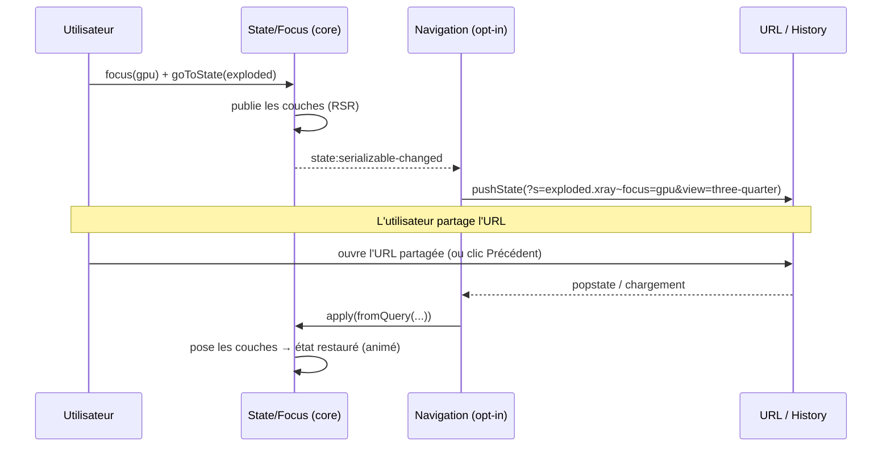

# Chapitre 20 — État runtime sérialisable, deep-linking & historique

> **Chapitre noyau, introduit en spec v2 (correction C10).** Corrige l'absence totale de sérialisation d'état de la v1 (deep-linking, partage d'URL, bouton Précédent). Sert aussi de fondation propre à la synchronisation multi-utilisateurs (chapitre 18).

---

## 20.1 Problème corrigé

La v1 ne définissait aucun moyen de **capturer, partager ou restaurer** l'état d'une exploration : impossible de partager par URL « le focus GPU du PC en vue éclatée », ni de gérer le bouton Précédent du navigateur. Ajouter cela après coup aurait imposé de rétrofiter la sérialisation dans des états déjà codés. La v2 fait de la **sérialisabilité de l'état runtime** une **exigence de conception** (dès P3/P6).

---

## 20.2 Définition de l'état runtime

L'**état runtime** est l'ensemble **minimal et sérialisable** décrivant ce que voit/fait l'utilisateur à un instant donné. Il est distinct de la **config** (immuable, le contenu) et de la **rest pose** (le modèle au repos).

```jsonc
// RuntimeState (schéma versionné)
{
  "v": 1,                          // version du format d'état
  "base": "exploded",              // état de base actif (région principale)
  "modifiers": ["xray"],           // modifiers actifs (régions parallèles)
  "focus": ["engine", "spark_plug"],// pile de focus (adresses de composants, du plus général au plus fin)
  "view": {                        // caméra (ou id de vue nommée)
    "ref": "three-quarter"         // soit un id de vue, soit une pose explicite { position, target, fov }
  },
  "selection": "gpu"               // sélection courante (optionnel)
}
```

| Champ | Source | Rôle |
|-------|--------|------|
| `base` | State Manager | État de base (statechart, chapitre 09). |
| `modifiers` | State Manager | Modifiers actifs. |
| `focus` | Focus Manager | Pile de focus (chapitre 08). |
| `view` | Camera (via RSR `cameraIntent`) | Vue courante (id ou pose). |
| `selection` | Selection Manager | Cible sélectionnée (optionnel). |

> **Principe** : l'état runtime référence des **entités logiques** (ids de composants/états/vues), pas des objets 3D. Il est **petit**, **lisible**, **portable** et **rejouable**.

---

## 20.3 API du core

Le core headless expose (dans l'espace `engine.state`) :

| Opération | Sémantique |
|-----------|-----------|
| `serialize(): RuntimeState` | Capture l'état courant. |
| `apply(state: RuntimeState, opts?)` | Restaure un état (animé ou instantané). Valide et **dégrade** si une référence n'existe plus (ex. composant absent) — jamais de plantage. |
| `toQuery(): string` / `fromQuery(s)` | Encodage compact ↔ chaîne d'URL. |
| `diff(a, b)` / `patch(state, patch)` | Calcul/application de deltas (base de la synchro multi-utilisateurs). |
| événement `state:serializable-changed` | Émis (débouncé) quand l'état runtime change, pour le binding URL/analytics. |

`apply` s'appuie entièrement sur les mécanismes v2 : il pose les couches d'état/focus au **Render State Resolver** (chapitre 19), ce qui garantit une restauration **déterministe et réversible**.

---

## 20.4 Module `Navigation` (opt-in) : binding URL & historique

Le binding avec l'URL et l'historique du navigateur est assuré par un module **`Navigation`** **optionnel** (opt-in), séparé du cœur logique (arbitrage O3). Deux modes :

| Mode | Comportement |
|------|-------------|
| **Intégré (opt-in)** | `Navigation` synchronise `RuntimeState` ↔ `history.pushState`/`popstate` et le fragment/query d'URL. Le bouton Précédent rejoue les états ; l'URL est partageable. |
| **Délégué à l'hôte** | Le module est désactivé ; l'hôte lit `serialize()` / appelle `apply()` et gère lui-même l'URL (ex. routeur applicatif). |



### 20.4.1 Encodage d'URL

- **Compact et lisible** : ex. `?s=exploded.xray&focus=engine.spark_plug&view=three-quarter`.
- **Versionné** (`v`) pour la compatibilité ascendante.
- **Robuste** : une entité absente est ignorée avec dégradation (l'URL d'un package v1 reste ouvrable sur une v1.1).
- **Sécurité** : le state désérialisé est **validé** (mêmes règles que la config) ; aucune donnée d'URL n'est exécutée.

---

## 20.5 Deep-linking : cas d'usage

| Cas | Bénéfice |
|-----|----------|
| **Partage** | Envoyer un lien pointant exactement une vue/composant. |
| **Bouton Précédent** | Navigation naturelle dans l'historique d'exploration. |
| **Signets** | Mémoriser une configuration. |
| **Documentation** | Lier depuis un texte vers « le composant X en coupe ». |
| **Reprise** | Rouvrir là où l'on s'était arrêté (persistance côté hôte). |
| **Tests e2e** | Amener le moteur dans un état précis de façon reproductible. |

---

## 20.6 Fondation pour la synchronisation multi-utilisateurs (lien chapitre 18)

Le multijoueur **ne repose pas** sur un déterminisme de simulation (illusoire en WebGL/async — correction v1 F20), mais sur la **synchronisation d'état** :

- un **snapshot** (`RuntimeState`) ou des **patches** (`diff`) sont diffusés par un **plugin de transport** (WebRTC/WebSocket) ;
- les pairs appliquent `apply`/`patch` → même état macroscopique, indépendamment des micro-différences de rendu ;
- modes « suivi du guide » (un pair pousse son état) ou « exploration partagée » (curseurs/sélections superposés).

> La sérialisabilité définie ici est donc la **brique commune** au deep-linking **et** au futur multijoueur — d'où sa présence dans le noyau v1.

---

## 20.7 Conséquences sur les autres chapitres

| Chapitre | Conséquence |
|----------|-------------|
| **02 Architecture** | Ajout du module `Navigation` (opt-in) ; l'état observable devient **sérialisable**. |
| **09 États** | `serialize/apply` de la partie macro (base+modifiers). |
| **08 Focus** | La pile de focus entre dans `RuntimeState`. |
| **18 Évolutions** | Le multijoueur est reformulé en **synchronisation d'état** (pas simulation déterministe). |
| **16 Roadmap** | Nouvelle exigence dès P3/P6 : l'état runtime DOIT être sérialisable ; `Navigation` livrable en P7/P10. |

---

## 20.8 Règles normatives (synthèse)

1. L'**état runtime** (base + modifiers + focus + vue + sélection) est **sérialisable/désérialisable**, versionné.
2. `apply` restaure via le **Render State Resolver** (déterministe, réversible) et **dégrade** si une référence manque.
3. Le binding URL/History est un module **`Navigation` opt-in** ; sinon délégué à l'hôte via l'API.
4. L'encodage d'URL est **compact, lisible, versionné, validé** (aucune exécution).
5. Le multijoueur (chapitre 18) est une **synchronisation d'état**, **pas** une simulation déterministe.
