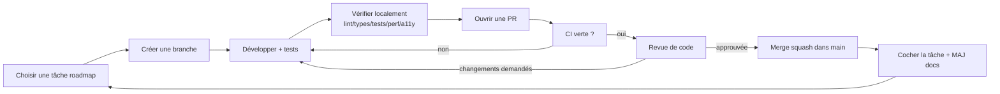
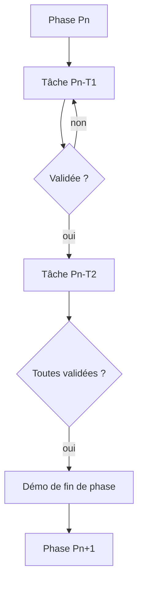

# Development Workflow — Explorer Engine

> Workflow de développement du projet, calqué sur les pratiques des grandes équipes logicielles : trunk-based léger, branches courtes, PR petites et revues, CI bloquante, une tâche de roadmap = un incrément validable.
>
> Ce workflow **opérationnalise** la [Constitution](../ENGINE_CONSTITUTION.md), la [Definition of Done](./DEFINITION_OF_DONE.md) et la [Checklist de revue](./CODE_REVIEW_CHECKLIST.md).

---

## 1. Principes

1. **La spécification fait foi.** Tout travail correspond à une tâche de la [Roadmap](./16-roadmap.md) et respecte la [Spécification v2](./README.md). Aucun écart non tracé.
2. **Incréments démontrables.** Une tâche livre quelque chose de *visible/vérifiable*. On ne fusionne pas du code inerte.
3. **Petites PR.** Une PR = une tâche (ou une sous-tâche). Objectif : revue en moins de ~30 min.
4. **`main` toujours vert et déployable.** On ne fusionne jamais en rouge.
5. **Une tâche à la fois**, validée avant la suivante (discipline de la roadmap).

---

## 2. Vue d'ensemble

---

## 3. Création d'une branche

- Partir de `main` à jour : `git fetch origin && git switch -c <branche> origin/main`.
- **Convention de nommage** : `<type>/<phase-tache>-<slug>`, par ex. :
  - `feat/P4-T2-hotspot-projection`
  - `fix/P6-T2-state-layer-restore`
  - `docs/adr-008-webgpu-adapter`
  - `chore/P0-T2-ci-setup`
- Types : `feat` | `fix` | `docs` | `refactor` | `test` | `perf` | `chore`.
- **Une branche = une tâche.** Branche courte (idéalement < 2 jours de travail).

---

## 4. Développement

- Respecter la [Constitution](../ENGINE_CONSTITUTION.md) et les [Standards de code](./15-standards-code.md) : TypeScript strict, core headless, aucune mutation directe (RSR), événements typés, DAG, `dispose` systématique.
- **Zéro `three`/DOM dans `core`** ; le rendu vit dans `renderer-three`, l'UI dans `ui-webcomponents`.
- Écrire les **tests en même temps** que le code (pas après).
- Commits atomiques et fréquents (voir §8).
- Mettre à jour la **documentation** touchée (spec, ADR, guide auteur) dans la **même** PR que le code.
- Si une décision d'architecture émerge → **ADR** (nouveau ou mise à jour de statut).

### 4.1 Si un problème d'architecture est découvert

La spec v2 est figée « sauf découverte d'un problème majeur ». Si le développement révèle une incohérence critique :

1. **S'arrêter** — ne pas contourner en douce.
2. Ouvrir une **issue** décrivant le problème et son impact.
3. Proposer un **ADR** (options + recommandation).
4. Obtenir l'accord du mainteneur **avant** de modifier la spec.
5. Amender la spec + l'ADR, puis reprendre. *(Constitution L27.)*

---

## 5. Tests

Pyramide de tests ([chapitre 15 §15.7](./15-standards-code.md)) :

| Niveau | Quand | Exécution |
|--------|-------|-----------|
| **Unitaire** | Logique pure (core headless : RSR, statechart, config, cadrage, easings). | Local + CI, rapide, sans navigateur. |
| **Intégration** | Interaction entre modules (chargement → hotspots/états construits). | Local + CI. |
| **E2E** | Parcours utilisateur critiques (via `apps/playground` + packages de référence). | CI (et local à la demande). |
| **Performance** | Non-régression FPS/mémoire/draw calls sur packages de référence. | CI (budgets). |
| **Accessibilité** | Audit automatisé (axe-core) + tests clavier. | CI. |

- Tout **bug corrigé** s'accompagne d'un **test de non-régression**.
- Tests **déterministes** (temps simulé pour les animations).
- Vérifier localement **avant** d'ouvrir la PR : `lint` + `types` + `tests` + (si pertinent) budgets perf + audit a11y.
- Le cas échéant, utiliser la skill de vérification bout-en-bout (`verify`) pour exercer le flux réel, pas seulement les tests.

---

## 6. Revue (Code Review)

- **Au moins une approbation** d'un mainteneur/pair avant merge.
- Le relecteur suit la [Checklist de revue](./CODE_REVIEW_CHECKLIST.md) (architecture, perf, a11y, sécurité, modularité, doc).
- **Bloquer** toute PR qui enfreint un invariant de la [Constitution](../ENGINE_CONSTITUTION.md), même verte.
- Discussions dans la PR ; l'auteur répond ou corrige. Une remarque non résolue ne se referme pas silencieusement.
- Revue **bienveillante et factuelle** : on critique le code, pas la personne ; on explique le « pourquoi ».

---

## 7. Merge

- **Condition de merge** : CI verte (lint + types + tests + build + validation des packages d'exemple + budgets perf/a11y) **ET** au moins une approbation **ET** [Definition of Done](./DEFINITION_OF_DONE.md) satisfaite.
- **Stratégie** : **squash-and-merge** (un commit propre par tâche dans `main`, message = résumé de la PR).
- **Interdit** : merge en rouge ; merge d'une PR qui enfreint un invariant ; auto-approbation d'une PR non triviale.
- Après merge : supprimer la branche, **cocher la tâche** dans la roadmap, mettre à jour le CHANGELOG (moteur/schéma) si nécessaire.
- Ne jamais fusionner dans `main` du travail de spécification tant que la phase de conception l'exige (règle de la phase courante).

---

## 8. Commits

- **Conventional Commits** : `type(scope): résumé impératif court`.
  - `feat(hotspots): project anchors to screen space`
  - `fix(states): compose xray and focus opacity layers`
  - `test(rsr): cover per-channel composition order`
- **Atomiques** : un commit = une idée cohérente ; le projet compile à chaque commit.
- **Impératif présent**, ≤ ~72 caractères pour le sujet ; corps expliquant le *pourquoi* si nécessaire.
- Référencer la tâche/issue (`P4-T2`, `#123`).
- Ne jamais committer de secrets, de code généré volumineux non nécessaire, ni l'identifiant de modèle de l'assistant.

---

## 9. Documentation

- La doc évolue **avec** le code, dans la **même PR** (spec, ADR, guides).
- Une modification de comportement observable → mise à jour du chapitre concerné.
- Une décision d'architecture → **ADR**.
- API publique → TSDoc renvoyant au chapitre de spec.
- La spec reste la **source de vérité** ; le code s'y conforme (Constitution L27).

---

## 10. Rythme de la roadmap

Chaque **phase** se clôt par une **démonstration** visible ([chapitre 16](./16-roadmap.md)). On ne démarre une tâche qu'après validation de la précédente.
